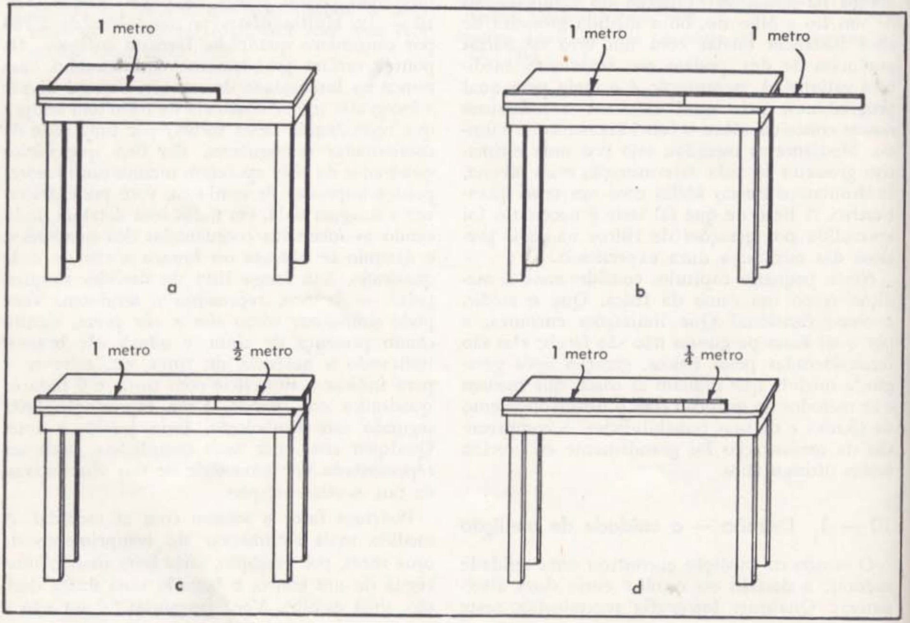

# Capitolo 10 - MISURAZIONE

La sensibilità di una microbilancia a fibra di quarzo (Fig. 7 — 3) mostra quanto possano essere raffinati i metodi precisi di misurazione fisica. Tuttavia, l’idea che tale misurazione sia sempre qualcosa di meticoloso e preciso non trova riscontro nella fisica. La valutazione della lunghezza di un filo a occhio nudo, o la misura approssimativa di una distanza stellare con un errore di diverse potenze di dieci, possono essere, in realtà, misurazioni preziose. La misurazione è il mezzo tramite il quale progrediamo, col quale mettiamo alla prova e affiniamo i nostri concetti sul funzionamento del mondo. Attraverso le misure, sia per una stima grossolana che per la determinazione più precisa, confrontiamo le nostre idee con una verifica quantitativa. La lezione che tale verifica sia necessaria è stata appresa da generazioni di fisici nella più preziosa delle scuole: la dura esperienza.

In questo breve capitolo consideriamo la misurazione come un ramo della fisica. Che cosa significa misurare, e come funziona? Quali limitazioni incontra, e perché? Queste domande non sono facili; esse sono riconsiderate dai fisici, generazione dopo generazione, man mano che cambiano le cose da misurare e i metodi di misurazione con lo sviluppo della tecnica e delle sue possibilità. La comprensione della misurazione è stata grandemente chiarita in questi ultimi anni.

## 10 — 1. Decisione — l’unità di misura

Lo studio della misurazione ha individuato un’unità naturale: la decisione o scelta tra due alternative. Qualsiasi fotografia riprodotta in questo libro mostra un qualche tipo di configurazione che appare in varie tonalità di grigio, dal quasi nero al quasi bianco. Tuttavia, un ingrandimento mostra che ciò che è stampato sulle pagine non è altro che inchiostro nero a intensità uniforme, che forma punti neri sulla carta bianca.

Molti di questi punti, circa 2700 per centimetro quadrato, formano la figura. I punti variano molto in dimensione, ma mai nell’intensità del loro colore. Se si divide la fotografia (che viene chiamata mezzatinta ogni volta che è riprodotta in questo modo) mediante una griglia di coordinate rettangolari, così fine che vari quadrati della griglia compaiono anche nei punti più piccoli stampati in mezzatinta, è possibile descrivere l’intera immagine, in tutti i suoi dettagli, indicando le coordinate successive dei quadrati e dicendo se il colore di ciascun quadrato è nero o bianco. Il lungo elenco di decisioni semplici, nero o bianco, rappresenta la mezzatinta. Si può simboleggiare il nero con “sì”, a indicare la presenza di inchiostro, e il bianco con “no”, a indicare l’assenza, oppure scrivere 1 per indicare la superficie con inchiostro e 0 per i quadrati bianchi. Una riproduzione fatta secondo questa simbologia renderebbe giustizia alla foto. Qualsiasi scena, per quanto complicata, può essere rappresentata da una serie di tali alternative, di tali scelte semplici.

Possiamo fare lo stesso con le misurazioni. La misura più rudimentale della lunghezza di un tavolo, ad esempio, sarebbe fatta usando un metro e compiendo una sola decisione, una scelta. Ci si chiede: “È o non è più lunga del metro?”. La risposta è semplicemente sì o no. Questa risposta dice molto poco; è solo l’inizio della misurazione. Supponiamo che la risposta sia sì. Allora si prendono due righelli da un metro uniti alle estremità, oppure si dispone lo stesso metro due volte, e si pone la domanda successiva: “Il tavolo è più lungo dei due metri insieme?” Diciamo che la risposta sia no; il vero valore della lunghezza deve trovarsi, quindi, tra uno e due metri. A questo punto si deve suddividere il metro, prendendo mezzi metri, quarti di metro e così via.  
Dopo una lunga serie di simili domande, si può fornire la lunghezza del tavolo con un numero elevato di cifre significative.  
Quanto più precisa è una misura, tanto maggiore è il numero di scelte necessarie; si può verificare, per gioco aritmetico, che sono necessarie tre o quattro scelte per ogni cifra significativa. Se, invece di una semplice lunghezza, si desidera misurare una grandezza più complessa (lo spostamento vettoriale, ad esempio), maggiore sarà il numero di scelte, poiché occorre specificare più numeri (cioè, le tre componenti del vettore).

Anche nel contare si prendono decisioni. L’oggetto che si vuole contare è presente oppure no? Quando si conta il numero di particelle emesse da una sorgente radioattiva, si osserva una lastra fotografica sviluppata o una camera a nebbia, e si decide se le varie configurazioni di grani d’argento o di goccioline d’acqua significano o no che lì è passata una particella. Bisogna decidere: sì o no. Oppure un contatore elettrico, captando la luce di uno scintillatore di plastica, dice “sì” quando una fluttuazione abbastanza grande nella luce indica il passaggio di una particella, e “no” altrimenti.

Qualsiasi conteggio, qualsiasi misurazione, può essere espresso in questi termini di sì o no. Possiamo ridurre tutte le misurazioni a una base comune, e iniziamo così a misurare la misura stessa.  
Sembra molto ragionevole affermare che l’unità di ogni misura sia la decisione, e che il numero di decisioni necessarie misuri ciò che è contenuto nella misura.

## 10 — 2. Amplificazione e presentazione

Il risultato finale di tutte le misure deve esserci comunicato in qualche modo. Talvolta effettuiamo le misure direttamente con i nostri stessi sensi, come accade quando contiamo scintillazioni. In altre situazioni, un apparecchio automatico ci presenta dei numeri su un quadrante; tutto ciò che dobbiamo fare è distinguere i numeri. Vi sono occasioni in cui compiamo un tipo di misura sullo strumento stesso, per esempio, quando leggiamo attentamente l’indicazione di una lancetta su una scala, con l’aiuto di una lente d’ingrandimento. In tutti questi casi, prima o poi, prendiamo alcune decisioni. Questo è, in realtà, il nostro ruolo nella misurazione. Lo strumento, che sia l’occhio o un misuratore, oppure un complesso banco di dispositivi elettronici, deve presentarci qualcosa — o presentarlo a qualche altro osservatore — in modo tale che si possa prendere almeno una decisione.

Il modo in cui presentiamo il risultato della misura è una questione di maggiore o minore perizia. Talvolta, i sensi, senza alcun ausilio, lo fanno; essi presentano il risultato delle loro letture direttamente all’interno del corpo. Spesso è necessario un aiuto, un’amplificazione nella maggior parte dei casi: un qualche fenomeno fisico, piccolo o debole, viene portato a produrne un altro, molto più intenso, e quest’ultimo è infine presentato direttamente ai sensi dell’osservatore. Gli amplificatori agiscono come mezzi per estendere i nostri strumenti naturali. Non si differenziano dai sensi in alcun aspetto essenziale, se non per il fatto che, invece di nascere con noi, gli uomini li costruiscono. Dal nostro punto di vista, tutti i mezzi per studiare il mondo fisico si fondano sullo stesso principio: tutti devono essere usati con attenzione, e tutti presentano alcune limitazioni.  
Una misura inizia con un qualche fatto fisico originario, e termina con alcune decisioni prese da un osservatore. Che tale informazione giunga direttamente all’occhio, oppure passi prima attraverso un complicato sistema radar, può essere molto importante per la sua utilità e il suo significato, ma non altera il concetto generale della misura.
## 10 — 3. Segnali e rumore

Non sempre è possibile prendere una decisione. Questa è l’origine dei limiti della misurazione, dell’errore.  
Il bordo del tavolo può essere stato segato così grossolanamente che alcune fibre del legno oltrepassano il segno, e altre no. Ogni divisione di una scala ha sempre un certo spessore, per cui vi sono occasioni in cui non si può dire se una lancetta ha oltrepassato o meno il riferimento. Se il segno fosse infinitamente sottile, decisioni successive chiarirebbero sempre da quale lato considerare. Non essendolo, c’è un limite a ciò che si può fare senza suddividere il segno stesso. Si arriva, infine, alla scala il cui limite è il caos molecolare, il moto browniano.  
L’operatore radio non può sempre distinguere il punto dal tracciato; anche nelle notti più silenziose, il rumore di Johnson — moto browniano nei suoi stessi circuiti — lo confonde. Il moto browniano genera “rumore” in tutte le misurazioni, e comporta un costante rischio di decisioni errate, specialmente quando la misura è sensibile o delicata.  
La vera base della decisione, detta rapporto segnale-rumore, è una grandezza che esprime la precisione con cui una misura può essere effettuata. Se il segnale è più debole del rumore, poche sono le misure affidabili.

Gli amplificatori aumentano il segnale fino a renderlo percepibile all’osservatore; ma amplificano anche il rumore. Un amplificatore perfetto non può migliorare il rapporto segnale-rumore; uno imperfetto — e nessun amplificatore perfetto è mai stato progettato — aggiungerà un po’ del proprio rumore, riducendo la fiducia nella misura.

Nella riproduzione del suono ad alta fedeltà, il segnale è la musica; il rumore proviene dalla trama del disco o del nastro, dall’amplificatore, o da un camion che passa all’esterno. La presentazione è destinata all’orecchio dell’ascoltatore. Il numero di scelte che compiamo ogni secondo, quando ascoltiamo la musica, è dell’ordine di decine di migliaia. La misurazione è simile, ma in genere comporta qualcosa di nuovo, non la riproduzione di qualcosa di già esistente.

![Figura 3: Dispositivi di percezione. Sono illustrate alcune delle molte modalità per presentare ai nostri sensi le informazioni derivate da oggetti inanimati. Una lancetta su una scala, come in un manometro (in alto), è utilizzata per trasmettere informazioni all’occhio. Il palmer (al centro a destra), progettato da C. M. Witcher, possiede scanalature che permettono di presentare l’informazione a un uomo cieco tramite il tatto. L’informazione può essere amplificata e percepita dall’udito mediante dispositivi elettronici e cuffie (in basso a destra). Uno schermo fluorescente, come quelli dei radar (in alto a destra), è usato per trasmettere informazioni visive sulle onde radio riflesse dalla Luna (echi lunari). Le informazioni destinate ai computer sono quasi sempre presentate su schede o nastri perforati. Al centro in alto si mostra una macchina per prepararli. Molti dispositivi elettronici presentano i loro risultati tramite luci che si accendono o si spengono, in un sistema di numerazione binaria. Sono illustrati numeri decimali, i corrispondenti numeri binari e le combinazioni di luci che li rappresentano in un divisore di conteggio elettronico.](Figure/Fig_10_03.png)

## 10 — 4. Scatole nere e calibrazione

Osserva l’autoradio di un’auto, o meglio ancora, il pannello radio di un aereo. Vedrai una scatola nera metallica, o una collezione di esse. Vari fili entrano ed escono dalle scatole, collegandole tra loro, o con l’esterno — con l’antenna o con la terra, con linee elettriche, oppure con un altoparlante o un indicatore. Se sollevi il coperchio di una scatola, vedrai all’interno un labirinto di fili colorati e piccole parti — componenti di apparecchiature elettroniche. Non comprendi lo scopo di ogni filo; ma sai perfettamente usare la scatola nera o radio.  
Questa esperienza ci ha lasciato una frase utile ed espressiva: ci riferiamo a un sistema fisico di qualunque tipo come una “scatola nera” quando lo utilizziamo senza analizzarne il funzionamento, senza sollevare il coperchio. Speriamo di sollevarlo, prima o poi, per tutte le scatole nere, ma finora ciò non è stato fatto. L’importante è che si possa fare reale progresso usando le scatole nere. Con un po’ di attenzione, possiamo usare con successo uno strumento il cui funzionamento non comprendiamo.

L’occhio è un buon esempio. È una vera scatola nera. Sappiamo, però, da innumerevoli prove, come usarlo, come distinguere chiaro e scuro, grande e piccolo, o veloce e lento. Conosciamo anche le sue limitazioni.  
Fino ad ora, in questo libro, il microscopio è stato una scatola nera. Eppure non ci pare che il suo uso sia un inganno. Per misurare con esso lo spessore di un capello, osserviamo semplicemente il capello contro una scala finemente graduata. L’esperienza visiva comune ci convince che, vedendo il capello accanto alla scala, possiamo misurarne perfettamente lo spessore, anche se osserviamo entrambi attraverso un microscopio. Stiamo usando il microscopio come una scatola nera; ma abbiamo imparato a fidarci di esso con l’uso.

In generale impariamo a usare le scatole nere impiegandole nello studio di oggetti noti, come la piccola scala che abbiamo usato in esperimenti precedenti. Possiamo, ad esempio, usare il telemetro di una macchina fotografica, anche senza sapere come funzioni. Con l’uso, apprendiamo che, quando regoliamo nel mirino le due immagini di un oggetto, la lettura sulla scala del telemetro indica la distanza dell’oggetto. Se il telemetro non ha scala, possiamo costruirne una, usandolo con distanze note. Potremo quindi usarlo per misurare distanze sconosciute. Usare una scatola nera in situazioni fisiche note ci permette di imparare come essa funziona, anche se non comprendiamo il perché. Quando il suo funzionamento è noto, possiamo impiegarla per fare nuove misure. In base all’uso, possiamo decidere quale reazione dello strumento (scatola nera o meno) corrisponda al valore della grandezza che desideriamo misurare. Questo processo di apprendere il funzionamento di uno strumento misurando con esso ciò che già conosciamo, si chiama calibrazione. In generale, si calibrano gli strumenti di misura, come hai fatto con la tua microbilancia o con il telemetro.

![Figura 4: Scatole nere. Il complesso mobile (in basso) contiene numerose scatole nere elettroniche. Si notino gli indicatori, le luci, l’oscilloscopio e il registratore grafico che presentano l’informazione all’osservatore. Il funzionamento della scatola nera (a destra) può comportare solo l’uso dell’indicatore, dei comandi e dei collegamenti frontali. La manutenzione implica il controllo e la sostituzione di valvole, ecc. (in basso a destra), o del labirinto di fili, resistori, condensatori ecc. sotto il telaio. Sia l’uso che la manutenzione possono avvenire senza comprendere la causa del funzionamento.](Figure/Fig_10_04.png)

La fisica è una grande impresa dell’umanità. Nessuno la conosce tutta, né può lavorare in tutti i suoi rami. Tutti noi usiamo alcune scatole nere, e gli strumenti sono, almeno in parte, una scatola nera per tutti. Il principio della bilancia a bracci uguali è chiaro, ma dietro la forma dei bracci c’è il lavoro di generazioni che hanno progettato e sperimentato affinché il supporto dei piatti li mantenesse in posizione verticale, e migliaia di altri dettagli. Per chi utilizza la bilancia — salvo il progettista esperto e abile di bilance — qualcosa di tutto ciò rimane una scatola nera. Anche il progettista probabilmente considera una scatola nera il supporto in agata su cui poggia il coltello.  
Egli sa che l’agata è dura e resistente, ma non sa perché. Le proprietà dell’agata dipendono dalla sua struttura molecolare; questa, per il progettista, resta una scatola nera.

Sebbene abbiamo usato il microscopio come una scatola nera, esso non può esserlo per tutti.  
La maggior parte delle cose costruite dall’uomo non può essere scatole nere in modo completo, perché qualcuno deve costruirle. Sono scatole nere parziali, perché siamo consapevoli di quanto ci manca per comprenderle.

La curiosità di aprire le scatole nere è necessaria per la comprensione della fisica. Ma è altrettanto necessario il buon senso per sapere quando e dove le scatole nere possano essere usate in sicurezza. La fiducia nella scatola nera nasce dalla calibrazione, dall’uso, dalla sperimentazione, e infine dall’apertura del coperchio e dalla verifica del metodo di funzionamento.  
Ciò che oggi resta una scatola nera, sarà aperto dalla prossima generazione; la sua apertura comporterà però l’uso sapiente di ogni tipo di scatola nera — scatole nere che non abbiamo mai visto.

## 10 — 5. Interazione

Nessuna misura può essere effettuata senza una qualche interazione con l’oggetto o il fenomeno misurato.  
Si può misurare un tavolo con un metro in una stanza buia, ma bisogna toccare il tavolo. Se la stanza è illuminata, si può allineare visivamente l’estremità del metro con il bordo del tavolo, ma la luce deve colpire il tavolo e ritornare alla vista.  
Neppure i pianeti possono essere misurati senza subire una perturbazione, seppur minima. La luce solare li devia leggermente dalle traiettorie che seguirebbero in sua assenza.  
Senza la luce del Sole, la misurazione non sarebbe possibile. Si potrebbe usare anche il radar, ma il suo segnale deve colpire l’oggetto e rimbalzare indietro.  
Tutto ciò può sembrare banale; ma considera un singolo atomo. Non esiste metro che non lo perturbi; persino la luce lo sposta o lo deforma profondamente.

Dobbiamo fare attenzione affinché le nostre misure non alterino indebitamente la grandezza che vogliamo misurare. Proteggersi contro perturbazioni eccessive è un compito semplice nella fisica macroscopica, poiché disponiamo di rilevatori delicati, come ad esempio la luce.  
Nella fisica dell’atomo, tuttavia, i problemi di interazione tra gli strumenti di misura e gli oggetti misurati costituiscono il centro dell’interesse, poiché non disponiamo di rilevatori che non disturbino queste minuscole strutture.  
Dobbiamo cercare di ammettere, per quanto possibile, tali perturbazioni.

## 10 — 6. Luce

La maggior parte delle decisioni che prendiamo, la maggior parte delle informazioni che riceviamo sul mondo, entra attraverso gli occhi. Nel cervello umano, l’area chiamata corteccia visiva, che riceve i segnali dall’occhio, è più grande di quella di tutti gli altri sensi messi insieme.  
L’occhio è una scatola nera che usiamo con audacia e precisione. Siamo tutti specialisti nel suo impiego. Ma in una stanza buia, l’occhio diventa inutile. Esso dipende da segnali luminosi.

Che cos’è la luce? L’abbiamo impiegata in molte delle misure descritte in questa parte del libro. Abbiamo formulato ipotesi sul suo comportamento. La luce agisce sui nostri strumenti più importanti. È presente ovunque nel nostro mondo. Dipendiamo così tanto da essa che non possiamo, in realtà, evitare di esaminarla.

La luce non è materia, ma talvolta nasce dalla materia. È qualcosa di diverso da tutto ciò che studiamo.  
Essa sarà il tema centrale della seconda parte di questo libro.

## PER CASA, IN CLASSE E IN LABORATORIO

1. Analizza la serie di decisioni che prendi nel verificare che il tuo orologio segna le 11 ore, 37 minuti e 23 secondi. Come cambierebbe questa sequenza di decisioni se l’orologio fosse ruotato di 90° rispetto alla sua posizione normale?  Se lo osservassi in uno specchio, quali decisioni prenderesti?

2. Quale tra le seguenti misure è più complessa e perché: misurare un tavolo di circa 75 centimetri di lunghezza con un’approssimazione di 1/2 centimetro, oppure misurare il diametro di un capello, al microscopio, con un’approssimazione di un centesimo di millimetro?  Discuti le decisioni necessarie.

3. Realizza una tabella che mostri tutte le possibili combinazioni accesa-spenta per un gruppo di cinque luci.  Usala per costruire un codice acceso-spento per rappresentare l’alfabeto.

4. Nel gioco del “telefono senza fili”, un capogioco compone un messaggio che poi sussurra al giocatore successivo, il quale scrive ciò che crede di aver udito e lo ripete alla persona seguente. Ogni persona (amplificatore) lungo il percorso del messaggio può introdurre proprie idee (rumore) nell’affermazione originale (segnale).  Prova questo gioco, confrontando la versione scritta finale con l’originale. Che tipo di “rumore” introduce ciascun amplificatore?

5. * Prova un esperimento sul rapporto segnale-rumore: disponi due persone sedute a una distanza di 1 metro, e alza progressivamente il volume di una radio o giradischi, fino a quando diventa difficile capirsi. Le persone dovranno mantenere le voci più o meno allo stesso livello per tutta la durata dell’esperimento.  Aumenta la distanza a 2 metri, poi a 2,5 metri, infine a 3 metri, ripetendo ogni volta l’esperimento.

6. Una macchina fotografica è una “scatola nera” per molte persone — in parte, lo è per tutti, poiché non sappiamo come funzioni l’azione fotografica di ciascun componente.  Fino a che punto una macchina fotografica è una “scatola nera” per te?

## LETTURE COMPLEMENTARI

- Berkeley, Edmund C., *Giant Brains: Machines That Think*, Wiley, 1949.  
  [https://archive.org/details/giantbrainsormac0000edmu](https://archive.org/details/giantbrainsormac0000edmu)

- Bowden, Bertram V., *Faster Than Thought*, Pitman & Sons, London, 1953.  
  [https://archive.org/details/faster-than-thought-b.-v.-bowden](https://archive.org/details/faster-than-thought-b.-v.-bowden)

- Gom, Saul, e Manheimer, Wallace, *The Electronic Brain and What It Can Do*, Science Research Association, Chicago, 1956.  
  *Non disponibile su archive.org*

- Wiener, Norbert, *The Human Use of Human Beings: Cybernetics and Society*, Doubleday Anchor Books, 1955.  
  [https://archive.org/details/humanuseofhuma1954wien](https://archive.org/details/humanuseofhuma1954wien)
