# Capitolo 6 - Vettori

Un'automobile che si muove lungo una strada percorre una traiettoria predeterminata, ma esistono molti movimenti in natura per i quali la traiettoria o la strada non sono fissate in anticipo. Se si guida una barca a motore in un lago, si pilota un aereo o si desidera studiare il movimento di un satellite che si muove nel cielo, ci si trova di fronte a una situazione nuova. Non esistono strade o percorsi sulla superficie dell’acqua o nello spazio.

Per descrivere il movimento in generale, dobbiamo conoscere qualcosa di più della sola velocità. Dobbiamo ampliare le idee del Capitolo 5, includendo anche la direzione del movimento. Introduciamo così grandezze che, oltre a un modulo, possiedono anche una direzione. Rappresenteremo queste grandezze con segmenti di retta. La lunghezza del segmento dà il modulo, e la sua direzione specificherà l’orientamento nello spazio. Verificheremo ora come operare con queste nuove grandezze, chiamate vettori.

## **6 — 1. Traiettorie e vettori; addizione e sottrazione di vettori**

La situazione più semplice che coinvolge i vettori si presenta quando si considera un movimento lungo una linea retta. Supponiamo di effettuare un viaggio in auto lungo una strada rettilinea. La **Figura 6 — 1** mostra una linea che rappresenta la strada; i punti A, B, C, ..., sulla strada, sono equidistanti — ad esempio, distano un chilometro l’uno dall’altro. Se si parte da C e ci si ferma in H, questa traiettoria è evidentemente rappresentata, nella figura, dalla freccia contrassegnata CH. La sua lunghezza è di 5 chilometri. Se poi si torna indietro fino a F, questa seconda traiettoria è rappresentata dalla freccia contrassegnata HF. Essa ha 2 chilometri di lunghezza, ma direzione opposta. Il risultato di queste due traiettorie è uguale a quello che si otterrebbe effettuando un unico viaggio da C a F, rappresentato dalla freccia CF, lunga 3 chilometri. Questo significa che: Traiettoria CH + Traiettoria HF = Traiettoria CF.  
Se si tenta di usare la sola lunghezza di ciascuna traiettoria per rappresentarla in questa equazione, si giungerebbe a una conclusione errata, dato che 5 km + 2 km ≠ 3 km. D’altra parte, si può osservare dalla figura che la traiettoria HF può essere rappresentata dal numero negativo (–2 chilometri).  
Si ottiene così il risultato corretto: 5 chilometri + (–2 chilometri) = 3 chilometri.

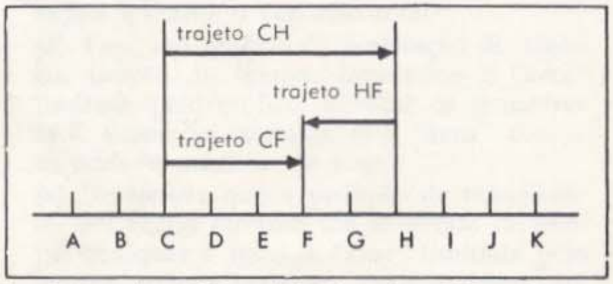

Come evidenzia questo esempio, possiamo rappresentare i due sensi possibili delle traiettorie lungo una retta con numeri positivi e negativi; ad esempio, numeri positivi per frecce che puntano verso destra, e negativi per quelle che puntano verso sinistra. L’addizione e la sottrazione di tali vettori corrispondono alla somma e alla sottrazione di numeri positivi e negativi.

Considerando traiettorie in qualsiasi direzione su una superficie piana, invece di limitarci a una linea retta, ci troviamo di fronte a un nuovo problema. Supponiamo di partire da un punto A. Si percorrono 2,7 km verso nord fino a B, e poi si prosegue camminando 2,7 km verso est fino a C, come indica la **Figura 6 — 2 (a)**. Una traiettoria diretta da A a C dà lo stesso risultato di questi due percorsi separati, come si mostra nella **Figura 6 — 2 (b)**. Possiamo allora scrivere:

Traiettoria AB + Traiettoria BC = Traiettoria AC

È possibile sommare traiettorie con qualsiasi angolazione, come quelle della **Figura 6 — 3**. Si noti che la somma di traiettorie che non sono allineate sulla stessa retta è un tipo di addizione diversa da quella dei numeri. In particolare, la distanza percorsa andando da A a C, passando per B, è maggiore della distanza in linea retta da A a C.

Per indicare una traiettoria da un punto A a un punto B, disegniamo una freccia in B, nel senso da A a B. Il verso della freccia indica il senso della traiettoria, e la lunghezza della freccia ci fornisce la distanza percorsa. Quando vogliamo riferirci a questa traiettoria da A a B, invece di scrivere “Traiettoria AB”, usiamo il simbolo vettoriale **AB**. Così, dalla **Figura 6 — 4 (a)**, concludiamo che:

$\vec{LM} + \vec{MN} = \vec{LN}$

È generalmente più conveniente usare una sola lettera per indicare un vettore. La traiettoria da L a M può essere rappresentata sia con il simbolo $\vec{LM}$ che con il nuovo simbolo **R**. La descrizione della **Figura 6 — 4 (b)** è dunque equivalente.

Per descrivere completamente una traiettoria rettilinea, è necessario conoscerne la lunghezza, la direzione e il punto iniziale o finale. Tuttavia, frequentemente, si ricorda che due traiettorie sono equivalenti se coprono la stessa distanza e nella stessa direzione, anche se partono da punti diversi. Quando siamo interessati soltanto alla distanza e alla direzione, useremo il termine **spostamento** anziché traiettoria. L’affermazione che si è percorso 1,4 chilometri nella direzione 15º ovest descrive completamente lo spostamento. Due vettori della stessa lunghezza e con identica direzione e verso rappresentano lo stesso spostamento. Quando si sposta un libro di un metro verso est e un metro verso nord, esso si trova a $\sqrt{2}$ metri a nord-est, indipendentemente dal punto di partenza.  

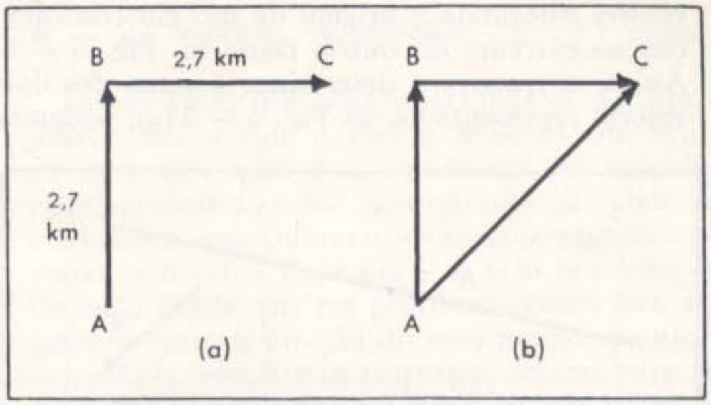

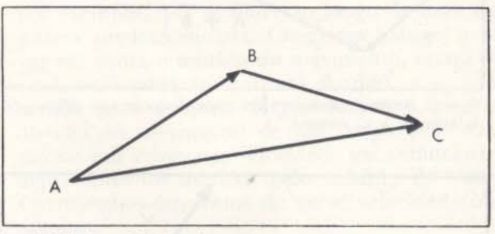

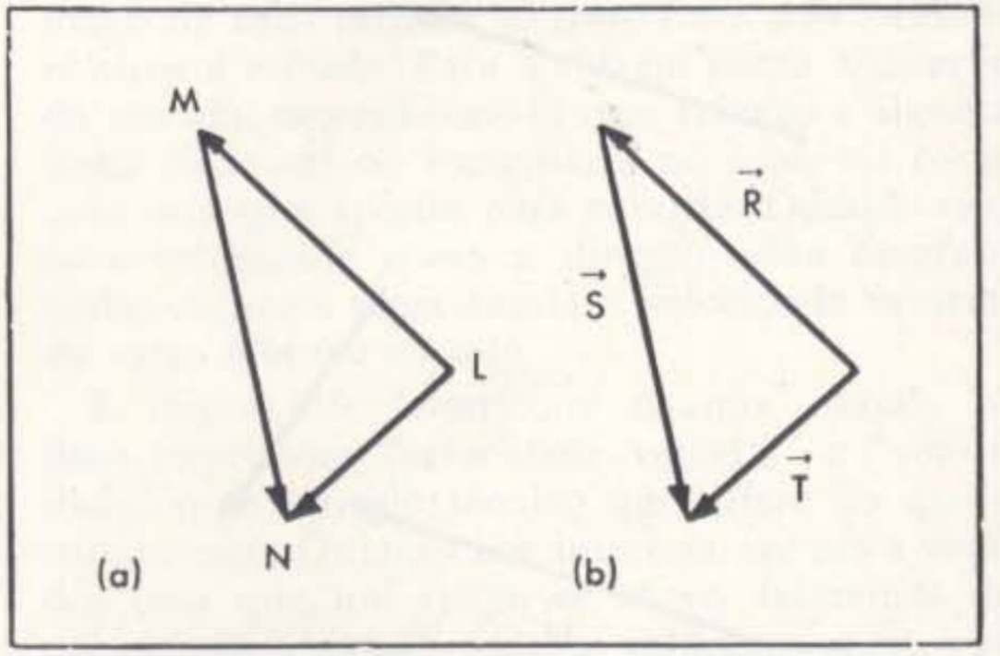

In generale, definiremo un vettore senza specificare dove si trovano le sue estremità, e li sommeremo secondo le regole viste, ponendo l’origine di uno in continuazione con l’estremità dell’altro, come nella **Figura 6 — 4**.  
Così, se vogliamo determinare la somma di due vettori rappresentati nella **Figura 6 — 5 (a)**, possiamo spostarne uno “parallelamente a sé stesso” fino a far coincidere la sua estremità con l’origine dell’altro, come indicato nella **Figura 6 — 5 (b)**. Questo significa che due vettori sono uguali se hanno lo stesso modulo (lunghezza), direzione e verso, indipendentemente da dove siano tracciati. Se è importante la posizione di un’estremità di un vettore, aggiungeremo tale informazione al momento dell’uso.

Sappiamo dunque come sommare vettori. Esiste un procedimento corrispondente per sottrarli? Ricordiamo che quando si lavora con numeri positivi e negativi, la risposta alla domanda:

$0 - 8 =\ ?$

è la stessa della questione:

$6 + (-8) =\ ?$

o del problema:

$6 = 8 +\ ?$

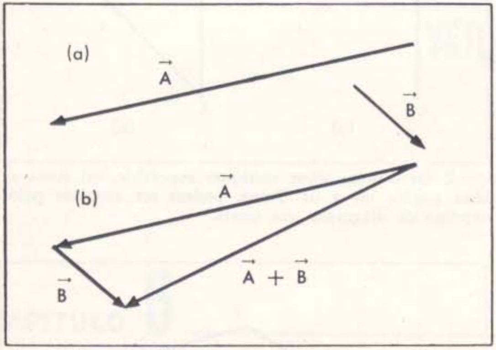

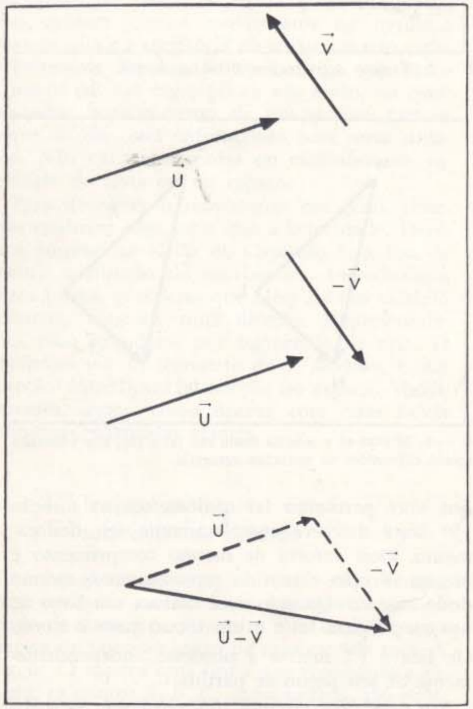

Esistono procedimenti simili per sottrarre vettori. Per capire perché, torniamo alle traiettorie, per un momento. Se si somma la traiettoria BA alla traiettoria AB, si ritorna al punto di partenza. Il risultato è una “traiettoria nulla”. Si dice allora che AB e BA sono traiettorie opposte, la cui somma è zero, e si scrive:

$\vec{AB} + \vec{BA} = 0$

In generale, sommare la traiettoria BA equivale a sottrarre la traiettoria AB, e quindi:

$\vec{CB} - \vec{AB} = \vec{CB} + \vec{BA} = \vec{CB} + (-\vec{AB})$

Le estremità dei vettori non sono rilevanti. L’opposto di un vettore $\vec{V}$ è un qualsiasi vettore $-\vec{V}$, uguale in lunghezza e direzione, ma di verso opposto.  
Possiamo allora sottrarre $\vec{V}$ da $\vec{U}$ sommando $-\vec{V}$ a $\vec{U}$. Il procedimento è illustrato nella **Figura 6 — 6**. Possiamo anche sottrarre $\vec{V}$ da $\vec{U}$ risolvendo il problema:

$\vec{U} = \vec{V} +\ ?$

Nella **Figura 6 — 7** sono indicati il vettore $\vec{U}$, il vettore $\vec{V}$, e la differenza $\vec{U} - \vec{V}$. Si osserva che questo vettore, nella figura, è parallelo al vettore corrispondente di stessa lunghezza e direzione nella **Figura 6 — 6**. Sono, dunque, uguali. I due metodi portano allo stesso risultato; si utilizzi quello che risulta più comodo.

Abbiamo usato spostamenti e l’addizione di spostamenti come esempi delle nuove grandezze che chiamiamo vettori. Possiamo rappresentare queste grandezze con segmenti di retta, ciascuno con una freccia indicante il verso, e la cui lunghezza dà il modulo. Ciò ci fornisce un modo standard di rappresentare i vettori.  
Ma cosa intendiamo veramente per **vettore**? I vettori sono grandezze qualsiasi che si sommano e si sottraggono nello stesso modo degli spostamenti. Si noti che i vettori sono in realtà grandezze nuove, non descrivibili unicamente con numeri. Le grandezze fisiche che possono essere definite semplicemente con numeri sono dette **scalari**. La temperatura di una stanza è un buon esempio di grandezza fisica scalare, mentre uno spostamento di 3 chilometri verso nord-est è una grandezza vettoriale. In fisica incontreremo diversi tipi di vettori.

## **6 — 2. Vettori velocità**

Se un aereo ha una velocità di 250 km/h rispetto all’aria che lo circonda, e soffia un vento di 50 km/h, qual è la velocità dell’apparecchio rispetto al suolo? Questa domanda non può ricevere risposta senza informazioni supplementari, come ad esempio se il vento è frontale, di coda o laterale. Poiché in problemi come questo importano sia la direzione del movimento sia la velocità, dobbiamo impiegare vettori per rappresentare i movimenti, come già avvenuto nella rappresentazione degli spostamenti.

Nel Capitolo 5 abbiamo visto come determinare la velocità istantanea di un oggetto, ad esempio un’automobile, che si muove lungo una traiettoria predeterminata. Abbiamo persino considerato il verso del movimento, usando il segno più per indicare un verso, e il segno meno per l’altro. Rappresenteremo dunque la direzione del movimento di un corpo con la direzione di un vettore, e la velocità istantanea (indipendentemente dal verso) con il modulo del vettore.  
Chiameremo questo vettore **vettore velocità istantanea**.

Quando si determina la velocità di un’auto con riferimento ai chilometri segnati lungo una strada, si ottiene la velocità relativa alla strada. Per tener conto della direzione della strada, la si specifica rispetto a una linea fissa reale o immaginaria sul suolo, come ad esempio una retta orientata verso nord. Quando sono determinate sia la velocità che la direzione, si ha specificata la **velocità vettoriale** dell’auto rispetto al suolo.

È importante sottolineare che stiamo usando i termini “velocità vettoriale” e “velocità” in un senso tecnico, diverso da quello comune. Quando ci interessa solo la rapidità con cui un corpo si muove, parleremo di **velocità**. Quando invece consideriamo anche la direzione, useremo il termine **velocità vettoriale**.  
Pertanto, la velocità vettoriale è un vettore, mentre la velocità è uno scalare.

Torniamo all’esempio dell’aereo menzionato all’inizio di questa sezione. Come possiamo determinare la rapidità con cui l’aereo si muove rispetto al suolo? Per capire cosa è coinvolto, consideriamo una situazione più semplice. Supponiamo di trovarci su un pallone aerostatico, sospesi in aria a qualche centinaio di metri. Se l’aria è perfettamente immobile, il pallone non si muove affatto.  
Se invece tutta la massa d’aria si muove a 10 km/h — in altre parole, se soffia un vento di 10 km/h — il pallone seguirà esattamente questo movimento. Solo quando la massa d’aria varia la sua velocità vettoriale, essa “soffia contro” il pallone, accelerandolo o rallentandolo fino a che esso si muove nuovamente con la stessa velocità dell’aria.

Immaginiamoci ora su un dirigibile, un grande pallone dotato di motore. Con il motore spento, il dirigibile si muove solo come si muove il vento. Ma quando il motore è in funzione, le eliche ci trascinano attraverso l’aria con una certa **velocità vettoriale relativa** alla massa d’aria. Il nostro movimento rispetto al suolo è dunque il risultato combinato del movimento dell’aria rispetto al suolo e del movimento del dirigibile attraverso l’aria.

Lo stesso accade per un aereo. L’apparecchio è sostenuto dall’aria. I suoi motori gli conferiscono una velocità vettoriale attraverso l’aria, che deve essere sommata alla velocità vettoriale del vento per ottenere la velocità vettoriale dell’aereo rispetto al suolo. In particolare, torniamo all’esempio dell’aereo diretto a nord, che attraversa l’aria a 250 km/h. Supponiamo che soffi un vento a 50 km/h verso est. Per “diretto” a nord intendiamo che il muso dell’aereo è esattamente a nord rispetto alla coda. Alcuni minuti dopo, il muso si trova ancora esattamente a nord della coda, ma l’aereo non è esattamente a nord della posizione iniziale.  
Mentre avanzava verso nord, l’aereo si è spostato verso est, seguendo tutta la massa d’aria. Nella **Figura 6 — 8 (a)** è rappresentato l’aereo diretto a nord, in A. Se non ci fosse vento, l’aereo si muoverebbe nella direzione del suo orientamento, e si troverebbe, in seguito, in B. Ma durante il tempo $t$, mentre l’aereo percorre la distanza $t \cdot 250\ \text{km/h}$ da A a B, l’aria si è spostata verso est, coprendo $t \cdot 50\ \text{km/h}$, e in tal modo l’aereo giunge in C.

L’addizione dei due vettori spostamento $\vec{AB}$ e $\vec{BC}$ conduce al vettore $\vec{AC}$, lo spostamento dell’aereo rispetto al suolo. Questi tre vettori formano un triangolo. Ciascun vettore è proporzionale a una velocità in una data direzione: $\vec{AB}$ alla velocità verso nord, $\vec{BC}$ alla velocità verso est, e $\vec{AC}$ alla velocità dell’aereo nella direzione del movimento rispetto al suolo. Dividendo ciascuno di questi spostamenti per il tempo trascorso, si ottiene un triangolo simile che rappresenta le corrispondenti **velocità vettoriali**.  
Avendo verificato che tali velocità vettoriali si sommano esattamente come gli spostamenti, concludiamo che la **velocità vettoriale è un vettore**.

![Figura 8: La parte (a) mostra la somma del vettore spostamento $\vec{AB}$, che rappresenta il movimento dell’aereo attraverso l’aria, e $\vec{BC}$, che rappresenta lo spostamento dell’aria. La loro somma è il vettore $\vec{AC}$, spostamento dell’aereo rispetto al suolo. Dividendo per il tempo trascorso, si ottengono i vettori velocità, come mostrato nella parte (b). La velocità vettoriale dell’aereo rispetto al suolo è il vettore somma della sua velocità vettoriale rispetto all’aria e della velocità vettoriale del vento rispetto al suolo.](Figure/Fig_6_08.png)

Nella **Figura 6 — 8 (b)** è rappresentato il diagramma dei vettori velocità. La velocità vettoriale $v_a$ dell’aereo rispetto all’aria è tracciata con direzione identica a $\vec{AB}$: è un segmento orientato verso nord, lungo in proporzione a 250 km/h. A questa velocità vettoriale dobbiamo sommare la velocità vettoriale del vento rispetto alla Terra ($v_v = 50\ \text{km/h}$ diretta verso est).  
Si ottiene così la velocità vettoriale $v_s$ dell’aereo rispetto al suolo. Sia la sua direzione che il modulo possono essere ottenuti direttamente dal diagramma.  
Poiché $v_a$ e $v_v$ sono perpendicolari in questo esempio, è facile calcolare il modulo della velocità vettoriale rispetto alla Terra. Usando il teorema di Pitagora:

$v_s = \sqrt{v_a^2 + v_v^2} = \sqrt{(250)^2 + (50)^2}\ \text{km/h} = 255\ \text{km/h}$

Si osservi che le diverse velocità sono state indicate con  $v_a$, $v_s$, e $v_v$ per indicare le velocità vettoriali, omettendo il simbolo di vettore sovrapposto. Questa notazione è molto comoda e spesso utilizzata.  
È possibile esercitarsi con i vettori e, in particolare, con le **velocità vettoriali relative**, affrontando il problema di navigazione proposto in questo riquadro. È più complesso rispetto all’esempio trattato in precedenza, ma i concetti fondamentali restano gli stessi.

### Scheda di approfondimento — UN PROBLEMA DI NAVIGAZIONE

Come esempio pratico delle relazioni che abbiamo visto, supponiamo che il navigatore di un aereo desideri andare da una città **C** a un’altra città **D**, distante 900 chilometri da **C**, in direzione **30º est**. Il meteorologo lo informa che soffia un vento da ovest verso est, con velocità di 50 km/h, e lui sa che il pilota intende mantenere una velocità di 240 km/h rispetto all’aria. Per raggiungere **D**, l’aereo deve muoversi sopra il suolo in direzione **30º est**.  
Il problema del navigatore è indicare al pilota l’**orientamento**, cioè la direzione nella quale il velivolo deve essere effettivamente puntato.

Il navigatore risolve il suo problema costruendo un **diagramma dei vettori velocità**, come indicato nella **Figura 6 — 9 (b)**. La **velocità vettoriale** $v_s$ dell’aereo rispetto al suolo si ottiene, in questo caso, come **vettore somma** della velocità vettoriale del vento $v_v$ e della velocità vettoriale dell’aereo rispetto all’aria $v_a$. Il navigatore inizia a tracciare il suo diagramma da un punto qualsiasi **O**, come mostrato nella figura.  
Conosce la direzione in cui deve andare l’aereo, cioè la direzione di $v_s$, e la traccia da **O**. Conosce anche completamente la velocità vettoriale del vento, quindi può tracciare questo vettore, che parte da **O** e si dirige direttamente verso est; il suo segmento **OP** rappresenta la velocità del vento: 50 km/h.  
Successivamente, per ottenere la **velocità vettoriale** $v_s$ dell’aereo rispetto al suolo, il navigatore deve aggiungere $v_a$, la velocità vettoriale dell’aereo rispetto all’aria. Il vettore $v_a$ deve quindi partire dal punto **P**, e avere una lunghezza proporzionale a 240 km/h.

Tuttavia, il navigatore **non conosce la direzione di** $v_a$.  
Tutto ciò che può fare, dunque, è tracciare un **cerchio** con centro in **P** e raggio esattamente proporzionale a 240 km/h.  
Nella **Figura 6 — 9 (b)** vediamo:

- la direzione di $v_s$, tracciata a **30º est**
    
- il vettore $v_v$, che rappresenta la velocità vettoriale del vento
    
- il cerchio che rappresenta tutti i possibili estremi del vettore $v_a$ tracciato da **P**.
    

Si osserva che questo cerchio **intercetta** la direzione di $v_s$ in un solo punto, il punto **R**.  
La **velocità vettoriale dell’aereo rispetto all’aria** deve avere esattamente la direzione che porta da **P** a **R**.

Il vettore $\vec{PR}$ è quindi $v_a$. Questa è l’unica direzione possibile che consente di ottenere la corretta direzione del movimento dell’aereo **rispetto al suolo**.

La **soluzione completa** trovata è mostrata nella **Figura 6 — 9 (c)**.  
Misurando nel diagramma dei vettori velocità, il navigatore determina che:

- **l’orientamento dell’aereo** (la direzione di $v_a$) è **19,89º est**.
    

Questa è la risposta al problema del navigatore. Egli può ora **informare il pilota** sulla direzione da seguire per il volo.

Il compito più importante del navigatore prima del decollo è determinare questa **orientazione**, ma il pilota può anche chiedere **quanto durerà il volo**.  
Per rispondere, il navigatore misura il modulo della velocità rispetto al suolo come appare nel diagramma, ottenendo:

- $v_s \approx 265\ \text{km/h}$
    

Dividendo la distanza di 900 chilometri tra **C** e **D** per questa velocità, prevede che il viaggio durerà circa **3 ore e 25 minuti**.

## **6 — 3. Componenti dei vettori**

Supponiamo che tu voglia attraversare a nuoto un fiume largo 1,4 chilometri. La corrente del fiume scorre a 1,4 km/h. Sei in grado di nuotare con una velocità media di 1 km/h, ma solo per 15 minuti.

Qual è il miglior piano da seguire?

Supponiamo che tu nuoti in modo da mantenere il corpo sempre perpendicolare alla riva. Ti muoverai così attraverso l’acqua in direzione perpendicolare alla corrente, che ti trascinerà costantemente verso valle. Quale sarà la tua velocità vettoriale rispetto alla riva del fiume?  
Se rappresentiamo la tua velocità attraverso l’acqua con $\vec{v_a}$, e quella della corrente con $\vec{v_c}$, la tua velocità vettoriale rispetto alla riva sarà $\vec{v_r}$, come indicato nella **Figura 6 — 10**.

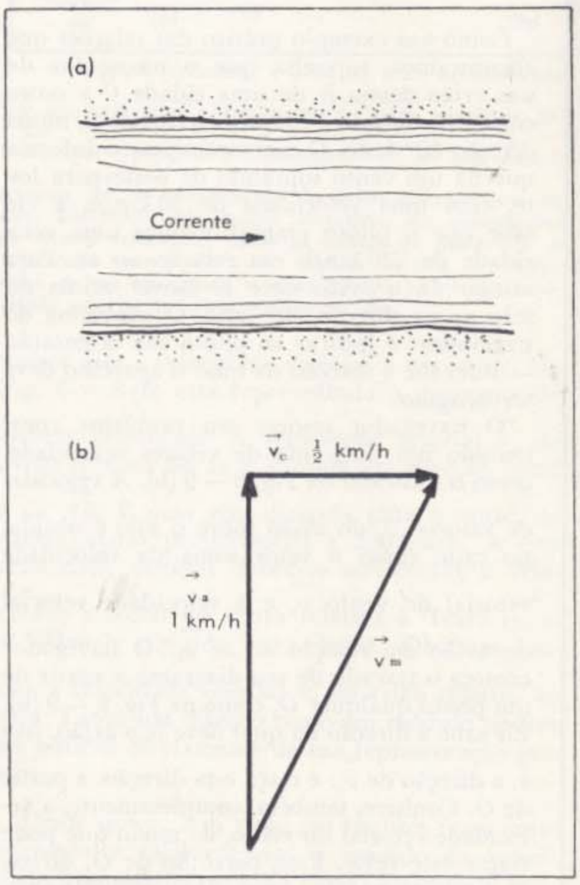

Si può osservare che il modulo di $\vec{v_r}$ è maggiore di quello di $\vec{v_a}$, ma questo consente di attraversare il fiume più rapidamente? No: il movimento perpendicolare alle rive del fiume (che determina il tempo di attraversamento) è sempre lo stesso. L’attraversamento avverrà nello stesso tempo.

La velocità vettoriale $\vec{v_r}$ ci dice soltanto che raggiungerai l’altra riva **più a valle** del punto di partenza.

La velocità vettoriale $\vec{v_r}$ è composta da due parti, perpendicolari tra loro; queste sono dette **componenti rettangolari** di $\vec{v_r}$.  
In questo caso, solo la componente $\vec{v_y}$ perpendicolare alla riva influisce sul tempo di attraversamento. L’altra componente, $\vec{v_x}$, **non altera** l’avanzamento verso l’altra riva.  
Queste componenti rettangolari sono **mutuamente indipendenti**: una non influisce sull’altra. Non importa il valore di $\vec{v_x}$: il tempo di attraversamento sarà sempre 15 minuti.

Supponiamo ora di dover affrontare un problema più difficile: puoi uscire dal fiume solo su una spiaggia situata **esattamente di fronte** al tuo punto di partenza. In tal caso, la tua velocità vettoriale rispetto alla riva deve formare **angolo retto** con essa.  
Ciò significa che la componente della tua $\vec{v_r}$ **parallela alla riva** deve essere nulla. Dovrai orientare il corpo controcorrente, in modo che la componente della tua velocità $\vec{v_a}$ (vedi **Figura 6 — 11**) **parallela alla riva**, sia uguale in modulo e opposta in verso a $\vec{v_c}$.

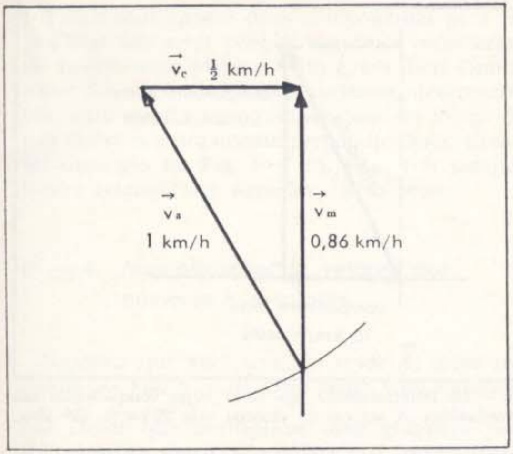

La tua velocità vettoriale attraverso il fiume, in questo caso, sarà di circa **0,86 km/h**, e **non sarai in grado di completare l’attraversamento**. Forse potrai guadare la parte restante.

Abbiamo visto che orientarsi controcorrente rende più difficile attraversare il fiume.  
Cosa accadrebbe se ti orientassi **un po’ nella direzione della corrente**? Naturalmente, **non** raggiungeresti la spiaggia, ma **almeno riusciresti ad attraversare** il fiume?  
Sei d’accordo che una corrente **perpendicolare** alla traiettoria pianificata **non può aiutarti**?

Ogni vettore $\vec{A}$ su un piano può essere rappresentato da **due componenti rettangolari**.  
Si scelgono anzitutto **due direzioni di riferimento perpendicolari** — ad esempio, le direzioni date dagli assi **OX** e **OY** nella **Figura 6 — 12**.

Per costruire la componente del vettore $\vec{A}$ lungo la direzione **OX**, si traccia una perpendicolare a **OX** che passa per l’estremo di $\vec{A}$.  
Poi si disegna il vettore parallelo a **OX**, che parte dall’inizio di $\vec{A}$ e termina su tale perpendicolare. Questo è il **vettore componente lungo OX** (a volte chiamato componente X di $\vec{A}$).  
Per ottenere il **componente nella direzione OY**, si procede in modo simile (vedi **Figura 6 — 12**).

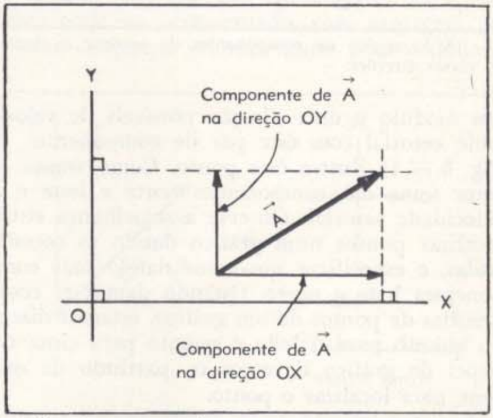

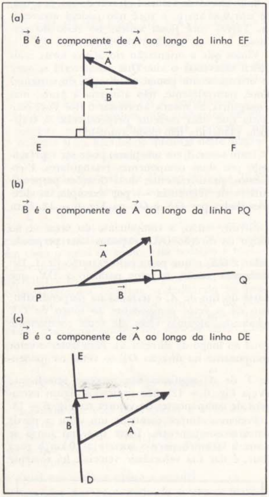

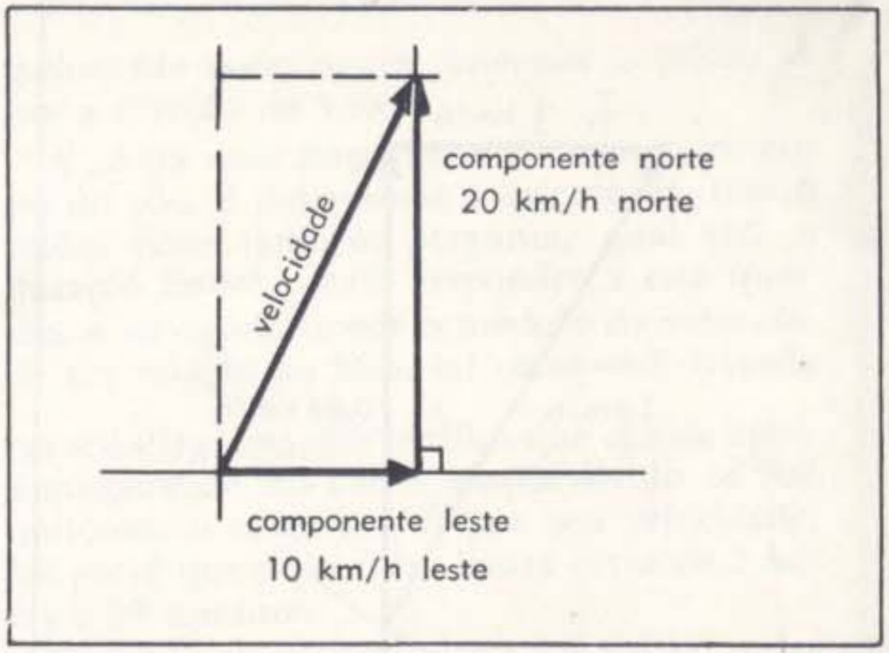

Un vettore può essere ricostruito a partire dalle sue componenti note. La **Figura 6 — 14** illustra questo concetto. Come si vede, il vettore somma delle componenti nord e est è la velocità vettoriale. Si noti la somiglianza tra il **localizzare punti su un grafico** fornendo le coordinate, e lo **specificare un vettore** fornendo le sue componenti est e nord.  
Quando diamo le coordinate di punti su un grafico, stiamo dicendo **di quanto muoversi verso destra** e **di quanto verso l’alto** partendo dall’origine, per localizzare il punto.

Si potrebbe rappresentare un vettore usando direzioni di riferimento che **non** siano perpendicolari tra loro. Tuttavia, le componenti **rettangolari** offrono vantaggi significativi rispetto a qualsiasi altra scelta.  
Come abbiamo visto nel caso del nuotatore, esse sono **indipendenti tra loro**. Tutti i sistemi di direzioni rettangolari di riferimento possiedono questa proprietà di **indipendenza**.

Se un vettore $\vec{R}$ è **perpendicolare** a una retta di riferimento **AB**, qual è la sua **componente lungo AB**?  
La componente di $\vec{R}$ lungo AB **cambia** se la componente **perpendicolare** ad AB viene **raddoppiata**?

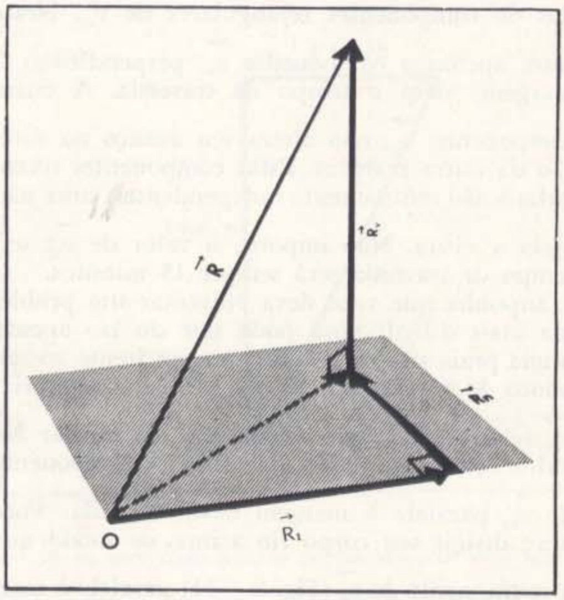

Fino ad ora abbiamo utilizzato **due componenti** per specificare un vettore, poiché abbiamo considerato vettori su un piano — cioè in **due dimensioni**.  
In **tre dimensioni**, possiamo determinare un vettore fornendo le sue **componenti lungo tre direzioni mutuamente perpendicolari**. Come illustrato nella **Figura 6 — 15**, queste tre componenti rettangolari, sommate tra loro, costituiscono il vettore.

## **6 — 4. Moltiplicazione di vettori per numeri e scalari**

Supponiamo di avere un vettore $\vec{A}$, come indicato nella **Figura 6 — 16**.  
Che cosa si intende, secondo te, per $2\vec{A}$?  
Poiché moltiplicare una grandezza per due significa **sommare la grandezza a sé stessa**, concludiamo che:

$$2\vec{A} = \vec{A} + \vec{A}$$

e vediamo che $2\vec{A}$ è un vettore il cui **modulo è il doppio** di quello di $\vec{A}$, e che **punta nella stessa direzione**.  
In generale, $k\vec{A}$, dove $k$ è un qualsiasi numero positivo, rappresenta un vettore **parallelo** a $\vec{A}$, e di **modulo $k$ volte maggiore**.

Ma cosa ci si deve aspettare nel caso in cui $k$ sia **negativo**?

Cosa significa $k\vec{A}$, ad esempio, per $k = \frac{1}{4}$?  
In algebra, $\frac{1}{4}x$ è il numero che sommato quattro volte dà $x$.  
Qui, $\frac{1}{4}\vec{A}$ indica il vettore che, sommato quattro volte, restituisce $\vec{A}$.  
Il **vettore lungo un quarto** e con la stessa direzione di $\vec{A}$ soddisfa questa condizione. Si può dimostrare che **nessun altro vettore** lo fa, poiché qualsiasi altro differirebbe in direzione o in modulo.

Riassumendo: **moltiplicare o dividere un vettore per un numero comune** significa moltiplicare o dividere il modulo, **lasciando invariata la direzione**.

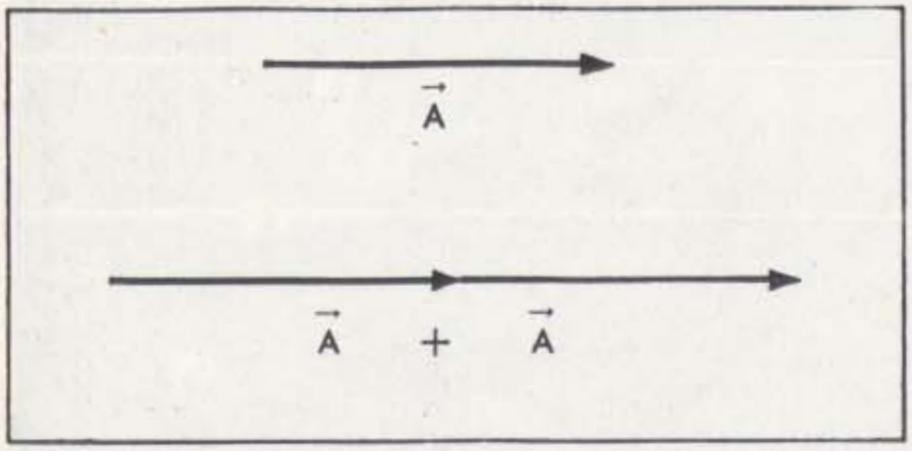

La regola appena trovata per la moltiplicazione di un vettore per un numero, come il 2, si applica ugualmente alla **moltiplicazione di un vettore per una grandezza scalare qualsiasi**, come ad esempio un **intervallo di tempo**.  
Esiste però una differenza importante tra moltiplicare per un semplice numero e moltiplicare per uno scalare che **possiede unità di misura**.

Quando un vettore viene moltiplicato per un numero, il **nuovo vettore ha le stesse unità** del vettore originale. Può essere tracciato nello stesso diagramma del vettore originale, e alla stessa scala.  
Quando invece si moltiplica un vettore per uno **scalare con unità**, le **unità del prodotto** sono diverse da quelle del vettore originale.  
Per evitare confusione, è preferibile rappresentare il nuovo vettore in **un altro diagramma**.

Supponiamo, ad esempio, che un aereo stia volando verso nord-est a **300 km/h**. Possiamo rappresentare il suo **vettore velocità** come nella **Figura 6 — 17**.

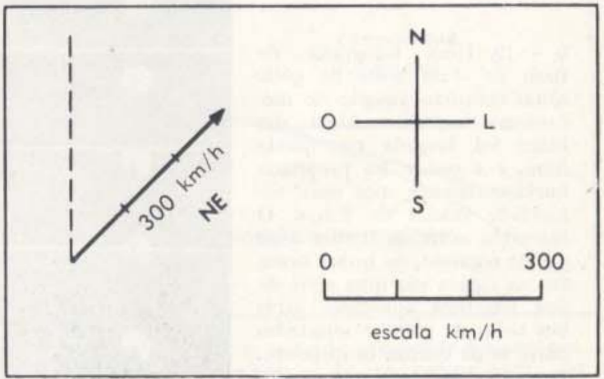

Se l’aereo vola per **1 ora**, sperimenta uno **spostamento** $\vec{R} = \vec{v}t = (300\ \text{km/h, nord-est}) \cdot (1\ \text{h}) = 300\ \text{km, nord-est}$.  
Possiamo rappresentare questo vettore spostamento in un **altro diagramma vettoriale**, come nella **Figura 6 — 18 (a)**, usando una **scala diversa** per rappresentare una distanza, invece di una velocità.  
Se l’aereo prosegue per un’altra **mezz’ora**, sperimenta un secondo spostamento uguale al primo, e la **somma** dei due deve essere **esattamente uguale a due volte** lo spostamento originale.

Lo **spostamento totale** di **600 km verso nord-est** può quindi essere rappresentato con vantaggio nello **stesso diagramma vettoriale** usato per lo spostamento originale, come mostrato nella **Figura 6 — 18 (b)**.  
**Non dovrebbe essere inserito nello stesso diagramma** del vettore velocità da 300 km/h, perché si tratta di **grandezze fisiche differenti**, con **unità diverse**.

## **6 — 5. Variazioni della velocità vettoriale e vettore accelerazione costante**

Nella **Figura 6 — 19** è riportata una fotografia a flash multipli di due palline. La pallina di sinistra cade verticalmente. Analizziamone il movimento determinando i vettori velocità in intervalli successivi di caduta.  
Possiamo ottenere il vettore velocità media per un dato intervallo temporale misurando la distanza tra due immagini successive della pallina e dividendo per l’intervallo di tempo tra i flash. Questo ci dà il **modulo** del vettore velocità; la sua **direzione** è quella del movimento tra le due immagini.

Nella **Figura 6 — 20** abbiamo misurato i successivi spostamenti e li abbiamo disposti affiancati. Poiché le linee bianche della **Figura 6 — 19** sono separate da 15 cm, e l’intervallo tra i flash è di 1/10 di secondo, abbiamo costruito una scala che consente di leggere direttamente questi vettori come **velocità vettoriali medie**.

Un rapido sguardo alla **Figura 6 — 20** mostra che il vettore velocità **varia costantemente**: a ogni intervallo aumenta di una quantità costante.  
Possiamo quindi scrivere:

$$\vec{v} = \vec{v_0} + n \cdot \Delta \vec{v}$$

dove $\vec{v_0}$ è il vettore velocità iniziale, e $\Delta \vec{v}$ è la **variazione costante di velocità vettoriale** a ogni intervallo. Sommando $n$ variazioni a $\vec{v_0}$ otteniamo la velocità alla fine del $n$-esimo intervallo.

Possiamo riscrivere quest’equazione per renderla simile a quelle già sviluppate per il moto lungo traiettorie prefissate (si veda Cap. 5, Sez. 5-6 e 5-7). Lì avevamo definito:

$$a = \frac{\Delta v}{\Delta t}$$

cioè l’accelerazione lungo la traiettoria. Qui, dividendo $\Delta \vec{v}$ per $\Delta t$, introduciamo il **vettore accelerazione**:

$$\vec{a} = \frac{\Delta \vec{v}}{\Delta t}$$

e la nostra equazione diventa:

$$\vec{v} = \vec{v_0} + \vec{a}t$$

dove $t$ è il tempo durante il quale la velocità vettoriale è passata dal valore iniziale $\vec{v_0}$ al valore al tempo $t$.

La velocità vettoriale di caduta della pallina **aumenta uniformemente**, come possiamo mostrare con fotografie flash scattate a intervalli di tempo sempre minori. Dopo un certo tempo $t$, essa sarà:

$$\vec{v} = \vec{u} + \vec{a}t$$

Abbiamo appena descritto il moto di caduta di una pallina usando il linguaggio dei vettori. Ma poiché la pallina si muove verso il basso lungo una traiettoria **rettilinea** e **nota**, non sarebbe stato necessario usare vettori: l’analisi poteva essere condotta anche usando velocità e accelerazione **lungo la traiettoria**, specificando che il moto è **sempre rettilineo e discendente**. Tuttavia, il linguaggio vettoriale diventa **molto utile** quando si analizzano **moti più complessi**.

Torniamo quindi alla **Figura 6 — 19** e analizziamo il moto dell’altra pallina, quella che si muove **verso destra** nella figura.

La seconda pallina si muove **verso destra e verso il basso**. Poiché la distanza tra le sue posizioni successive aumenta, deduciamo che la **velocità vettoriale aumenta**.  
E poiché la traiettoria **non è rettilinea**, anche la **direzione della velocità vettoriale cambia**.

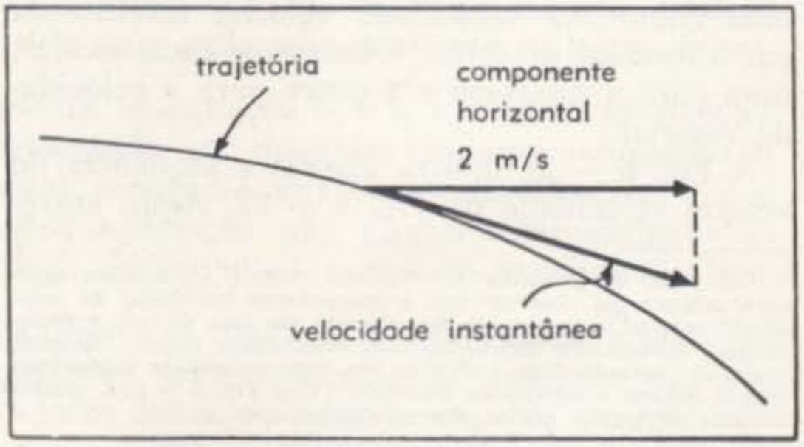

Possiamo analizzare la **Figura 6 — 19** per ottenere la **velocità vettoriale istantanea** della pallina in diversi punti della traiettoria.  
I risultati di tale analisi sono mostrati nella **Figura 6 — 22**, dove abbiamo in un unico grafico sia la **posizione** della pallina che la sua **velocità vettoriale istantanea** a intervalli di 0,10 s.  
Si notino le **due scale**: una per la distanza e una per la velocità vettoriale.

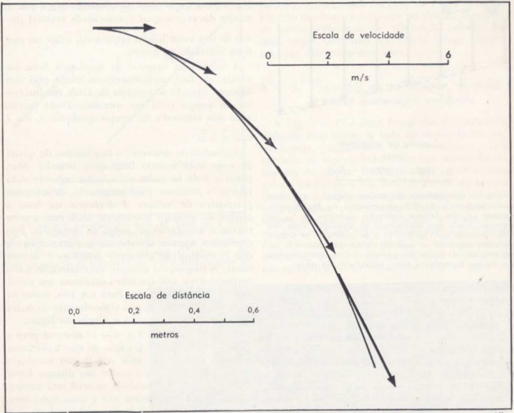

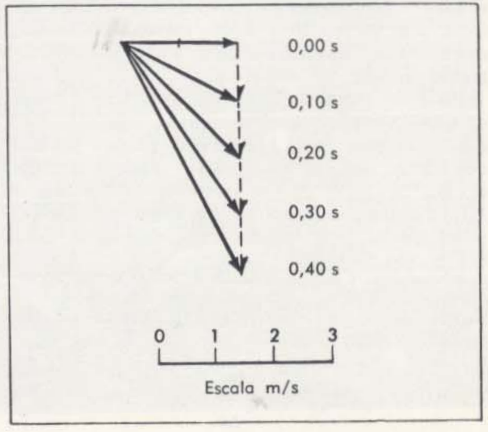

La **Figura 6 — 23** mostra solo la sequenza dei vettori velocità della **Figura 6 — 22**. I vettori successivi si ottengono **sommando un vettore costante diretto verticalmente verso il basso**.
Un modo per trovare la velocità vettoriale istantanea in questo caso consiste nell’osservare che la componente orizzontale della velocità vettoriale è costante.
Ciò deriva dal fatto che lo spostamento orizzontale è lo stesso in ogni intervallo di tempo.
Otteniamo quindi $\vec{v}$ a partire da questo dato e dal fatto che il vettore velocità istantanea indica sempre la direzione della traiettoria (vedi Figura 6 — 21).
Altri metodi di analisi possono fornire risultati ancora più precisi.

Pertanto, tracciamo i **vettori velocità** partendo da uno stesso punto.  
L’analisi di questa figura ci mostra che i vettori successivi si ottengono **aggiungendo ogni volta un vettore di circa 1 m/s** (in realtà **0,98 m/s**), diretto verticalmente verso il basso. Possiamo esprimere questa regola in forma di equazione.

Cominciamo esprimendo le **componenti della velocità vettoriale**:

- La **componente orizzontale** della velocità vettoriale è: $$v_x = 2,00\ \text{m/s},\ \text{verso destra}$$e rimane costante durante tutto il movimento.
    
- La **componente verticale** è nulla per $t = 0{,}00\ \text{s}$ e **aumenta di 0,98 m/s ogni 0,10 s**. Si tratta quindi di un **aumento uniforme al ritmo di 9,8 m/s²**. Di conseguenza, la componente verticale della velocità vettoriale in qualsiasi istante $t$ è: $$v_y = (9{,}8\ \text{m/s}^2) \cdot t,\ \text{verso il basso}$$
Componendo le due componenti rettangolari per ottenere il **vettore velocità** in un qualsiasi istante $t$, otteniamo:

- $\vec{v}(t) = (2{,}00\ \text{m/s},\ \text{verso destra}) + (9{,}8\ \text{m/s}^2)\cdot t,\ \text{verso il basso}$
    

La componente verticale di questo vettore è il **prodotto tra un tempo e un’accelerazione**.  
Poiché il tempo è in secondi e l’accelerazione in m/s², il prodotto ha unità di m/s, come si conviene a una componente di velocità.  
Questo è un altro esempio del principio (visto nella Sezione 6–4) secondo cui la **moltiplicazione di un vettore per uno scalare** restituisce un nuovo vettore nella stessa direzione, ma con modulo pari al prodotto dello scalare per il modulo del vettore originale.

Possiamo scrivere l’equazione del **moto della pallina lanciata orizzontalmente** nello stesso modo con cui abbiamo descritto la caduta libera:

- La velocità iniziale $\vec{v_0} = (2{,}00\ \text{m/s},\ \text{verso destra})$
    
- L’accelerazione costante $\vec{a} = (9{,}8\ \text{m/s}^2,\ \text{verso il basso})$
    

Otteniamo quindi:

$$\vec{v}(t) = \vec{v_0} + \vec{a}t$$

Si noti che **l’accelerazione** di entrambe le palline è **diretta verso il basso**.  
Il moto discendente è lo stesso per entrambe, come si può verificare osservando che percorrono la stessa distanza in verticale a ogni intervallo di tempo.  
L’unica differenza nelle due descrizioni è nel valore di $\vec{v_0}$.  
Il **vettore accelerazione** $\vec{a}$ è lo stesso per entrambe.

Nel **Capitolo 5** avevamo visto che $v = v_0 + at$ descriveva la velocità in qualsiasi istante nel caso di **accelerazione costante lungo la traiettoria**.  
Ora, la formula $\vec{v} = \vec{v_0} + \vec{a}t$ descrive il **vettore velocità** in qualsiasi istante, purché $\vec{a}$ sia costante.

Si noti che il **vettore accelerazione** non deve necessariamente essere diretto lungo la traiettoria, come dimostrato nel caso della pallina destra nella **Figura 6 — 19**.  
Inoltre, $\vec{a}$ può essere **qualunque vettore costante con le corrette unità fisiche**.

Il valore **$9{,}8\ \text{m/s}^2$ verso il basso**, che abbiamo ottenuto per le palline, è solo un **caso particolare**, che si verifica quando esse si muovono **liberamente vicino alla superficie terrestre**.  
Studiando altri tipi di movimento, incontreremo **altri valori costanti di $\vec{a}$**, e anche **vettori accelerazione che variano nel tempo**.  
Ad esempio, **spingendo una pallina**, possiamo ottenere qualunque accelerazione $\vec{a}$ desideriamo.

## **6 — 6. Accelerazione variabile e accelerazione vettoriale istantanea**

Nella sezione precedente abbiamo descritto un moto con **accelerazione vettoriale costante**.  
Abbiamo introdotto il **vettore accelerazione** per descrivere come varia il **vettore velocità**. Anche quando l’accelerazione vettoriale **non è costante**, possiamo introdurla nello stesso modo, definendola come:

$$\vec{a} = \frac{\Delta \vec{v}}{\Delta t}$$

dove $\Delta \vec{v}$ è la variazione del vettore velocità durante l’intervallo $\Delta t$.  
Si noti che questo vettore accelerazione ha **la stessa direzione di $\Delta \vec{v}$**.  
Poiché $\Delta \vec{v}$ **non deve necessariamente avere la stessa direzione della velocità**, anche $\vec{a}$ può essere **diretta in qualsiasi verso rispetto alla traiettoria**, come abbiamo visto nel caso della pallina destra nella sezione precedente.

L’accelerazione vettoriale così definita è l’**accelerazione media** durante l’intervallo di tempo $\Delta t$.  
Se però l’accelerazione **varia nel tempo**, il suo valore dipenderà dall’intervallo scelto.

Supponiamo, per esempio, di avere una **motoscafo** che si muove lungo la traiettoria indicata nella **Figura 6 — 25 (a)**.  
All’istante $t_1$ ha velocità $\vec{v_1}$, e a un istante successivo $t_2$ ha velocità $\vec{v_2}$.  
Qual è l’**accelerazione media** nell’intervallo $t_2 - t_1$?  
Per rispondere, dobbiamo **determinare $\Delta \vec{v} = \vec{v_2} - \vec{v_1}$**, e poi dividere per $\Delta t$.  
Questo procedimento è illustrato nella **Figura 6 — 25 (b)**.

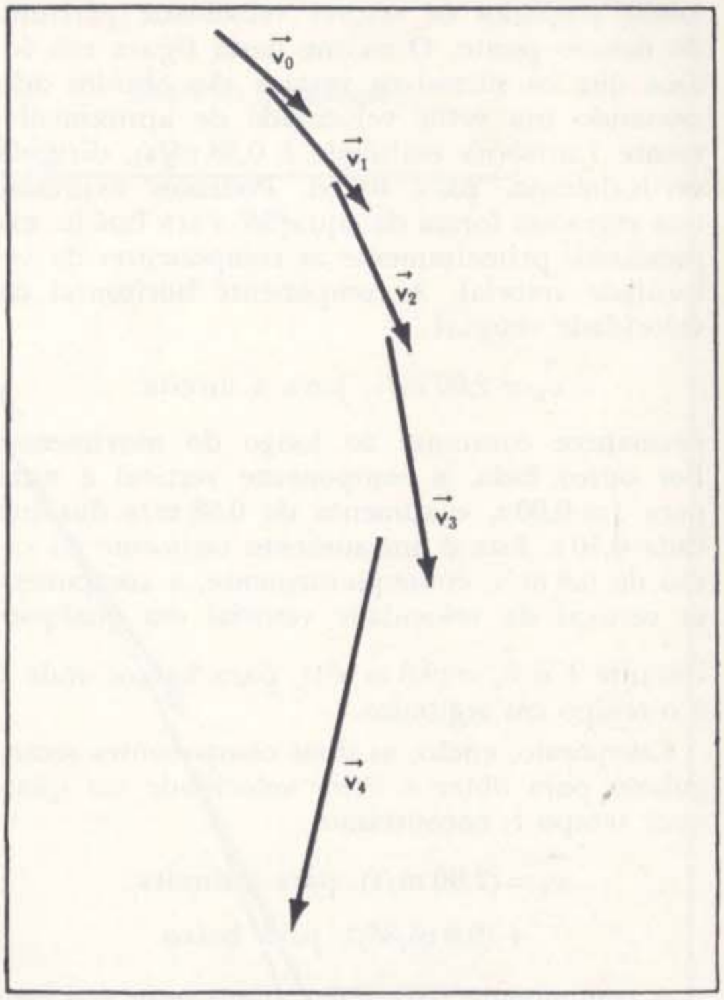

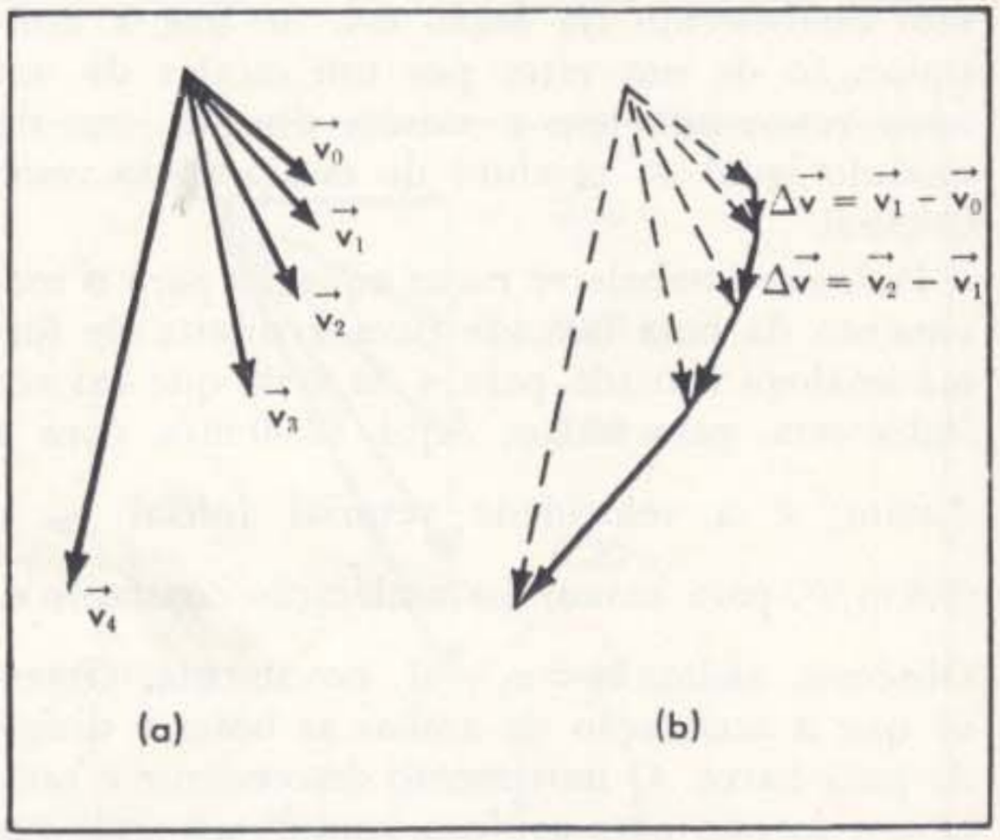

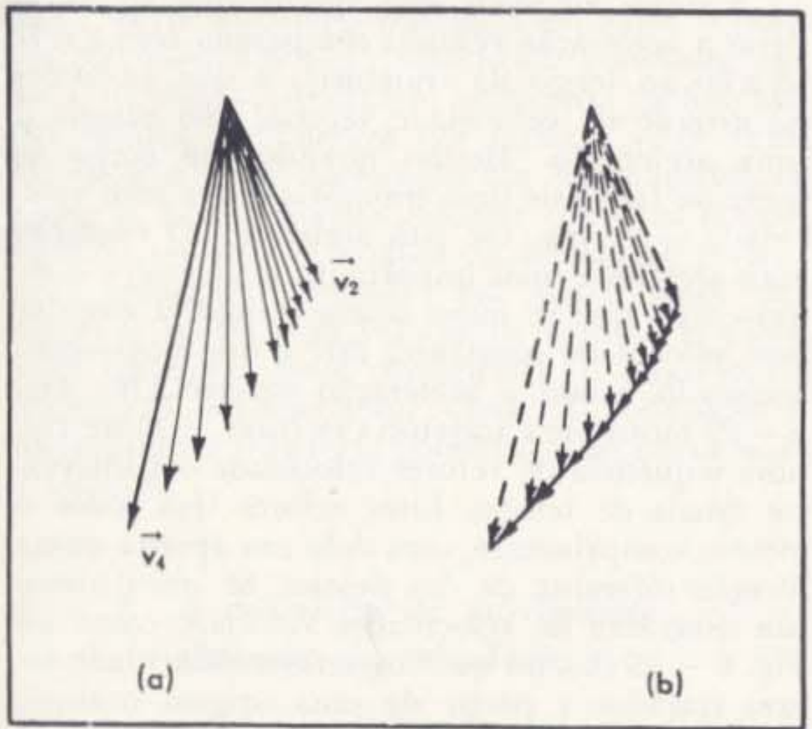

Con il procedere del movimento, l’**accelerazione può variare**. Non ci aspettiamo affatto che resti costante lungo l’intero intervallo $t_1 \rightarrow t_2$.

In casi simili, abbiamo bisogno di conoscere **l’accelerazione vettoriale istantanea** in istanti specifici, piuttosto che una media su vari intervalli.

Per trovare l’accelerazione vettoriale **istantanea** in un dato istante $t$, si calcola l’**accelerazione media su intervalli sempre più piccoli** contenenti quell’istante.  
L’accelerazione istantanea si definisce allora come **il limite** del rapporto $\Delta \vec{v} / \Delta t$ quando $\Delta t \to 0$.  
Questo **vettore limite** ha di norma **modulo e direzione ben definiti**.

Per esempio, la **Figura 6 — 25** mostra i **vettori velocità successivi della lancia** a intervalli di 10 secondi.  
Se costruiamo una fotomontaggio in cui tutti questi vettori partono da un’origine comune, otteniamo la **Figura 6 — 26**.  
Le variazioni di velocità $\Delta \vec{v}$ in ciascuno dei quattro intervalli differiscono sia in **modulo** che in **direzione**, quindi anche le **accelerazioni medie** risultano diverse.

Se invece usiamo intervalli di tempo di **2 secondi**, otteniamo i diagrammi nella **Figura 6 — 27**.  
Poiché i dettagli sono difficili da distinguere, nella **Figura 6 — 28** è mostrata una **versione ingrandita (5×)** dei primi 10 secondi.  
Osserviamo che tutte e cinque le variazioni di velocità $\Delta \vec{v}$ **differiscono molto meno** in modulo e direzione rispetto a quelle della **Figura 6 — 26 (b)**.

Scegliendo intervalli ancora più piccoli di 2 secondi, le successive variazioni di velocità vettoriale sarebbero ancora più simili.  
Possiamo in generale scegliere intervalli **sufficientemente brevi** da far sì che l’accelerazione **non cambi sensibilmente** tra un intervallo e l’altro, né in modulo né in direzione.

Con questa comprensione del termine “molto breve”, possiamo dire che **l’accelerazione vettoriale istantanea in un dato istante $t$** è **l’accelerazione media** calcolata su un intervallo brevissimo che include quell’istante.  
In termini matematici, è il **limite del rapporto $\Delta \vec{v} / \Delta t$** quando $\Delta t$ tende a zero.

Come visto nella **Sezione 5–6**, l’accelerazione vettoriale istantanea si definisce come:

$$\vec{a} = \lim_{\Delta t \to 0} \frac{\Delta \vec{v}}{\Delta t}$$

La novità introdotta dal concetto di accelerazione vettoriale rispetto a quella lungo la traiettoria è che **le variazioni nella direzione della velocità generano accelerazione**.  
Anche quando un corpo si muove lungo una traiettoria **curva** con **velocità costante**, esso è comunque soggetto ad **accelerazione**.

Il caso più semplice e più importante è quello di un corpo che si muove lungo **una traiettoria circolare a velocità costante**. Si tratta di un **moto accelerato**, anche se l’accelerazione varia.

Nella **Figura 6 — 29 (a)** si mostra una traiettoria circolare con una sequenza di vettori velocità a intervalli temporali uguali.  
Questi vettori hanno **tutti la stessa lunghezza**, ma **direzioni differenti**.

Tracciando questi vettori velocità con **origine comune**, come nella **Figura 6 — 29 (b)**, si osserva che le successive **variazioni di velocità vettoriale** $\Delta \vec{v}$ differiscono tra loro in **direzione**.  
Poiché queste variazioni **non sono parallele**, ne consegue che il **vettore accelerazione** non può essere costante.

Riducendo gli intervalli di tempo, come nella **Figura 6 — 29 (c)**, si vede che **l’accelerazione vettoriale istantanea è perpendicolare al vettore velocità** in ogni istante.  
Il fatto che l’**angolo tra i due vettori rimanga sempre di 90°** indica che essi **ruotano a una velocità angolare uniforme**.

Questo esempio mostra che **un’accelerazione può derivare da un cambiamento di direzione**, anche **senza variazioni di velocità**.  
Nel moto rettilineo, invece, l’accelerazione rappresenta la **variazione del modulo della velocità**.

In generale, se un corpo si muove lungo una traiettoria curva, la sua **accelerazione vettoriale forma un certo angolo** con la traiettoria.

- La **componente lungo la traiettoria** determina la **variazione del modulo** della velocità.
    
- La **componente perpendicolare** riguarda il **cambiamento di direzione** del vettore velocità.
    

Puoi usare questo fatto per dimostrare che, nel **moto circolare uniforme**, l’**accelerazione è diretta lungo il raggio** del cerchio?

È possibile far muovere un oggetto con **velocità costante lungo una traiettoria qualsiasi**.  
In tal caso, poiché il modulo della velocità non cambia, l’accelerazione **non può avere componente lungo la traiettoria**.  
Essa sarà allora **perpendicolare al moto**, cioè **perpendicolare alla traiettoria in ogni punto**.

Il **moto circolare uniforme** è dunque solo uno dei molti casi in cui i vettori **velocità e accelerazione** sono **ortogonali**.  
Nel moto circolare, però, **il modulo dell’accelerazione rimane costante**.  
Quando invece un corpo si muove a velocità costante lungo **una traiettoria più complessa**, il **modulo dell’accelerazione perpendicolare varia**.  
Essa è **maggiore nei tratti in cui la curva è più accentuata**.

## **6 — 7. La descrizione del movimento; sistemi di riferimento**

Abbiamo studiato i **vettori** in modo approfondito per descrivere il movimento, riportare le **posizioni successive di un oggetto nello spazio** e la rapidità con cui si muove attraverso di esso.  
Anche i movimenti aggraziati di un valzer possono essere descritti completamente — seppure in modo un po' noioso — come **una sequenza di posizioni** delle mani, dei piedi e del resto del corpo dei ballerini, una posizione adatta per ogni istante.  
Danzare seguendo la musica significa, di fatto, **misurare il tempo**: per ogni nota esiste una figura coreografica corretta, corrispondente a un determinato momento.

Il movimento più semplice e fondamentale è quello di un **singolo oggetto**, le cui parti non riteniamo necessario distinguere — sia perché non possiamo osservarle, sia perché restano fisse le une rispetto alle altre.  
Un pianeta, come **Giove**, si muove nel cielo. Possiamo rappresentarne la posizione, in ogni istante, con un **vettore** che immaginiamo tracciato dalla Terra a Giove.  
Un aereo rimbomba nel cielo mentre si dirige verso una destinazione; anche le sue posizioni possono essere rappresentate da vettori (**Figura 6 — 32**).  
Né il pianeta né l’aereo sono punti materiali: se volessimo sapere cosa accade al loro interno, avremmo bisogno di molte più informazioni rispetto a quelle fornite da questi vettori di posizione.  
Per molte esigenze dell’**astronomia** o della **navigazione**, tuttavia, è sufficiente considerarli **come punti situati all’estremità di un vettore**.  
Quando il pianeta o l’aereo si muovono, **il vettore posizione cambia**, modificando **modulo e direzione**.

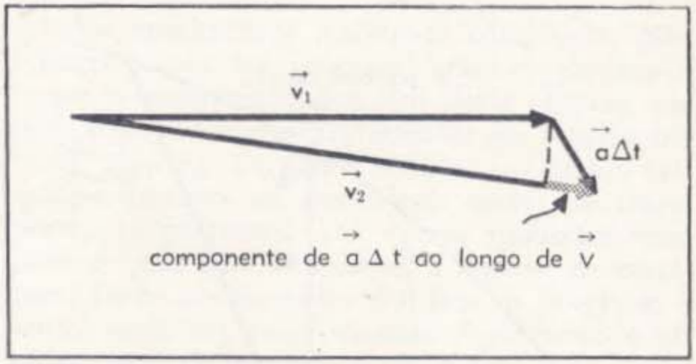

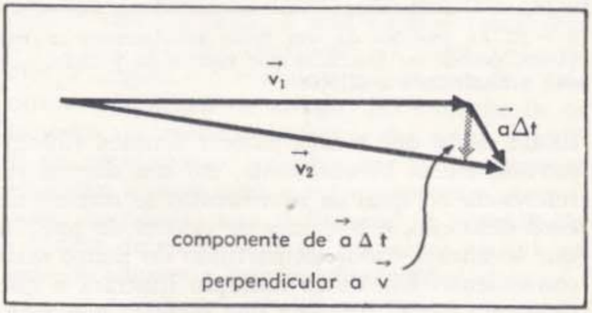

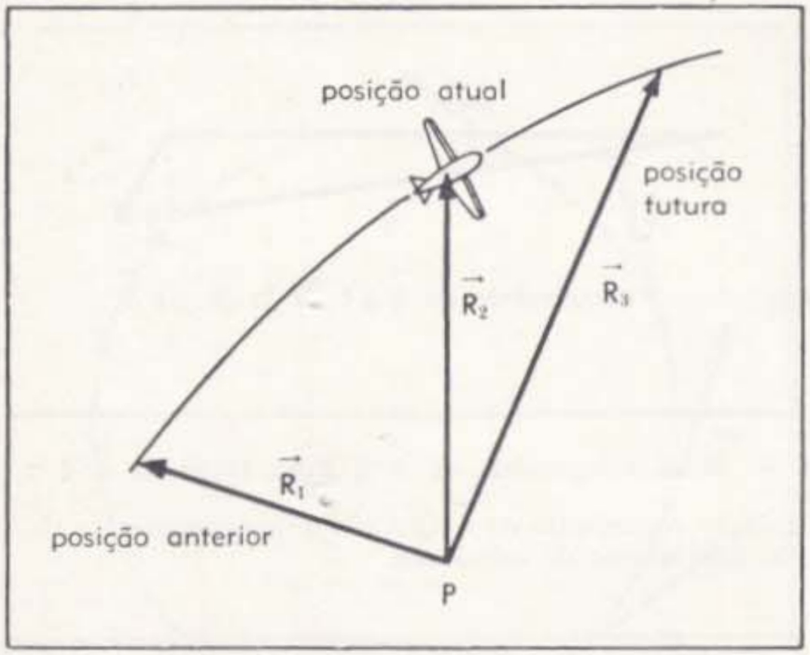

In ciascuno degli esempi, il vettore posizione va da un punto identificabile, detto **origine**, all’oggetto in movimento: dalla Terra a Giove, dalla torre di controllo all’aereo.  
Inoltre, come osservato nella **Sezione 6–2**, il **movimento è sempre misurato rispetto a un sistema di riferimento**, così come lo sono le posizioni.

Il movimento dell’aereo, ad esempio, è descritto **rispetto alla superficie terrestre**, così come il moto delle palline nella **Figura 6 — 19**.  
Il movimento dell’aereo **rispetto a un altro aereo** può essere molto diverso da quello **rispetto al suolo**.  
Il moto della pallina lanciata nella Figura 6 — 19, ad esempio, è un moto a **velocità vettoriale costante rispetto** all’altra pallina che cade verticalmente.  
Il moto di **Giove rispetto al Sole** è **più semplice** di quello rispetto alla Terra.  
Per un automobilista in marcia, una goccia di pioggia che cade **verticalmente** rispetto al suolo, appare **quasi orizzontale** nella sua direzione.

Il **modo in cui descriviamo il movimento** dipende dunque dal **sistema di riferimento** rispetto al quale lo osserviamo.

In genere vogliamo descrivere il moto **in modo che sembri semplice**. Ci collochiamo mentalmente in un **sistema di riferimento** in cui i movimenti appaiano più facili da descrivere, e tracciamo i **vettori posizione** a partire da un punto conveniente.

Un altro esempio può chiarire il concetto. Supponiamo di essere nuovamente sulla Terra, e di osservare il **moto di un punto sulla periferia di una ruota** che si muove lentamente.  
Il punto si muove lungo una curva complicata chiamata **cicloide**, illustrata nella **Figura 6 — 33**.  
Un vettore posizione con origine fissa sulla Terra e diretto verso questo punto esegue un movimento **estremamente complesso**.  
Un punto sulla Terra non è sempre l’origine più adatta per i vettori posizione.

Se ci spostiamo **sull’auto**, e osserviamo la ruota **dal finestrino**, il punto sulla ruota si muove **uniformemente lungo una traiettoria circolare**, e il vettore posizione appare **molto più semplice**.

Nella descrizione del moto, cerchiamo di collocare l’**origine nel punto più conveniente**, anche se a volte **non possiamo fisicamente raggiungerlo**.  
I **moti planetari**, ad esempio, appaiono complicati se descritti con vettori di posizione la cui origine è **la Terra**.  
**Copernico** evidenziò che i moti dei pianeti diventano **molto più semplici** se si considera il **Sole come centro** del sistema solare.  
**Spostare l’origine dei vettori al Sole** è stata un’intuizione cruciale.  
Da allora, la **scelta dell’origine** nel luogo più adatto è diventata **una tecnica fondamentale della fisica** per descrivere i movimenti in termini semplici.

## **6 — 8. Cinematica e dinamica**

Quanto abbiamo discusso finora costituisce il ramo della fisica chiamato **cinematica**, dal termine greco _kínema_, che significa “movimento”.  
È quella parte della fisica che si occupa della **descrizione del movimento**, senza considerare **cosa** si muove o **cosa lo provoca**.  
La scienza della **meccanica**, e in realtà gran parte della fisica, è dominata dallo studio del movimento; questo studio, però, è **completo solo** se lo si estende a ciò che si chiama **dinamica** (dal greco _dýnamis_, “forza”).  
Nella dinamica si trattano le **cause del movimento**, **ciò che si muove**, e **come la sua natura influisce sul movimento**.

Nello studio della cinematica, dobbiamo misurare **solo posizioni e tempi**; nella dinamica, invece, bisogna tenere conto anche delle **forze** che causano o si oppongono ai movimenti.

Il movimento può essere **semplice o complesso**.  
Il metodo della fisica consiste nell’**analizzare prima i casi più semplici**, ricavandone il più possibile, e poi affrontare casi via via più complessi.  
Sarebbe un errore pensare che un rapido e elementare studio della fisica possa spiegare, ad esempio, la **frantumazione delle onde sulla riva**, la **traiettoria di un jet nel cielo**, o i **ritmi intricati di un motore Diesel**.

Tuttavia, questi e molti altri movimenti possono essere affrontati **seguendo gli stessi metodi di analisi** già accennati per i casi semplici.  
Quando ciò che si muove **non è un singolo oggetto isolato**, come una pietra o un’auto, ma **un fluido intero**, come l’aria o l’acqua, **anche la sola cinematica diventa difficile**.  
I **vortici** dietro un’elica in rotazione o una palla da baseball in movimento (**Figura 6 — 34**) sono esempi di **moti estremamente complessi**.  
Il loro studio costituisce un campo specialistico che richiede **enormi operazioni di "contabilità" matematica**, per seguire la traiettoria di ogni piccola porzione di aria.

Diventano necessari **strumenti matematici molto potenti**, ma le **idee di base** usate per risolvere questi problemi derivano dalle **stesse considerazioni già viste**: **le leggi fondamentali restano invariate**.  
Occorre tuttavia **cautela** nel proporre spiegazioni troppo semplici per ciò che è **chiaramente complesso sul piano cinematico**.  
Non si possono progettare aerei né comprendere la meteorologia **senza verificare le teorie con esperimenti** e **senza interpretare teoricamente i risultati sperimentali**.

Bisogna **passare continuamente tra teoria e osservazione sperimentale** per affrontare i movimenti realmente complessi.  
Tuttavia, con questo metodo, **si sono ottenuti — e si otterranno — grandi progressi**.  
In nessuna parte del mondo naturale — né sulla Terra, né nel cielo, né nelle macchine, né nei mezzi di trasporto — è stato finora trovato un movimento **che non possa essere analizzato dalla meccanica**.

**Dove la cinematica è semplice, il progresso è rapido; dove è difficile, il progresso è lento.**  
In questo corso, dove cerchiamo di apprendere le **basi**, non vogliamo dare l’impressione che **non esistano casi complessi e interessanti**: **esistono eccome**, soprattutto nella **tecnologia**.

Nell’ingegneria e nella tecnologia, l’obiettivo è **realizzare qualcosa di utile** per le persone.  
Nella scienza — e in particolare nella fisica — il fine è **comprendere**, e da ciò, **prevedere e controllare**.  
In fisica cerchiamo ciò che è **semplice**, e lo studiamo a fondo, **anche se è costoso e difficile da raggiungere**.

Nell’ingegneria, i **metodi sistematici sviluppati nella ricerca fisica** vengono poi **applicati in modo meticoloso e spesso brillante** a problemi più complessi e di **evidente utilità pratica**.  
L’estensione, per quanto complicata, del metodo del **tentativo ed errore** è sempre basata su ciò che è **semplice e ben compreso**.

## **6 — 9. La velocità della luce**

Abbiamo già sottolineato che le esperienze quotidiane possono essere ampiamente **estese o generalizzate**.  
È esattamente ciò che abbiamo fatto, **basando il nostro studio del movimento sulle idee di spazio e tempo**, formatesi dall’esperienza.  
Ma se tali schemi vengono estesi **oltre un certo limite**, possono risultare **errati**. Devono essere **verificati**.

Da cinquant’anni sappiamo che le **nozioni comuni di spazio e tempo**, pur essendo estremamente affidabili per la maggior parte dei movimenti quotidiani, **non sono valide per movimenti estremamente rapidi**.  
Per velocità che si avvicinano all’**ordine di grandezza della velocità della luce**, la cinematica fin qui discussa **non è più corretta**.

Accade che la scala delle velocità **non può essere estesa indefinitamente**.  
Se si sommano velocità molto elevate, si entra in un regime in cui **le regole usuali dell’addizione non valgono più**.  
A questo punto emerge un **limite naturale alla velocità**, **che non può essere superato**: questo limite è la **velocità della luce nel vuoto**, che sappiamo essere molto vicina a:

$$3 \cdot 10^8\ \text{m/s}$$

Le velocità dei **razzi più veloci** non superano:

$$2 \cdot 10^4\ \text{m/s}$$

Velocità fino a $10^3\ \text{m/s}$ coprono l’intero insieme dei corpi principali del sistema solare: **pianeti, meteoriti** e le **invenzioni dell’ingegneria umana**.  
Solo **piccole particelle**, come gli **elettroni** e loro simili, si muovono a velocità **apprezzabilmente maggiori**, vicine a quella della luce.

Per studiarle è necessario ricorrere alle idee della **cinematica relativistica**.  
Tuttavia, per tutto il resto — **astronomia del sistema solare, ingegneria, fisica sperimentale su larga scala** — la cinematica che abbiamo studiato, cioè la **cinematica di Newton**, è sufficientemente precisa.

Tutto questo rappresenta un esempio di come si possano **partire da idee familiari**, che funzionano bene in un **ampio ambito**, e **modificarle completamente** quando si entra in un ordine di grandezza diverso.

Il fatto che le idee comuni possano essere adattate a **condizioni estreme**, non annulla **il loro significato né la loro utilità** nell’ambito per cui sono state create e **ampiamente verificate**.  
La **cinematica newtoniana** è **una buona approssimazione** della cinematica relativistica, **ogni volta che le velocità siano piccole rispetto a quella della luce**.

## **PER CASA, CLASSE E LABORATORIO**

— Nella risoluzione dei problemi seguenti, traccia sempre un diagramma corretto, su carta liscia o quadrettata, usando righello e compasso. Molti esercizi possono essere risolti costruendo e misurando tale diagramma, **senza calcoli numerici**.
⭐: facile; ⭐⭐: medio; ⭐⭐⭐: difficile;

1. ⭐ Traccia diagrammi per rappresentare i seguenti spostamenti:
   (a)5,00 cm verso est, seguito da 3,00 cm verso nord, seguito da 6,00 cm verso ovest.
   (b) 5,00 cm verso est, seguito da 6,00 cm verso ovest, seguito da 3,00 cm verso nord. 
   (c) 6,00 cm verso ovest, seguito da 3,00 cm verso nord, seguito da 5,00 cm verso est.  
   (d) Confronta i diagrammi dei punti (a), (b) e (c) e stabilisci una regola generale sull’**addizione di tre spostamenti**.

2. ⭐ Un uomo compie il seguente itinerario: parte da casa, percorre 4 isolati verso est, 3 isolati verso nord, 3 isolati verso est, 6 isolati verso sud, 3 isolati verso ovest, 3 isolati verso sud, 2 isolati verso est, 2 isolati verso sud, 8 isolati verso ovest, 6 isolati verso nord e 2 isolati verso est.  
   **A quale distanza e in quale direzione** si trova dalla propria abitazione?
   #discussione #consigliato 
   
3. ⭐ Un uomo percorre un sentiero a forma di **esagono regolare**, ciascun lato lungo 10 m. Due lati sono orientati verso est e ovest.  
    (a) Descrivi i suoi spostamenti successivi.  
    (b) Qual è il suo **spostamento totale**?
    
4. ⭐⭐ La lancetta dei minuti di un orologio è lunga 2,2 cm.  
    (a) Qual è lo spostamento dell’estremità della lancetta tra le 12:00 e le 12:15?  
    (b) Tra le 12:00 e le 12:30?  
    (c) Tra le 12:00 e le 13:00? 
    #discussione #consigliato 
    
5. ⭐⭐ Nell’orologio del problema 4, la lancetta delle ore è lunga 1,5 cm.  
    Qual è lo spostamento tra le estremità delle due lancette:  
    (a) alle 12:00?  
    (b) alle 15:00?  
    (c) alle 18:00?  
    (d) alle 12:30? 
    #discussione #consigliato 
    
6. ⭐⭐ Un vettore orizzontale lungo 10,00 cm è sommato a un altro vettore lungo 10,00 cm orientato a 70,0º sopra l’orizzontale.  
    Disegna con precisione e in scala per determinare **modulo e direzione** della somma. Raggiungi, se possibile, una **precisione di 0,1 mm** per la lunghezza e **0,1º** per l’angolo.
    #discussione #consigliato 
    
7. ⭐⭐ (a) Determina la somma di un vettore di 2 cm verso est con uno di 3 cm verso nord-ovest.  
   (b) Determina la somma di un vettore di 8 cm verso est con uno di 12 cm verso nord-ovest.  
   (c) Confronta i risultati dei punti (a) e (b), e stabilisci un **teorema relativo all’addizione di coppie di vettori multipli di altre coppie**. Puoi dimostrarlo in generale?
   #discussione 

8. ⭐ Un aereo vola verso sud-est a 600 km/h.  
    Disegna un diagramma dei suoi spostamenti a partire dal punto di partenza dopo:  
    — 0,50 h  
    — 1,50 h  
    — 2,00 h
    
9. ⭐ La velocità di un aereo rispetto all’aria è di 480 km/h. Qual è la sua velocità rispetto al suolo:  
    (a) con un vento **contrario** di 32 km/h?  
    (b) con un vento **a favore** di 32 km/h?
    #discussione #consigliato 
    
10. ⭐⭐Un gruppo di escursionisti cammina in media a 5,0 km/h lungo il seguente percorso:  
    (segue descrizione della rotta).  
    (a) In quale direzione devono camminare per tornare direttamente al punto di partenza?  
    (b) Quanto tempo impiegheranno per tornare?
    
    
11. ⭐ Un aereo si orienta verso sud e vola a 540 km/h rispetto all’aria. Attraversa una corrente che si muove verso est a 250 km/h.  
    (a) Qual è la **direzione** del movimento rispetto al suolo?  
    (b) Qual è la **velocità rispetto al suolo**?  
    (c) Che distanza percorre **sul suolo in 15 minuti**?
    #discussione #consigliato 
    
12. ⭐⭐⭐ Un pilota vuole raggiungere una città situata 600 km a nord, volando a 300 km/h rispetto all’aria. C’è un vento da ovest a 40 km/h.  
    (a) In quale direzione deve orientare l’aereo?  
    (b) Quanto durerà il volo?
    
13. ⭐⭐ Un aereo deve raggiungere un luogo a 200 km a est del punto di partenza. Soffia un vento nord-ovest a 30 km/h. Il pilota vuole completare il viaggio in 40 minuti.  
    (a) Quale deve essere la direzione dell’aereo?  
    (b) Quale velocità deve avere rispetto all’aria?
    #consigliato 
    
14. ⭐⭐⭐ Un battello naviga direttamente verso sud a 25 km/h in una zona dove soffia vento da sud-ovest a 18 km/h. 
    Qual è l’**angolo** tra la direzione nord e la **scia del fumo** uscente dalla ciminiera?
    #discussione  #consigliato 
    
15. ⭐ Il seme di una pianta alta cade con velocità verticale costante di 0,3 m/s subito dopo essersi staccato dal cono. Circa a quale **distanza dalla base** di un albero alto 60 m cadrebbero i semi portati da un vento a 40 km/h?
    
16. ⭐ Un uomo rema in barca **perpendicolarmente alla corrente** a 40 km/h. Il fiume scorre a 60 km/h e ha una larghezza di 0,20 km.  
    (a) Che direzione segue realmente la barca rispetto alla riva?  
    (b) Quanto tempo impiega per attraversare il fiume?  
    (c) A quale distanza più a valle arriva?  
    (d) Quanto tempo impiegherebbe **senza corrente**?
    #discussione #consigliato 
    
17. ⭐⭐ Un osservatorio meteorologico misura l’altezza delle nuvole osservando l’**angolo di elevazione** del punto in cui la luce di un fascio verticale è riflessa.  
    (a) Se la base è lunga 300 m, qual è l’altezza della nuvola per angoli di 18º, 43º e 77º?  
    (b) Perché le osservazioni con angoli superiori a 84º forniscono altezze diverse?  
    (c) Qual è l’altezza se l’angolo osservato è 84º, con base di 300 m?
    
18. ⭐ Qual è il **modulo** di uno spostamento le cui componenti lungo gli assi perpendicolari sono:  
    — X: –400 m  
    — Y: 250 m  
    — Z: 8,50 m?
    #consigliato 
    
19. ⭐ A quale distanza un radar localizzerà un aereo che vola a **10 km di altezza** e a **18 km di distanza orizzontale** dalla stazione radar?
    

20. ⭐⭐ Un aereo decolla da un aeroporto in direzione sud e, mentre sale a una velocità di 0,30 km/min, mantiene una velocità di 4,0 km/min rispetto al suolo. Dopo 0,50 min, vira verso est, mantenendo la stessa velocità rispetto al suolo e lo stesso ritmo di salita. Dopo 10 minuti dal decollo:
    (a) Qual è l’altezza raggiunta dall’aereo?  
    (b) Qual è la sua direzione rispetto all’aeroporto?  
    (c) A quale distanza dal punto di decollo si trova il punto sul suolo **direttamente sotto** l’aereo?  
    (d) A quale distanza si trova l’aereo dal punto di decollo?
    #consigliato 

21. ⭐⭐⭐ Un aereo che vola verso nord a 320 km/h passa direttamente sotto un altro aereo che vola verso est a 260 km/h.  
    (a) Qual è la **componente orizzontale** dello spostamento del secondo aereo rispetto al primo, 20 minuti dopo l’incrocio? E dopo 50 minuti?  
    (b) Qual è la componente orizzontale della **velocità vettoriale relativa** dell’aereo che vola verso est rispetto a quello che vola verso nord?  
    (c) La direzione di questo vettore velocità relativa alla Terra cambia?
    #consigliato 
    
22. ⭐⭐ Un transatlantico viaggia a 18 km/h. Un passeggero, sul ponte, cammina verso poppa a 4,0 m/s. Dopo aver percorso 30 m, svolta a 90º e cammina alla stessa velocità verso il parapetto, distante 12 m dal punto della svolta.  
    (a) Qual è la sua velocità vettoriale rispetto alla superficie dell’acqua mentre cammina verso poppa? E mentre si dirige verso il parapetto?  
    (b) Traccia i vettori spostamento rispetto alla superficie dell’acqua relativi alla sua camminata. Qual è lo spostamento **totale** dal punto di partenza?
    #consigliato 
    
23. ⭐⭐⭐ Un pilota navale, in rotta per raggiungere la sua portaerei, sa di trovarsi **600 miglia nautiche a sud** di essa nel momento in cui determina la sua posizione. La portaerei si muove a **15º est** a **25 nodi**. Il vento, alla quota di volo, soffia a **40 nodi, 70º ovest**. Quale deve essere la sua **direzione e velocità relativa all’aria** per incontrare la portaerei dopo due ore?
    
24. ⭐⭐⭐ Una vite ha **24 filetti per centimetro** e un diametro di **0,25 cm**. 
    (a) Determina lo spostamento risultante di un punto $P$ marcato sulla vite, dopo **una rotazione completa**, in termini di spostamento **verso l’alto, il basso, destra, sinistra, dentro o fuori dal foglio**.  
    (b) Fai lo stesso per **1/4 di giro**.  
    (c) Fai lo stesso per **3/4 di giro**.

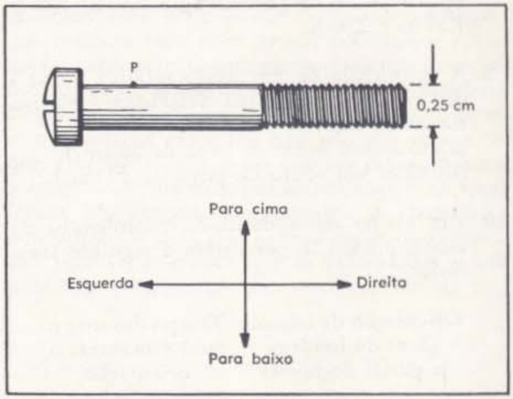

25. ⭐⭐⭐ Un oggetto si muove lungo una **traiettoria circolare** con velocità costante di **2,0 m/s**, variando la sua direzione di **30º in 3,0 secondi**.  
    (a) Qual è la sua **variazione di velocità vettoriale**?  
    (b) Qual è la sua **accelerazione media** durante i 3,0 secondi?
    #discussione #consigliato
    
26. ⭐⭐ Una lancetta dei secondi ha una lunghezza di **2,0 cm**.  
    (a) Calcola la **velocità** dell’estremità della lancetta.  
    (b) Qual è la **velocità vettoriale** dell’estremità a $t = 0,0$ s? E a 15 s?  
    (c) Calcola la **variazione di velocità vettoriale** tra $t = 0,0$ e $t = 15$ s.  
    (d) Calcola il **vettore accelerazione media** tra $t = 0,0$ e $t = 15$ s.
    #discussione #consigliato 
    
27. ⭐⭐ Indica, nella **Figura 6 — 36**, le **componenti di A e B** lungo ciascun asse. Mostra che la **somma delle componenti** di A e B lungo ciascun asse è la componente di C lungo tale asse. Osserva, quindi, che puoi ottenere $C$ **sia sommando direttamente A e B, sia sommando le componenti** di $A + B$.
    #consigliato 
    

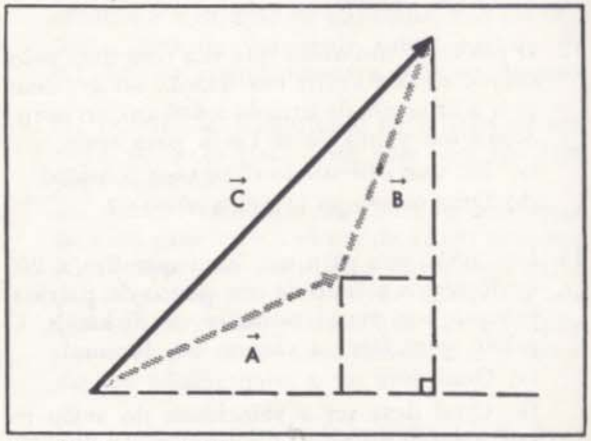
