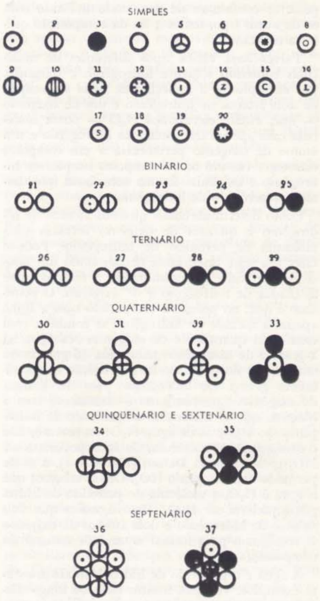
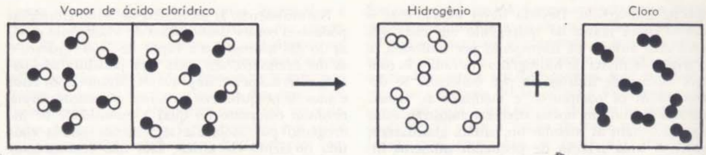
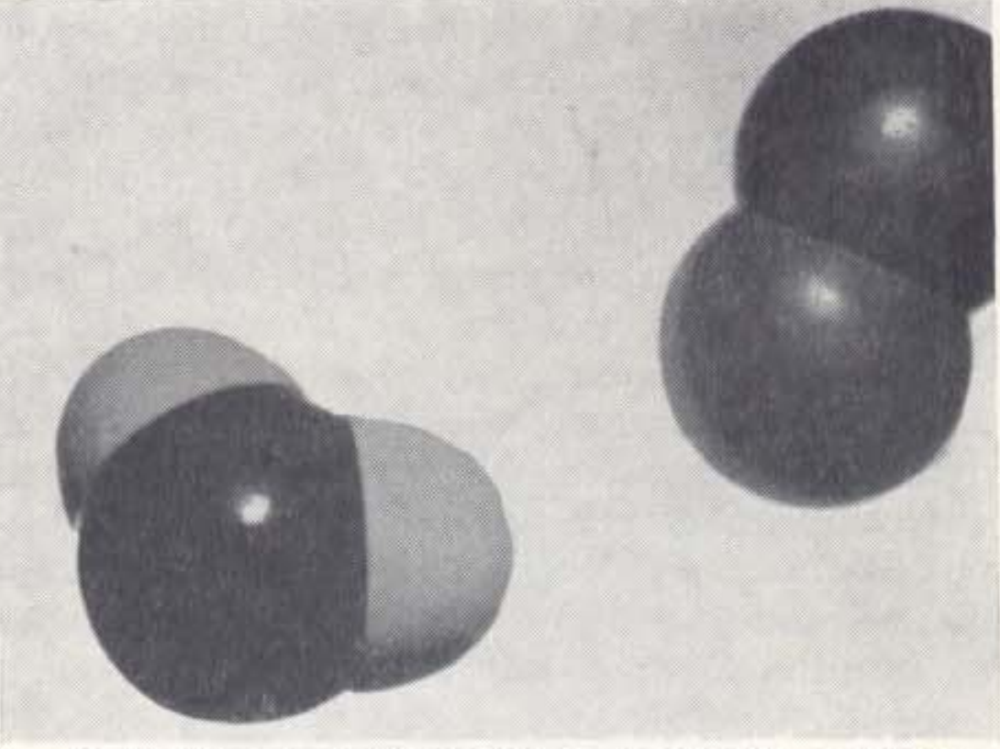
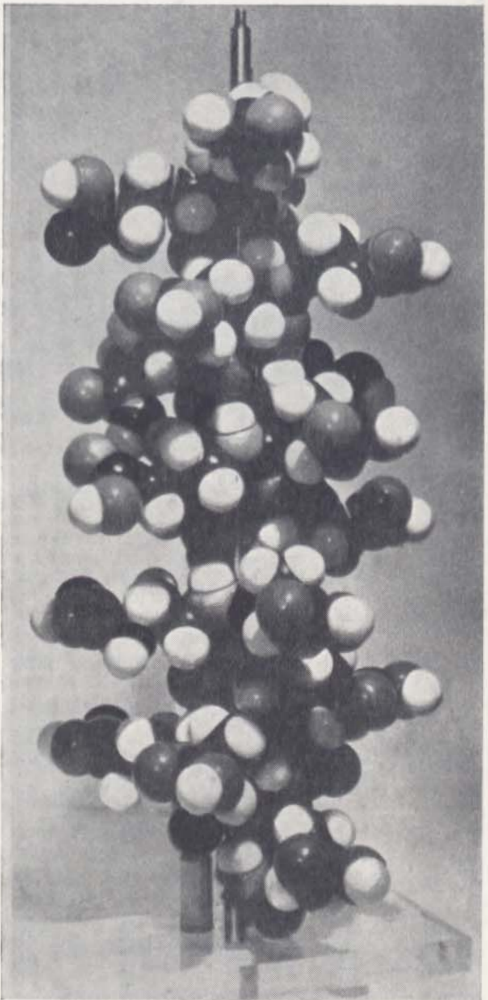
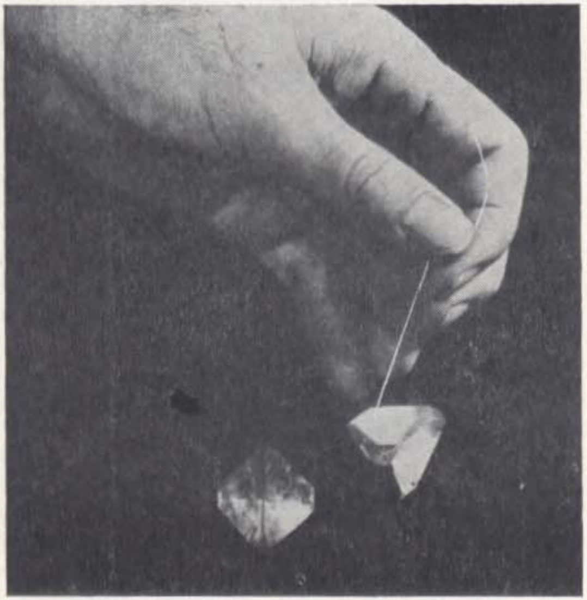
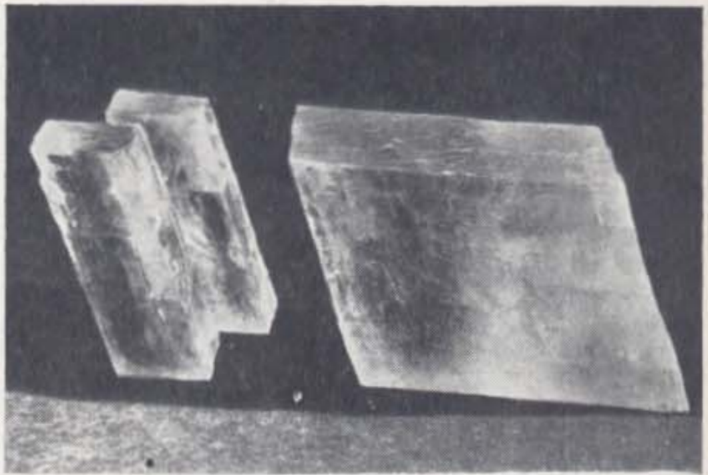
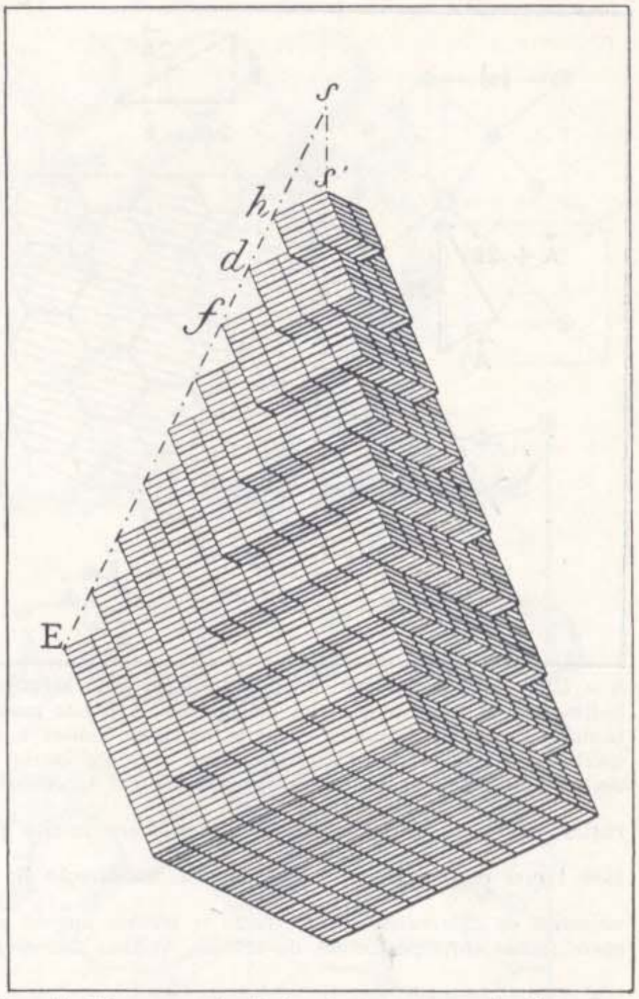
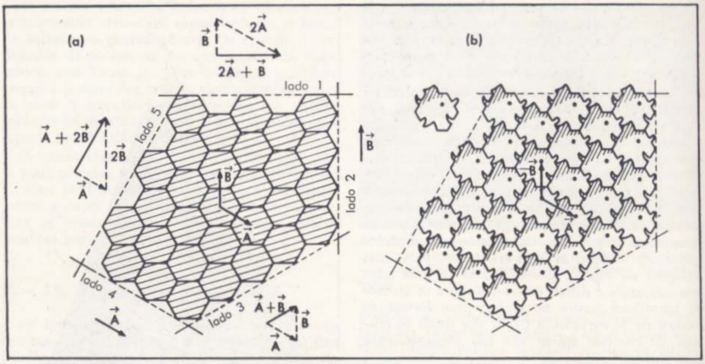
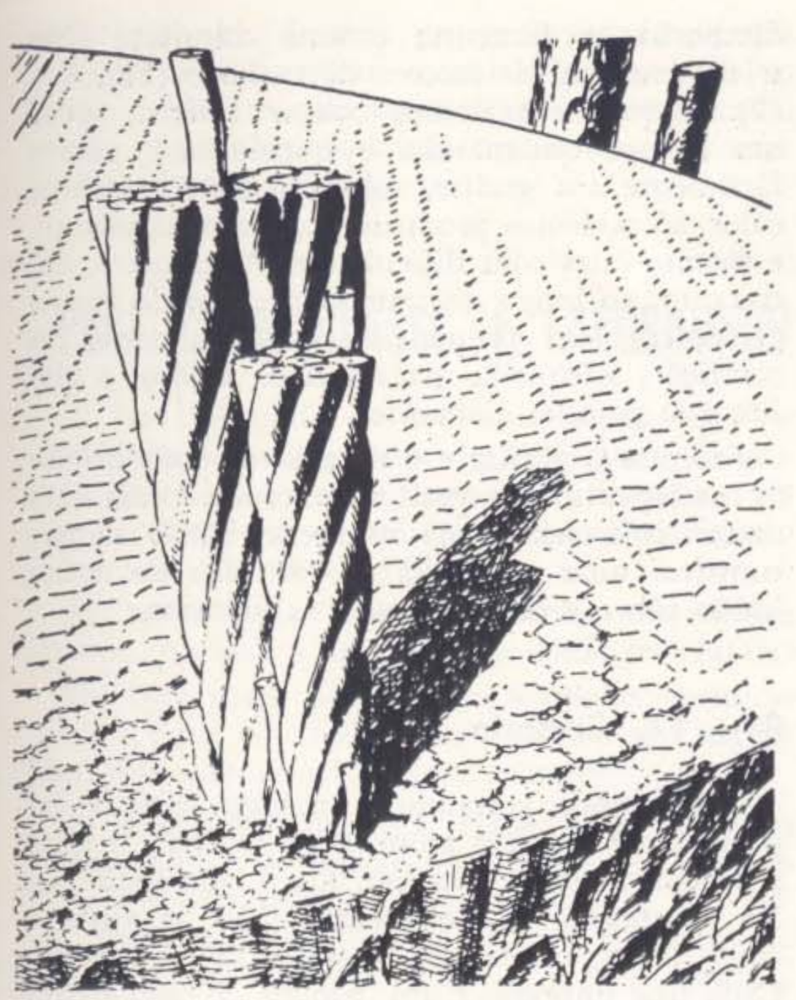
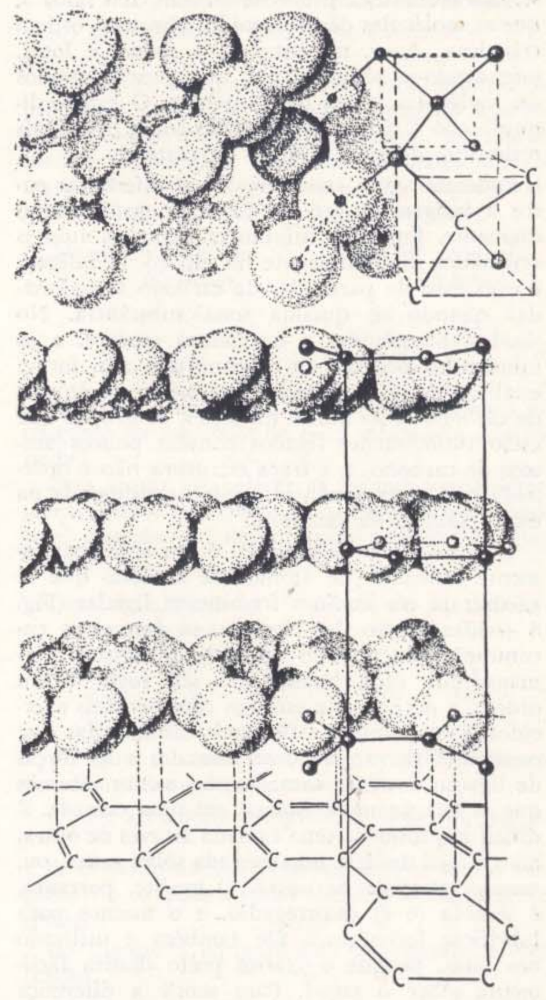

# Capitolo 8 - Atomi e molecole

## 8 — 1. Leggi della composizione chimica

I chimici hanno preparato circa duecentomila composti differenti contenenti carbonio, e poche migliaia privi di tale elemento. Ogni giorno vengono scoperti nuovi composti nella materia vivente, nel suolo e nelle rocce; altri sono ancora in fase di sintesi. Tutte queste sostanze sono state analizzate ripetutamente, e da tali analisi sono state tratte conclusioni generali di grande importanza.

Le prime furono formulate da John Dalton intorno al 1800, quando il corpo di conoscenze era molto meno convincente di quanto lo sia oggi.

La prima di queste conclusioni generali è la legge della composizione chimica costante. Essa afferma che ogni campione di una determinata sostanza, considerata sufficientemente pura secondo diversi criteri, contiene sempre le stesse proporzioni, in massa, di tutti gli elementi in cui può essere decomposta. Le “ricette” non cambiano. L’acqua è sempre composta da un grammo di idrogeno per otto di ossigeno, il sale comune da un grammo di sodio per ogni 1,5 grammi di cloro, e lo zucchero comune presenterà 1,0 grammo di idrogeno per 6,5 grammi di carbonio e 8,0 grammi di ossigeno, ogni volta che venga scomposto nei suoi tre elementi. Qualunque ne sia la provenienza, lo zucchero da tavola (il chimico lo chiama saccarosio) fornisce sempre la stessa analisi; se un campione diverge, è sempre possibile constatare che si tratta di zucchero impuro, perché il suo sapore, la sua forma cristallina, il colore, o qualche altra proprietà, lo distingue da quelli che possiedono la composizione costante prevista. Qualche processo finirà per separare gli altri componenti, ottenendo tutto il saccarosio presente nella composizione normale.

La legge della composizione costante è valida con grande precisione per praticamente tutte le sostanze organiche contenenti carbonio, e per migliaia di altre. Supponiamo, ad esempio, di voler preparare cloruro di sodio — sale comune — con 6 grammi di sodio per ottenere 100 grammi di sale. Supponiamo ora di tentare di combinare 50 grammi di sodio con 61 grammi di cloro: otterremo esattamente 100 grammi di sale, come prima. Rimarranno 11 grammi di sodio in eccesso; i 61 grammi di cloro possono combinarsi soltanto con 39 grammi di sodio. Inoltre, quando brucia, si osserva che contiene il 39 per cento di sodio e il 61 per cento di cloro.

La legge della composizione costante, tuttavia, non è valida per ogni materiale apparentemente uniforme. Un secchio d’acqua salata, ad esempio, può avere composizione omogenea. Ogni campione prelevato da esso può contenere esattamente le stesse proporzioni di acqua e sale. Se si aggiunge una manciata di sale e si agita, dopo una perfetta miscelazione, l’acqua salata apparirà nuovamente uniforme, ma le proporzioni di acqua e sale saranno ora differenti. Contrariamente all’acqua o allo zucchero, l’acqua salata non possiede una composizione fissa.

L’acqua salata è una soluzione, meglio descritta in termini di due componenti differenti — acqua e sale — che la costituiscono. Lo stesso tipo di descrizione si applica a molte leghe, come l’ottone, il bronzo, l’acciaio, il duralluminio, l’argento da moneta o sterling, l’oro da gioielleria, e così via. L’ottone presenta una notevole variazione di colore e altre proprietà, a seconda della composizione, proprio come accade con l’acqua salata.

Molte materie plastiche condividono anch’esse questa proprietà di composizione variabile, pur potendo sembrare omogenee a tutti i test.

Il comportamento delle sostanze a composizione costante è il tema fondamentale della chimica classica; altre sostanze, tuttavia, sono talmente interessanti e importanti che hanno costituito i domini di specialisti, quali i chimici metallurgici e i chimici dedicati allo studio dei polimeri. Vedremo che la nostra immagine di un mondo costituito da un numero limitato di specie atomiche è sufficientemente ampia da includere entrambi i tipi di sostanze. Per il momento, cerchiamo di apprendere ciò che possiamo su queste sostanze che presentano la notevole proprietà della composizione costante.

Possiamo riassumere dicendo che vi sono molti materiali omogenei nei quali chimici e spettroscopisti trovano gli elementi costitutivi sempre combinati secondo una stessa “ricetta” ben definita. Questi materiali sono i composti. In un composto, per ogni grammo di un elemento costitutivo, è sempre presente un numero definito di grammi di ciascun altro elemento.

Finora questi risultati — che erano nuovi all’epoca di Dalton — si accordano sufficientemente bene con la concezione atomica. Se gli elementi sono ciascuno una collezione di atomi identici che si uniscono in piccoli gruppi per formare i composti, ci aspetteremmo che i campioni su scala macroscopica mostrino proporzioni costanti degli elementi. Si verifica, ad esempio, che l’acqua è sempre composta da un grammo di idrogeno per otto grammi di ossigeno. Se l’unità naturale dell’acqua — la molecola d’acqua — fosse costituita da un atomo di idrogeno e uno di ossigeno, allora qualsiasi campione d’acqua conterrebbe numeri uguali di atomi di idrogeno e di ossigeno. Inoltre, le masse di idrogeno e di ossigeno sarebbero sempre nel rapporto tra le masse dei rispettivi atomi. D’altra parte, se la molecola d’acqua è composta da due atomi di idrogeno e uno di ossigeno (come oggi si sa che è), allora ogni campione d’acqua dovrà contenere atomi di idrogeno e ossigeno nel rapporto di due a uno.

Nuovamente, il rapporto tra le masse degli elementi sarà costante, questa volta nel rapporto tra la massa di due atomi di idrogeno e quella di un atomo di ossigeno. Ogni volta che atomi di una specie si combinano in modo definito con quelli di un’altra, abbiamo la legge della composizione chimica costante.

È possibile che esistano diversi tipi di molecole contenenti solo idrogeno e ossigeno. Per esempio, se la molecola dell’acqua è composta da due atomi di idrogeno e uno di ossigeno — che scriviamo H₂O — un’altra molecola formata da un solo atomo di idrogeno e uno di ossigeno apparterrebbe a un composto diverso. Esiste infatti un altro composto semplice di idrogeno e ossigeno: è una sostanza che chiamiamo perossido di idrogeno.

Come potremmo determinare quanti atomi di idrogeno e quanti di ossigeno formano una molecola di perossido di idrogeno? È possibile eseguire un test importante, decomponendo una piccola quantità di perossido e determinando il rapporto tra le masse di idrogeno e ossigeno. Il risultato è che, nel perossido rispetto all’acqua, solo la metà dell’idrogeno si combina con una data quantità di ossigeno. Nell’acqua ci sono 2 grammi di idrogeno per ogni 16 grammi di ossigeno, mentre nel perossido di idrogeno c’è solo 1 grammo di idrogeno per 16 grammi di ossigeno. Questo risultato è coerente con l’idea che le molecole di perossido siano HO e quelle dell’acqua H₂O; tuttavia, non lo dimostra. Le molecole dell’acqua potrebbero essere HO, come pensava Dalton (Fig. 8-1), e quelle del perossido HO₂. Oppure, se sappiamo che l’acqua è H₂O, la molecola del perossido potrebbe essere H₂O₂ (cioè due atomi di idrogeno e due di ossigeno che si combinano per formare l’unità naturale del composto).

L’acqua e il perossido di idrogeno sono solo esempi. Vedremo molti altri casi nel corso di questo capitolo. In tutti i composti, le combinazioni di numeri definiti di atomi di vari tipi portano a proporzioni costanti degli elementi. Inoltre, come abbiamo visto nel nostro semplice esempio, ogni volta che due elementi si combinano in più di un modo per formare molecole differenti, il rapporto tra le diverse masse di un elemento che si combinano con una data massa dell’altro si presenta come un rapporto tra numeri interi semplici. Non è sempre uno a due, come nel caso della quantità di idrogeno che si combina con una certa quantità di ossigeno nel perossido di idrogeno e nell’acqua. Ma è sempre un rapporto tra piccoli numeri interi. Questa legge, fondata sull’osservazione, è precisamente ciò che ci aspetteremmo se fossero gli atomi a combinarsi. Se solo numeri interi di atomi possono combinarsi per formare una molecola, allora sono possibili soltanto rapporti tra numeri interi semplici.

Questa legge dei rapporti è nota come legge delle proporzioni multiple; essa rappresenta uno dei principali argomenti a favore della composizione atomica della materia, presentato da Dalton.

Probabilmente l’esempio più spettacolare delle proporzioni multiple si trova nelle combinazioni di azoto e ossigeno. Un grammo di azoto si combina con ½ grammo di ossigeno per formare il gas esilarante. Esattamente il doppio di ossigeno (1 grammo) si combina per formare l’ossido nitrico. In altri composti di azoto e ossigeno vi sono esattamente tre, quattro e cinque volte la quantità iniziale di ossigeno per grammo di azoto. In altre parole, per ogni grammo di azoto troviamo, nei diversi composti, 1 × ½ grammo, 2 × ½ grammo, 3 × ½ grammo, 4 × ½ grammo, 5 × ½ grammo di ossigeno. Questi numeri interi (e i numeri interi simili per altre combinazioni di elementi) sono un riflesso diretto della natura atomica della materia.

Le proporzioni costanti e, in particolare, le proporzioni multiple osservate nella composizione chimica dei composti costituiscono una prova potente dell’esistenza degli atomi. Ma, a differenza di Dalton che presentò questa evidenza all’inizio del XIX secolo, noi abbiamo visto anche altre prove dell’esistenza degli atomi. Abbiamo osservato l’esistenza di unità naturali in monocristalli e altre microstrutture. Abbiamo contato atomi tramite il numero delle loro emissioni radioattive. Possiamo ora aggiungere l’evidenza chimica a tutte queste altre indicazioni dell’esistenza degli atomi.

## 8 — 2. Il problema della determinazione delle formule molecolari

Quanti atomi di ciascun tipo si combinano per formare le molecole delle sostanze pure? Se torniamo alla sezione precedente, vediamo che le leggi della composizione chimica non determinano da sole le formule molecolari esatte. Non potevamo essere certi che la molecola dell’acqua fosse H₂O (2 atomi di idrogeno e 1 di ossigeno), o che quella del perossido d’idrogeno fosse HO. (In realtà è H₂O₂). Il tema delle sezioni successive sarà come determinare le formule molecolari esatte.

Come accade frequentemente, vi sono molti modi per determinare le formule chimiche; una serie di evidenze ha contribuito alla determinazione pratica di un gran numero di esse. Il problema di organizzare una tabella di formule chimiche è simile a quello di comporre uno di quei rompicapi cinesi in cui un insieme di pezzi di legno si incastrano per formare un solido compatto. La collocazione di un determinato pezzo nel gioco, o di un composto nella tabella, dipende dalla posizione delle altre componenti. Confrontando i rapporti tra le masse rilevati in una vasta varietà di composti, e utilizzando molti altri elementi di prova, i chimici sono giunti progressivamente a formule sulle quali possono confidare.

Le reazioni chimiche dei gas hanno svolto un ruolo importante nella storia della determinazione delle formule molecolari. Non seguiremo qui lo sviluppo storico dei fatti; utilizzando però alcune informazioni ricavate da tecniche moderne di conteggio delle disintegrazioni radioattive, e altre ottenute dai metodi tradizionali della chimica dei gas, illustreremo come possano essere determinate le formule chimiche. Le formule così stabilite concordano con quelle dedotte dalla grande massa di prove accumulate nel secolo scorso. Esse vengono testate anche mediante tecniche moderne, come la misurazione delle masse di atomi e molecole individuali mediante spettrometria di massa, che tratteremo nella Parte IV. Per illustrare la determinazione delle formule molecolari, discuteremo brevemente i gas nella prossima sezione e, successivamente, nella Sezione 8-4, determineremo alcune formule complete.

## 8 — 3. Il numero di particelle nei gas

Nella Sezione 7-13 abbiamo descritto un esperimento di conteggio degli atomi di polonio attraverso le loro disintegrazioni radioattive. Come abbiamo visto, ogni atomo di polonio, prima o poi, “esplode”, emettendo una particella che si muove rapidamente e che possiamo rilevare e contare. A partire da $10^{-7}$ kg di polonio vengono emesse, nel tempo, $3 \cdot 10^7$ di queste particelle — corrispondenti a $3 \cdot 10^{19}$ atomi di polonio originariamente presenti. Ma la storia non finisce qui. Anche le particelle emesse sono materia. Quando il polonio emette una particella, la sua massa diminuisce. Pesando il campione dopo l’esperimento, si scopre che le particelle hanno portato via circa il 2 per cento della massa iniziale. Inoltre, ripetendo l’esperimento in un tubo di vetro chiuso, si può impedire la fuga delle particelle. Al termine, il tubo contiene non solo un metallo, ma anche un’altra sostanza: il gas elio. Il peso indica che questo elio, formatosi dalle particelle emesse, è responsabile di quasi tutta la perdita di massa. Inoltre, in entrambi gli esperimenti, il metallo residuo non è più polonio: si è trasformato in un metallo più comune e non radioattivo, il piombo.

Apparentemente, quando un atomo di polonio esplode, lancia una particella di elio, e ciò che resta è una particella di piombo. L’elio può essere raccolto, come fece per primo Rutherford; e si può così ottenere un campione di elio contenente un numero noto di particelle. Da $10^{-7}$ kg di polonio otteniamo $3 \cdot 10^{19}$ particelle; da 1 grammo, $3 \cdot 10^{21}$ particelle. Pesando questa quantità di elio si trova una massa di 0,02 grammi, ovvero circa $6{,}7 \cdot 10^{-23}$ grammi per particella di elio.

Con questa informazione possiamo apprendere qualcosa sul comportamento di un gas. Possiamo verificare quante particelle distinte di elio occupano un certo volume a temperatura e pressione determinate. Possiamo prendere un pallone di plastica molto leggero, un sacco che, una volta gonfiato, ha un volume definito — per esempio 5 litri — e determinare, a temperatura ambiente, quante particelle devono essere introdotte per gonfiarlo a sufficienza da mantenere la forma, contrastando la pressione atmosferica. Naturalmente, esperimenti precisi non vengono svolti esattamente in questo modo; ma con esperienze simili nel principio e molto vicine a quella descritta, si scopre che 0,89 grammi di gas elio occupano un volume di 5 litri ($5 \cdot 10^{-3}\ \text{m}^3$) alla pressione atmosferica normale e alla temperatura del punto di fusione del ghiaccio (cioè 0 °C).

Questi 0,89 grammi consistono di:

$$
\frac{0{,}89\ \text{g}}{6{,}7 \cdot 10^{-23}\ \text{g/particella}} = 1{,}34 \cdot 10^{22}\ \text{particelle di elio}
$$

Concludiamo quindi che $1{,}34 \cdot 10^{22}$ particelle occupano 5 litri in queste condizioni. Osserviamo che il volume occupato da una particella nel gas è:

$$
\frac{5 \cdot 10^{-3}\ \text{m}^3}{1{,}34 \cdot 10^{22}} \approx 4 \cdot 10^{-25}\ \text{m}^3\ \text{per particella di elio}
$$

Come abbiamo visto nel capitolo precedente, questo valore è circa mille volte maggiore del volume tipico — circa $3{,}0 \cdot 10^{-29}\ \text{m}^3$ — occupato da un atomo in una molecola. È possibile che una particella di elio sia davvero così grande? Per rispondere a questa domanda, riflettiamo sulle proprietà dei gas. In seguito le considereremo in maggior dettaglio, ma tutti noi abbiamo osservato la comprimibilità dei gas. Ad esempio, con una pressione aggiuntiva possiamo forzare una maggiore quantità di gas a occupare lo stesso volume in un pneumatico. Osserviamo inoltre che i gas hanno mobilità: si allontanano quando ci muoviamo; si mescolano facilmente tra loro — un gas penetra nell’altro — e si spostano da un punto all’altro di un recipiente fino a riempirlo, qualunque ne sia la forma. Queste osservazioni comuni indicano che i gas possono essere costituiti da molte molecole che occupano solo una piccola parte dello spazio totale occupato dal gas. Tra le molecole ci sono regioni vuote, più grandi delle molecole stesse, ed è attraverso questi spazi che le molecole di un gas si muovono, mentre si diffondono in un altro.

Un modello di gas costituito da molecole separate, che si muovono in tutte le direzioni e sono ampiamente distanziate rispetto alle proprie dimensioni, spiega le proprietà comuni dei gas. Questo modello rende ragionevole l’idea che ogni particella di elio sia molto più piccola di 40.000 ångström cubici, il volume che sembra occupare in condizioni normali di temperatura e pressione. Ma cosa determina, allora, il numero di particelle di un gas che occupa un certo volume? Tutti i gas contengono lo stesso numero di particelle in volumi identici? Il numero dipende dalla massa delle molecole individuali, o forse da qualche altra proprietà? Per cominciare a rispondere a queste domande, consideriamo un gas diverso.

Il gas radon è prodotto dalla disintegrazione radioattiva del radio, e possiamo determinare il numero di particelle in un campione di questo gas. Si prende un campione di radio e si estrae, per mezzo di una pompa, il radon formatosi dalla sua disintegrazione. A partire dal ritmo con cui il radio si disintegra, si determina quante particelle di radon vengono prodotte in un breve intervallo di tempo. Questo ci fornisce un numero noto. Tuttavia, in questo caso, occorre andare oltre: il radon stesso si disintegra. La metà dei suoi atomi si trasforma, emettendo ciascuno una particella di elio in poco meno di quattro giorni. Dal ritmo con cui esso si forma costantemente dalla disintegrazione del radio e da quello con cui a sua volta si trasforma, possiamo sapere esattamente quante particelle di radon contiene un campione in un dato istante.

Utilizzando il gas radon, si è verificato che $1{,}34 \cdot 10^{22}$ particelle occupano un volume di 5 litri, alla pressione atmosferica normale e a 0 °C. In altre parole, alla stessa temperatura e pressione, lo stesso numero di particelle di elio e di radon occupano esattamente lo stesso volume.

La massa di radon in questo campione, tuttavia, non è di 0,89 grammi come nel caso dell’elio, bensì di 49,5 grammi. La massa di ciascuna particella di radon è dunque circa 55 volte quella di una particella di elio; ma, in quanto gas, le particelle si comportano in modo identico. Lo stesso numero di particelle di qualsiasi tipo esercita la stessa pressione quando è contenuto in volumi uguali a una data temperatura.

Poiché lo stesso numero di particelle di due gas completamente diversi agisce nello stesso modo, ci interessa certamente sapere se numeri uguali di particelle di tutti i gas occupano volumi identici alla stessa temperatura e pressione. Sfortunatamente, per la maggior parte dei gas non è così facile contare le particelle contenute in un campione. Sarà necessario ricorrere a un metodo di indagine un po’ meno diretto. Questo metodo indiretto mostrerà che i numeri di particelle sono gli stessi. Ci permetterà anche di determinare le formule molecolari.

## 8 — 4. La determinazione delle formule molecolari

Cominciamo col raccogliere campioni di diversi gas contenenti idrogeno. I composti più comuni di questo tipo sono l’acido cloridrico, il gas idrogeno, il vapore acqueo e l’ammoniaca. Supponiamo di prendere volumi uguali di ciascuno di questi composti, alla stessa temperatura e pressione. Supponiamo, provvisoriamente, che il numero di molecole — cioè il numero di particelle del gas — sia lo stesso in ogni campione. Questa supposizione è nota come ipotesi di Avogadro, in onore del fisico italiano che la propose nel 1811. Quali conseguenze — quale comportamento osservabile — possiamo attenderci sulla base di questa ipotesi?

Secondo le nostre idee sugli atomi e le molecole, tutte le molecole di un determinato gas dovrebbero essere uguali. Se le molecole contengono idrogeno, ciascuna dovrebbe contenere lo stesso numero di atomi di idrogeno. Inoltre, questo numero deve essere uno, due, tre, eccetera: cioè un numero intero di atomi di idrogeno per molecola. Dunque, se vi è lo stesso numero di molecole in ciascuno dei nostri campioni di gas diversi, possiamo concludere che dovrebbe esserci la stessa massa di idrogeno in ciascun campione le cui molecole contengano solo un atomo di idrogeno. Dovrebbe esserci il doppio di questa massa in ogni gas contenente due atomi di idrogeno per molecola, e il triplo in ogni gas con tre atomi per molecola. Se scomponiamo i composti e misuriamo le masse di idrogeno nei nostri campioni, tali masse dovrebbero essere uguali oppure presentare tra loro rapporti di piccoli numeri interi.

Ecco una conseguenza dell’ipotesi di Avogadro che può essere verificata sperimentalmente. A metà del XIX secolo furono misurate le masse di vari elementi contenuti in campioni standard di gas. In quell’occasione, Stanislao Cannizzaro compilò i risultati. Da allora molti esperimenti di questo tipo sono stati ripetuti. Per esempio, si è trovato sperimentalmente quanto segue: (1) la massa di idrogeno in un dato volume di gas idrogeno è esattamente il doppio della massa contenuta nello stesso volume di vapore di acido cloridrico, alle medesime condizioni; (2) la massa di idrogeno nel vapore acqueo è anch’essa esattamente il doppio di quella nel vapore di acido cloridrico; (3) la massa di idrogeno nell’ammoniaca è tripla rispetto a quella dell’acido cloridrico. La **Tabella 1** riporta questi e altri risultati. Si notino i rapporti tra numeri interi. Questi risultati confermano fortemente la nostra ipotesi: a pari temperatura e pressione, volumi uguali di qualsiasi gas contengono lo stesso numero di molecole. Inoltre, sembrano indicare che ogni molecola di acido cloridrico contiene un atomo di idrogeno; le molecole di gas idrogeno e quelle di vapore acqueo ne contengono due ciascuna, e ogni molecola di ammoniaca ne contiene tre.

**Tabella 1**

Massi di idrogeno in campioni di gas di volume uguale alla stessa temperatura e pressione:

| Gas                    | Massa di idrogeno (in grammi) |
|------------------------|-------------------------------|
| Vapore di acido cloridrico | 0,1                           |
| Idrogeno               | 0,2                           |
| Vapore di acqua        | 0,2                           |
| Ammoniaca              | 0,3                           |
| Metano                 | 0,4                           |
| Vapore di acido nitrico| 0,1                           |
| Acetilene              | 0,2                           |
| Propano                | 0,8                           |
| Etilene                | 0,4                           |
| Cloruro di ammonio     | 0,4                           |
| Etano                  | 0,6                           |

Naturalmente, si potrebbe ipotizzare che le molecole di acido cloridrico contengano due atomi di idrogeno ciascuna, quelle del gas idrogeno e del vapore acqueo quattro, e quelle dell’ammoniaca sei; ma questa possibilità appare estremamente improbabile. Anche dopo anni di ricerche, i chimici non hanno trovato alcun composto in cui la quantità di idrogeno per molecola sia inferiore a quella dell’acido cloridrico. Non si è trovato alcun composto in cui la quantità di idrogeno sia intermedia tra quella dell’acido cloridrico e quella del vapore acqueo, né tra quest’ultima e quella del gas ammoniaca. Se davvero vi fossero due atomi di idrogeno in una molecola di acido cloridrico, ci si attenderebbe di trovare composti con un solo atomo per molecola. Tali composti fornirebbero una massa di idrogeno pari alla metà di quella dell’acido cloridrico. Ci si aspetterebbe anche di trovare molecole con tre atomi di idrogeno, con massa compresa tra quella dell’acido cloridrico e quella del vapore acqueo. L’assenza di simili composti costituisce una forte evidenza a favore dell’idea che le molecole discusse contengano esattamente uno, due e tre atomi di idrogeno per molecola, anziché due, quattro, sei o altro numero. L’idea che i campioni con la minor quantità di idrogeno siano costituiti da molecole contenenti un solo atomo deriva quasi direttamente dalla definizione di atomo come unità base o minima quantità di un elemento. Essa è corroborata dal fatto che tutte le altre masse sono multipli interi. Ne concludiamo, quindi, che nelle molecole sono presenti quei numeri interi di identiche unità elementari. Abbiamo così trovato un’evidenza concreta, a partire dalla quale possiamo risalire alla composizione molecolare dettagliata.

Altre evidenze (alcune delle quali saranno discusse nella Parte IV) concordano perfettamente con queste conclusioni. Per esempio, una molecola di gas idrogeno ha una lunghezza circa doppia rispetto alla sua larghezza. Essa sembra essere composta da due unità, in accordo con la nostra precedente conclusione che ogni molecola di idrogeno contiene due atomi di idrogeno. Inoltre, a temperature sufficientemente elevate, possiamo decomporre le molecole di idrogeno in due atomi separati. Tutto indica che le molecole di gas idrogeno siano in effetti molecole $H_2$. Inoltre, possiamo ora vedere che il vapore acqueo contiene esattamente due atomi di idrogeno ...per molecola; l’acido cloridrico ne ha uno, l’ammoniaca ne ha tre. Abbiamo così determinato con precisione una parte delle formule di queste molecole.

Abbiamo appreso quanti atomi di idrogeno vi siano per molecola in certi composti, ma qual è il numero di atomi di cloro in una molecola di vapore di acido cloridrico, o il numero di atomi di ossigeno in una molecola di vapore acqueo? Vi sono diversi modi per rispondere a queste domande. Uno di essi è utilizzare lo stesso metodo che abbiamo impiegato per determinare il numero di atomi di idrogeno in una molecola.

Per esempio, per conoscere la formula completa delle molecole di acido cloridrico, possiamo considerare una serie di composti gassosi del cloro. Oltre all’acido cloridrico, consideriamo il cloro stesso, che esiste sotto forma di gas velenoso di colore verde. Usiamo inoltre altri due gas contenenti cloro: i vapori di cloroformio e di tetracloruro di carbonio (il primo, reso famoso dai romanzi gialli come mezzo per stordire le vittime; il secondo, un liquido tossico usato comunemente nei solventi per pulizia). Raccogliamo volumi uguali di questi gas, a temperatura e pressione definite, e misuriamo quindi le masse di cloro contenute nei campioni.

Scopriamo che la massa di cloro nel gas cloro è esattamente il doppio di quella contenuta nell’acido cloridrico. La massa di cloro nel vapore di cloroformio è tre volte quella dell’acido cloridrico, e nel tetracloruro di carbonio è esattamente quattro volte tanto. Concludiamo quindi che vi è un atomo di cloro per molecola di acido cloridrico, due atomi per molecola di gas cloro, tre per molecola di cloroformio, e quattro per molecola di tetracloruro di carbonio. Determiniamo così completamente la composizione molecolare dell’acido cloridrico. Le sue molecole contengono un atomo di idrogeno e un atomo di cloro, e la formula molecolare dell’acido cloridrico è HCl. Incidentalmente, verifichiamo anche che, come nel gas idrogeno, le molecole del gas cloro contengono due atomi ciascuna. Le molecole di questo gas sono $Cl_2$, proprio come quelle del gas idrogeno sono $H_2$.

Possiamo estendere questo tipo di analisi a molti composti. Per esempio, studiando i gas contenenti azoto e ossigeno, si verifica che la molecola dell’ammoniaca è $NH_3$, quella dell’acqua è $H_2O$, quella del protossido di azoto è $N_2O$, quella del gas ossigeno è $O_2$, quella dell’azoto molecolare è $N_2$, e così via. Alla fine, con tali evidenze, otteniamo una serie ragionevolmente completa di formule chimiche per le molecole.

## 8 — 5. La legge delle relazioni volumetriche

Tutto sembra in ordine, e la coerenza dei nostri risultati fornisce un forte sostegno all’ipotesi di Avogadro, secondo cui numeri uguali di molecole gassose occupano lo stesso volume, a temperatura e pressione determinate. Un’ulteriore evidenza a favore di questa ipotesi può essere trovata nello studio dei volumi dei gas risultanti dalla decomposizione di vari composti.

Supponiamo di decomporre l’acido cloridrico. Si parte da vapore di acido cloridrico che occupa un volume noto, a una certa temperatura e pressione. Decomponiamo l’acido cloridrico in idrogeno e cloro. Anch’essi sono gas, e possono essere raccolti separatamente. Alla stessa temperatura e pressione iniziali, ciascuno dei due gas occupa esattamente la metà del volume originariamente occupato dal vapore di acido cloridrico.

Questo risultato è precisamente ciò che ci aspetteremmo. Ogni molecola di vapore di acido cloridrico è HCl. Ciascuna contiene un atomo di idrogeno e uno di cloro, secondo la nostra precedente conclusione. D’altro canto, ogni molecola di idrogeno contiene due atomi di idrogeno, e ogni molecola di gas cloro possiede anch’essa due atomi di cloro. Di conseguenza, il numero di molecole di gas idrogeno e di gas cloro sarà soltanto la metà del numero di molecole di vapore di acido cloridrico presenti all’inizio. Secondo l’ipotesi di Avogadro, metà delle molecole, qualunque ne sia il tipo, occuperebbe metà del volume. Alle stesse condizioni di temperatura e pressione, quindi, il gas idrogeno occuperà soltanto metà del volume originariamente occupato dal vapore di HCl, e lo stesso varrà per il gas cloro. Ed è proprio ciò che si verifica.

Consideriamo un altro esempio. Supponiamo di decomporre l’acqua. Si ritiene che la formula di una molecola di vapore acqueo sia $H_2O$. Quando decomponiamo l’acqua, dunque, ciascuna molecola fornirebbe un atomo di ossigeno e due atomi di idrogeno. Nella decomposizione del vapore acqueo, quindi, otterremmo lo stesso numero di molecole di idrogeno quante ne avevamo originariamente di acqua (ricordiamo che il gas idrogeno è $H_2$, e ciascuna delle sue molecole contiene due atomi di H). Pertanto, alla stessa temperatura e pressione, il gas idrogeno occuperà lo stesso volume che era stato occupato dal vapore acqueo. Questo è esattamente ciò che si osserva sperimentalmente.

Poiché sappiamo che le molecole di ossigeno contengono due atomi ciascuna, e ogni molecola di vapore acqueo fornisce solo un atomo di ossigeno, ci aspettiamo che, alle stesse condizioni di temperatura e pressione, il volume di ossigeno liberato sia soltanto la metà del volume originario di vapore acqueo. Anche questo è esattamente ciò che accade.

In generale, ci si attende che quando le sostanze vengono decomposte, i volumi dei gas prodotti, alle stesse condizioni di temperatura e pressione, mantengano tra loro rapporti di piccoli numeri interi. Allo stesso modo, quando si formano composti mediante reazioni chimiche tra gas, i volumi dei gas utilizzati presenteranno tra loro rapporti di numeri interi semplici. Questa aspettativa riguardo alle relazioni volumetriche viene solitamente confermata.

Nel nostro discorso abbiamo alterato l’ordine storico — anzi, l’abbiamo quasi invertito. La legge delle relazioni volumetriche, alla quale siamo appena giunti, fu in realtà formulata dal chimico francese Gay-Lussac nel 1808. Successivamente, nel 1811, il fisico italiano Avogadro mostrò che la legge delle relazioni volumetriche si adattava bene alla visione atomica della materia. Egli introdusse la supposizione che volumi uguali di gas, alla stessa temperatura e pressione, contengono lo stesso numero di molecole.

Il lavoro di Cannizzaro, intorno al 1858, convinse molti della correttezza di Avogadro. Come abbiamo visto, l’ipotesi di Avogadro è oggi ampiamente giustificata — è diventata la legge di Avogadro. Con metodi moderni possiamo persino contare il numero di molecole presenti in un campione di gas.

## 8 — 6. Masse molecolari e unità

Poiché conosciamo il numero di molecole in un campione di gas, e possiamo misurarne la massa, possiamo determinare facilmente la massa di una singola molecola. La massa di una molecola di gas idrogeno, misurata in questo modo, è approssimativamente $3{,}34 \cdot 10^{-24}$ grammi. La massa di una molecola di ossigeno è 16 volte maggiore, cioè $5{,}3 \cdot 10^{-23}$ grammi. Potremmo elencare un’ampia serie di masse molecolari determinate con questo metodo.

A partire dalle masse delle molecole possiamo ricavare le masse degli atomi. Sappiamo che le molecole di idrogeno sono costituite ciascuna da due atomi di idrogeno. Di conseguenza, la massa di un atomo di idrogeno è:

$$
\frac{3{,}34 \cdot 10^{-24}}{2} = 1{,}67 \cdot 10^{-24}\ \text{grammi}.
$$

Allo stesso modo, determiniamo le masse degli atomi elencate nella **Tabella 2**.

**Tabella 2**  
*Massa degli atomi (in $10^{-24}$ grammi)*

| Atomo     | Massa ($10^{-24}$ g) |
|-----------|----------------------|
| Cloro     | 34,9                 |
| Fluoro    | 31,5                 |
| Elio      | 6,64                 |
| Idrogeno  | 1,67                 |
| Azoto     | 23,2                 |
| Ossigeno  | 26,6                 |
| Sodio     | 38,1                 |

Non tutti gli elementi possono essere trasformati facilmente in gas. Otteniamo il carbonio puro, per esempio, come grafite o diamante, nessuno dei quali si vaporizza facilmente. Possiamo però determinare la massa di un atomo di carbonio misurando la massa di una molecola di anidride carbonica gassosa. La formula del biossido di carbonio (come indica il nome) è $CO_2$. Conosciamo questa formula applicando il metodo descritto nella Sezione 8-3 a molti composti gassosi del carbonio (oltre ad altre evidenze).

Otteniamo quindi la massa di una molecola di $CO_2$ misurando la massa in un volume standard di $CO_2$ a temperatura e pressione normali. Verifichiamo che essa è $7{,}3 \cdot 10^{-23}$ grammi per molecola. Poiché sappiamo già che la massa di una molecola di $O_2$ è $5{,}3 \cdot 10^{-23}$ grammi, ne risulta che la massa di un atomo di carbonio è:

$$
7{,}3 \cdot 10^{-23} - 2 \cdot 5{,}3 \cdot 10^{-23} = 2{,}0 \cdot 10^{-23}\ \text{grammi}.
$$

Utilizzando metodi chimici simili, possiamo ottenere le masse di tutti i diversi tipi di atomi. Alcune sono elencate nella **Tabella 3**, mentre una tabella completa si trova alla fine di questo volume. Le masse di circa 100 elementi sono conosciute con notevole precisione, ottenute con vari metodi.

Quando lavoriamo con le masse di atomi e molecole, talvolta è scomodo esprimerle in grammi o chilogrammi. Ci troviamo spesso a dividere per un fattore molto grande (circa $10^{-24}$) che riduce la scala dal livello macroscopico al livello atomico. Ben prima che questo fattore fosse noto con precisione, si usava esprimere le masse molecolari e atomiche in una scala relativa conveniente. John Dalton stesso scelse l’elemento più leggero, l’idrogeno, come base per il sistema di masse atomiche relative. Alla fine del secolo scorso, tale scelta divenne standard. In questa scala, la massa atomica dell’ossigeno era 16.

Tuttavia, cinquant’anni fa, divenne evidente che i rapporti non erano così semplici; misurazioni accurate delle masse in composti di idrogeno e ossigeno mostrarono che il rapporto tra le masse atomiche era circa dell’1% inferiore a 16. Come spesso accade, si modificò la base dell’unità. Si decise di mantenere il valore 16 per l’ossigeno, definendo 16,000 unità di massa atomica come la massa atomica dell’ossigeno, facendo passare l’idrogeno a 1,008 unità. Nella terza colonna della **Tabella 3** sono incluse le masse atomiche espresse in tali unità.

**Tabella 3**  
*Massa degli atomi in grammi e in unità di massa atomica (uma)*

| Atomo     | Massa ($10^{-24}$ g) | Massa (uma) |
|-----------|----------------------|-------------|
| Alluminio | 44,8                 | 26,98       |
| Carbonio  | 19,9                 | 12,01       |
| Cloro     | 58,9                 | 35,46       |
| Rame      | 105                  | 63,54       |
| Fluoro    | 31,5                 | 19,00       |
| Oro       | 327                  | 197,0       |
| Elio      | 6,64                 | 4,003       |
| Idrogeno  | 1,67                 | 1,008       |
| Ferro     | 92,8                 | 55,85       |
| Piombo    | 344                  | 207,2       |
| Mercurio  | 333                  | 200,6       |
| Neon      | 33,5                 | 20,18       |
| Azoto     | 23,2                 | 14,01       |
| Ossigeno  | 26,6                 | 16,00       |
| Silicio   | 46,6                 | 28,09       |
| Argento   | 179                  | 107,9       |
| Sodio     | 38,1                 | 22,99       |
| Zolfo     | 53,2                 | 32,07       |
| Zinco     | 109                  | 65,38       |
Poiché disponiamo della tabella delle masse atomiche o, anche solo, della conoscenza delle loro masse relative, possiamo facilmente determinare le masse che si combinano nei vari composti. L’ossido nitroso, ad esempio, è $N_2O$, e 28 grammi di azoto si combinano con 16 grammi di ossigeno, dando il rapporto 7 a 4, già menzionato. L’ammoniaca è $NH_3$, e 14 grammi di azoto si combinano con 3 grammi di idrogeno. L’acido nitrico è $HNO_3$, e 1 grammo di idrogeno si combina con 14 di azoto e 48 di ossigeno in questo composto.

Questi esempi hanno un interesse limitato. Le masse che si combinano sono ben note e hanno contribuito a stabilire la tabella; tuttavia, a partire dalla **Tabella 3**, possiamo determinare le masse che si combinano in qualunque tipo di composto, senza dover stabilire sperimentalmente ciascuna combinazione. Tali calcoli vengono utilizzati nella stima delle quantità di vari prodotti chimici necessari in tutti i processi chimici dell’industria.

Una applicazione molto più interessante della nostra conoscenza delle masse atomiche relative emerge quando si studia un composto sconosciuto. Possiamo determinare la sua formula chimica partendo dai valori osservati per le masse che si combinano e dalle note masse relative degli atomi. Supponiamo, per esempio, di non conoscere la formula di un composto in cui l’ossigeno e l’idrogeno si combinano in masse relative di 16 a 1. Osserviamo allora, sulla base della tabella, che in questo composto gli atomi di ossigeno e di idrogeno si combinano nel rapporto di 1 a 1. L’esempio è banale — si tratta indubbiamente del perossido di idrogeno — ma il principio è chiaro. In modo analogo, il chimico può studiare composti ben più complessi.

## 8 — 7. Moli e numero di Avogadro

Abbiamo iniziato la sezione precedente determinando la massa, in grammi, di un atomo di idrogeno. Ciò ci ha fornito un modo per determinare quanti atomi sono presenti in un campione di dimensioni ordinarie. Quanti atomi di idrogeno ci sono in un grammo di idrogeno? Poiché ogni atomo di idrogeno pesa $1{,}67 \cdot 10^{-24}$ grammi, un grammo di idrogeno contiene:

$$
\frac{1}{1{,}67 \cdot 10^{-24}} = 6 \cdot 10^{23}\ \text{atomi di idrogeno}.
$$

Chiamiamo questo numero di atomi di idrogeno **una mole di atomi di idrogeno**. Più in generale, definiamo **una mole** come un insieme di $6 \cdot 10^{23}$ oggetti identici, qualunque sia la loro natura, e chiamiamo **numero di Avogadro** il valore $6 \cdot 10^{23}$. A partire dalle masse relative delle molecole, possiamo prevedere quanto debba pesare una mole di un dato tipo di molecole. Una mole di molecole di idrogeno (ciascuna contenente due atomi di idrogeno) ha una massa di 2 grammi. Una mole di molecole di ossigeno ha una massa di 32 grammi, e così via. Il numero di grammi in una mole è pari al numero di unità di massa atomica nella massa della molecola.

Misurando le masse delle moli di diversi oggetti, possiamo conoscere le masse molecolari relative. Questo ci fornisce un modo semplice per misurare le masse molecolari nella scala delle unità di massa atomica.

Nella Sezione 8-3 e seguenti, abbiamo appreso che ogni mole di particelle sufficientemente piccole occupa lo stesso volume quando viene trasformata in gas, a pressione atmosferica normale e alla temperatura di fusione del ghiaccio. Come visto lì, $1{,}84 \cdot 10^{23}$ particelle occupano, in queste condizioni, 5 litri. Di conseguenza, una mole occupa:

$$
\frac{5\ \text{litri} \cdot 6 \cdot 10^{23}}{1{,}34 \cdot 10^{22}} = 224\ \text{litri}.
$$

Misurando la massa in grammi di un gas che occupa 22,4 litri a tale temperatura e pressione, possiamo determinare quindi il numero di unità di massa atomica delle particelle che lo costituiscono.

Sebbene una mole di qualsiasi gas costituito da particelle abbastanza piccole occupi lo stesso volume, quando i gas sono concentrati in forma solida o liquida i volumi che occupano sono differenti. In questi casi i volumi dipendono dalle dimensioni delle particelle stesse. Per le molecole composte da pochi atomi, il volume di una mole è dell’ordine delle dimensioni del nostro pollice. Ma se le particelle stesse sono grandi, contenendo molti atomi ciascuna, una mole può occupare un volume molto maggiore. Una mole di spilli, ad esempio, coprirebbe la superficie terrestre con uno strato di circa 20 metri di profondità.

Per comprendere il concetto di mole e di numero di Avogadro, lo definiamo approssimativamente come il numero di atomi di idrogeno presenti in un grammo. Più precisamente, una mole è il numero di particelle identiche la cui massa, in grammi, è uguale alla massa, in unità di massa atomica, di una di esse. Il numero di Avogadro è dunque il numero di unità di massa atomica per grammo. Poiché abbiamo stabilito la scala delle unità di massa atomica in modo che la massa di un atomo di idrogeno valga approssimativamente 1,01 unità, il numero di Avogadro risulta essere circa l’1% maggiore. In ogni caso, esso è pari a $6 \cdot 10^{23}$, con un’incertezza inferiore all’1%.

Il valore più preciso attualmente accettato per il numero di Avogadro è:

$$
6{,}025 \cdot 10^{23}.
$$

Questo è il numero di oggetti contenuti in una mole ^[Nella propria sezione, vedremo che i fisici, oggi, definiscono l’unità fisica di massa fissando la massa dell’isotopo più abbondante dell’ossigeno esattamente a 16 unità di massa atomica. Un **isotopo** è un atomo di massa specifica, appartenente a una determinata specie chimica. Il numero di Avogadro è quindi definito precisamente come il numero di questi atomi contenuti in 16 grammi. Questo numero è $6{,}025 \cdot 10^{23}$]. Questo percorso per arrivare al concetto di mole è laborioso — e abbiamo omesso gran parte della storia nella nostra descrizione. Se dovessimo riorganizzare oggi la fisica su basi razionali, sceglieremmo senz’altro una strada diversa. Cominceremmo fissando un numero intero adeguato, ad esempio $10^{24}$, per definire una mole di oggetti identici. Introdurremmo quindi un’unità di massa pari alla massa di una mole di ossigeno. In questo modo, la natura ci fornirebbe un’unità di massa per sostituire il grammo, e il fattore di scala tra gli atomi e gli oggetti comuni sarebbe una potenza di dieci. Purtroppo, una simile modifica implicherebbe la revisione dell’intero sistema mondiale di pesi. Molte delle nostre unità, come quelle di forza ed energia, dipendono dalle attuali unità di massa. Una tale variazione è impraticabile, e continueremo a usare il chilogrammo di Sèvres e le moli di $6 \cdot 10^{23}$ oggetti.

## 8 — 8. Masse atomiche e numeri interi; isotopi

La scala delle unità di massa atomica fu originariamente stabilita scegliendo come unità la massa di un atomo di idrogeno. Perché fu modificata, adottando come nuova base la massa di un atomo di ossigeno uguale a 16 unità?

La decisione fu in parte dettata dalla convenienza: molti composti contenenti ossigeno erano già stati studiati direttamente. Inoltre, un altro argomento favorì la scelta di fissare la massa atomica dell’ossigeno esattamente a 16,000 unità di massa atomica: con questa scelta, molti degli elementi più pesanti dell’ossigeno presentavano valori di massa atomica prossimi a numeri interi, con uno scarto inferiore a una parte su mille. Così, il bismuto ha massa 209,00; il manganese 54,94; il cromo 52,01; lo iodio 126,91, e così via.

Questo risultato è molto suggestivo; poteva indicare che qualche unità ancora più fondamentale si combinasse per formare gli stessi elementi. Infatti, il fisico e chimico inglese William Prout suggerì audacemente, in forma anonima nel 1816, che tutti gli elementi fossero costituiti dall’unione di atomi di idrogeno. Era un’idea in anticipo sui tempi e ricevette poco sostegno. Con dati migliori, risultò sempre più evidente che alcuni elementi avevano masse atomiche distanti dai numeri interi. È difficile trovare un caso più lontano da un numero intero della massa atomica del cloro, pari a 35,457, o quella del rame, 63,54. La teoria di Prout sembrava dunque superata.

Tuttavia, le masse atomiche erano vicine a numeri interi molto più spesso di quanto potesse essere spiegato dal caso. Nuovamente si riaccese la speranza, tra i fisici, di una struttura fondamentale semplice e ordinata per tutta la materia. La risposta al problema dei valori frazionari giunse dallo studio della disintegrazione radioattiva e, quasi contemporaneamente, da altre fonti.

Consideriamo il campione di polonio descritto nel capitolo precedente. Il polonio è un elemento: i suoi composti, spettri, ecc., sono ben conosciuti. È instabile e si disintegra in piombo. Dal polonio disintegrato, un buon chimico, esperto nella manipolazione di tracce di materia, è in grado di isolare piombo con una serie di processi chimici. Si tratta di piombo autentico: il suo aspetto, punto di fusione, proprietà chimiche e spettro sono identici a quelli di qualsiasi altro campione di piombo. Ma non è esattamente lo stesso. La densità del piombo derivato dal polonio è inferiore di circa mezzo per cento rispetto a quella del piombo comune; la sua massa atomica è soltanto 206,04, contro i 207,21 del piombo ordinario.

La conclusione è chiara: gli atomi di piombo esistono in più di una varietà distinta. Ogni atomo di piombo ha le stesse proprietà chimiche e approssimativamente lo stesso spettro, totalmente diversi da quelli di altri tipi di atomi. Queste proprietà lo identificano come piombo. Tuttavia, gli atomi di piombo possono avere masse differenti, tutte espresse in numeri interi o quasi interi.

Gli elementi, così come li troviamo in natura, non sono realmente indivisibili; possono essere distinti, di solito non per via chimica, ma per mezzo delle loro masse atomiche. Un elemento può essere una miscela di diversi di questi atomi, tutti di identica natura chimica, ma diversi in massa. La massa atomica misurata è semplicemente un valore medio. Il cloro, per esempio, è una miscela di due tipi diversi di atomi: tre atomi su quattro hanno una massa prossima a 34,98, il resto attorno a 36,98. Agli atomi dello stesso elemento che differiscono in massa diamo il nome di **isotopi** di quell’elemento. Un isotopo è un atomo con una massa specifica, ma anche con identiche proprietà chimiche. Le unità della materia, come le troviamo sulla Terra, sono isotopi.

Negli studi iniziali, il valore medio mascherava spesso la vera natura delle masse atomiche individuali. Alcuni elementi, però, possiedono un solo isotopo stabile — cioè non radioattivo; lo iodio ne è un esempio. Lo iodio ha sempre presentato massa atomica intera, pari a 127 u.m.a., perché non era necessario distinguere una miscela di isotopi. Lo stesso ossigeno, lo standard di massa, è in realtà una miscela di tre isotopi, con masse prossime a 16, 17 e 18. Fortunatamente, gli isotopi più pesanti dell’ossigeno sono rari: più del 99,7% dell’ossigeno naturale è del tipo con massa prossima a 16.

Per le misure di precisione, i fisici attualmente non prendono come massa atomica di riferimento quella dell’ossigeno medio, ma quella dell’isotopo più abbondante, fissandone la massa esattamente a 16,0000 unità di massa atomica. Questo comporta un lieve aumento nei valori delle masse atomiche degli altri isotopi, di circa tre parti su diecimila. Questo nuovo standard è talvolta chiamato **scala fisica delle masse atomiche** ^[**Nota**: Nel settembre 1961, l’Unione Internazionale di Chimica Pura e Applicata ha adottato una nuova tabella delle masse atomiche, nella quale lo standard è l’isotopo del carbonio 12, con massa fissata a 12,0000. Questa tabella ha sostituito quella precedente basata sull’ossigeno con massa atomica 16,0000. Gli svantaggi della transizione — come la leggera variazione dei valori delle masse atomiche e delle costanti fondamentali dipendenti dal numero di atomi in un grammo-atomo — sono compensati dal vantaggio di eliminare le discrepanze tra la scala chimica e quella fisica.].

Come Prout aveva ipotizzato, gli isotopi sono costituiti da unità di idrogeno e, probabilmente, si formarono proprio in questo modo. I fisici e i chimici che si occupano delle differenze tra isotopi rappresentano un isotopo scrivendo il simbolo dell’elemento chimico a cui appartiene, con un esponente che indica il numero di unità di idrogeno più vicino alla massa atomica dell’isotopo stesso. Così, per gli isotopi del cloro scriviamo $^{35}$Cl e $^{37}$Cl; oppure, per gli isotopi dell’ossigeno, $^{16}$O, $^{17}$O e $^{18}$O. L’esponente è detto **numero di massa** dell’isotopo. Esso indica, come Prout aveva previsto, quanti atomi di idrogeno devono combinarsi per formare quell’atomo.

Una volta scoperti gli isotopi, si poté verificare che esistono piccole differenze nel comportamento chimico e negli spettri degli isotopi di uno stesso elemento. Tali differenze erano passate inosservate in precedenza. Si è scoperto anche che due campioni di uno stesso elemento, provenienti da fonti diverse, possono differire leggermente nella massa atomica, a seconda della miscela precisa di isotopi presenti. Il carbonio ottenuto dal petrolio è leggermente più leggero di quello proveniente da grafite naturale. Ciò dimostra che i processi naturali che formano tali sostanze sono capaci di distinguere tra i diversi isotopi di un medesimo elemento chimico. Tuttavia, gli effetti sono sempre piccoli e sembra che tali processi geologici o biologici riescano a separare gli isotopi solo molto debolmente.

È possibile separare artificialmente gli isotopi su larga scala. Tali separazioni costituiscono una parte importante dell’industria dell’energia atomica.

L’elemento idrogeno ha due isotopi stabili, presenti in ogni campione d’acqua in un rapporto di circa 1 del più raro ogni 6.500 atomi del tipo comune. Le loro masse sono: 2,015 per il più pesante e raro, e 1,008 per l’atomo comune di idrogeno. Poiché tali masse differiscono relativamente in misura significativa, le proprietà fisiche e chimiche dei composti dell’idrogeno pesante presentano differenze marcate rispetto agli stessi composti dell’idrogeno ordinario.

L’idrogeno pesante viene prodotto commercialmente mediante distillazione dell’acqua — facendola bollire e condensando il vapore in un recipiente separato. L’“acqua pesante” (che appare come acqua comune, ma costa circa Cr$ 6.000,00 al kg) distilla più lentamente dell’“acqua leggera”. Il “ghiaccio pesante” ha lo stesso aspetto, sensazione al tatto e gusto del ghiaccio normale; galleggia sull’acqua pesante pura, ma affonda in acqua normale. L’idrogeno con massa 2 è frequentemente chiamato **deuterio** (dal greco *deuteros*, “secondo”) e rappresentato con il proprio simbolo, **D**.

Nelle masse atomiche degli isotopi più pesanti, permangono lievi discrepanze rispetto ai valori interi; questi valori tendono ad allontanarsi dai numeri interi man mano che il numero di massa cresce. La massa atomica dell’isotopo più pesante trovato in natura, l’uranio $^{238}$U, è pari a 238,12, con una discrepanza rispetto all’intero più vicino di circa una parte su duemila. Scendendo nella scala verso elementi più leggeri, troviamo una diminuzione abbastanza regolare della discrepanza; tuttavia, al di sotto di elementi come il ferro (numero di massa intorno a cinquanta), le discrepanze ricominciano ad aumentare e diventano piuttosto irregolari.

La maggiore discrepanza nota tra gli elementi naturali è quella dell’idrogeno stesso, il cui valore è conosciuto con precisione pari a 1,008145, cioè circa l’1% in più rispetto all’intero. Anche queste discrepanze hanno un significato profondo. Sappiamo oggi che esse rappresentano ciò che Prout non poteva immaginare — che gli elementi devono essere costruiti dall’idrogeno e da un altro “costituente”: l’**energia**. Tali discrepanze sono completamente spiegate dalla relazione di Einstein:

$$
E = mc^2.
$$

## 8 — 9. La struttura intima della materia

Sotto la diversità dei composti, i chimici hanno riconosciuto l’unità fra le centinaia di elementi. Oggi siamo andati oltre. Attualmente, le unità degli elementi possono essere analizzate a loro volta, e gli atomi trasmutati, uno trasformato in un altro — anche se ciò non può essere fatto con gli strumenti tradizionali del chimico. Dispositivi come il ciclotrone del fisico nucleare permettono tali trasformazioni, seguendo regole e metodi diversi.

Attraverso una lunga catena di operazioni, nelle quali si impiega molta energia (e gran parte di essa si trasforma in forme che non possiamo trattenere o raccogliere), si può ridurre infine qualunque campione di materia in una forma speciale: l’elemento idrogeno. L’idrogeno, a sua volta, è costituito da unità naturali — un protone e un elettrone, legati in una struttura interconnessa. Non conosciamo subunità permanenti ulteriori in cui queste unità, le più semplici, possano essere scomposte. Inoltre, la materia, come la conosciamo, possiede sempre, nella sua analisi fondamentale, esattamente un protone per ogni elettrone. Da questo punto di vista, la massa non è altro che la somma del numero di queste coppie (protone più elettrone) in cui ogni porzione di materia può essere infine risolta.

Stabilendo una costante di proporzionalità, contando quante di queste coppie si trovano nel chilogrammo standard, otteniamo la misura più semplice della quantità di materia di qualsiasi campione: è il numero di protoni ed elettroni in cui esso può essere infine decomposto. L’unità della materia deriva, in un certo senso, dal fatto che essa può essere tutta costruita — o scomposta — in unità di idrogeno. Tutte queste unità sono identiche. La misura della materia si riduce dunque al problema di contare componenti identici.

È anche probabile, sebbene lontani dalla certezza, che tutta la materia dell’universo abbia avuto origine dall’idrogeno, o forse da porzioni separate di protoni ed elettroni. Essa si è evoluta nella sua attuale complessità attraverso combinazioni, lungo la lunga storia di galassie, stelle, pianeti e vita — storia che non abbiamo ancora completamente svelato. I processi effettivi di formazione degli elementi, che portarono alla nascita del nostro Sole e della nostra Terra, e che continuano oggi in altre stelle, sembrano iniziare da masse di gas idrogeno, che le osservazioni astronomiche mostrano riempire lo spazio all’interno della nostra galassia e costituire la maggior parte della massa delle stelle. Questi processi sono stati seguiti dalla fusione delle unità di idrogeno, con la formazione degli atomi.

Nei minuscoli nuclei degli atomi, i protoni sono accompagnati da neutroni e circondati dai lontani e rapidi elettroni. I neutroni si formano da unità di idrogeno durante il processo di condensazione, ma sono instabili. Se estratti dai nuclei e isolati, si disintegrano in protoni ed elettroni. I nuclei hanno un diametro inferiore a $10^{-14}$ m, mentre gli elettroni si muovono a distanze che raggiungono $10^{-10}$ m — che è la dimensione di un atomo. Questi atomi sono, a loro volta, unità completamente stabili, e costituiscono i blocchi costitutivi delle successive strutture della materia. Sono le unità fondamentali considerate dal chimico. La storia di come si siano separati gli atomi degli elementi chimici, suddividendoli in unità di idrogeno, è il tema di un altro campo della fisica — la fisica nucleare.

Prout è stato, infine, giustificato. Gli elementi possono essere costruiti a partire da unità di idrogeno; inoltre, ogni atomo è stato, a suo tempo, formato per condensazione dell’idrogeno nel corso dell’evoluzione della nostra galassia.

Le piccole discrepanze che abbiamo osservato tra le masse atomiche degli isotopi e i numeri interi rappresentano l’equivalente in massa — determinato dalla relazione di Einstein — dell’energia totale ceduta o assorbita nei numerosi passaggi intermedi.

Si potrebbe contare il numero di unità di idrogeno presenti in un qualsiasi blocco di materia. Tale conteggio costituirebbe una base poco pratica, ma logicamente soddisfacente, per tutte le misure chimiche di massa. Essa e la massa misurata con una bilancia concordano entro una parte su mille. Contate le unità di idrogeno contenute nel campione e quelle contenute nel chilogrammo standard di platino: il loro rapporto sarà precisamente la massa del campione in chilogrammi.

Ma la bilancia comune funziona meglio: essa registra persino la perdita o il guadagno di quelle minuscole quantità di massa che vengono irradiate o fornite durante la formazione degli elementi a partire dalle unità di idrogeno. La massa misurata con la bilancia comprende più di quanto si ottiene contando il numero di unità di massa. La bilancia attuale, o una bilancia straordinariamente precisa del futuro, può misurare la massa della luce e del calore, così come quella delle unità di idrogeno. Per questa ragione, la bilancia continuerà a essere conservata come simbolo di definizione per fissare il significato della massa.

## 8 — 10. Molecole — Strutture e proprietà

L’abilità e la soddisfazione del chimico consistono nel comprendere abbastanza bene le molecole da riuscire a separarle e a ricomporle. Le molecole semplici, come $H_2O$ o $CO_2$ (il biossido di carbonio presente nel gas che espiriamo), costituiscono l’“abecedario” della sua scienza, ma il loro campo d’azione è immenso. Usiamo l’acido stearico per formare un film monomolecolare sebaceo. La formula dell’acido stearico è più complessa di quelle comuni: può essere scritta come $C_{18}H_{36}O_2$. Lo zucchero da cucina ha formula $C_{12}H_{22}O_{11}$. 

In portoghese, le stesse lettere, in proporzioni diverse, formano parole differenti, come si vede negli esempi *ar*, *ara*, *arar*. L’“ortografia” molecolare segue regole simili. Proprietà tanto diverse come quelle dello zucchero e del sebo derivano da differenze fra molecole tutte costituite da tre tipi di atomi — C, H e O. Le molecole differiscono perché le proporzioni di C, H e O sono diverse. Ma possono anche differire pur avendo le stesse proporzioni di elementi. Come una diversa disposizione di lettere può generare parole diverse (*ramo*, *amor*), anche le molecole variano se gli stessi atomi sono disposti in configurazioni tridimensionali differenti. L’insieme molecolare ha una forma geometrica definita. Non solo il tipo e il numero di atomi determinano le proprietà di una sostanza: anche la disposizione degli atomi nella molecola è importante. Conoscere la struttura delle molecole è uno degli obiettivi principali del chimico.

Un paio di esempi illustreranno le differenze di struttura e di proprietà che possono esistere anche fra molecole aventi le stesse proporzioni, e persino lo stesso numero esatto di atomi. Le molecole di butano e isobutano hanno entrambe formula $C_4H_{10}$, ma gli atomi di carbonio e idrogeno sono disposti in modo diverso nei due casi. Le due strutture sono diverse, e ciò è mostrato nella Fig. 8 — 4. Le proprietà del butano e dell’isobutano sono differenti. I punti di ebollizione, per esempio, non coincidono: il butano bolle a una temperatura molto prossima a quella di fusione del ghiaccio, mentre l’isobutano bolle a —10 °C. I punti di fusione sono —135 °C e —145 °C rispettivamente; inoltre, il butano è più solubile in acqua, alcol ed etere rispetto all’isobutano.

Un altro esempio è dato da molecole in cui gli atomi C, H e O si combinano secondo la formula $C_2H_6O$: l’**alcol etilico** e l’**etere dimetilico**. Essi sono illustrati nella Fig. 8 — 4. Alcune persone bevono il primo, ma il secondo è universalmente considerato un veleno. (Non è nemmeno usato come anestetico: si tratta di un altro tipo di etere). L’alcol etilico solidifica a —117,3 °C e bolle a +78,5 °C, mentre l’etere dimetilico solidifica a —138,5 °C e bolle a —23,65 °C. (°C indica i gradi della scala Celsius o centigrada, trattata nel Capitolo 9. Ricordiamo che 0 °C è la temperatura di fusione del ghiaccio e 100 °C quella del vapore acqueo in ebollizione a pressione normale).

## 8 — 11. Lo studio delle molecole organiche

La chimica dei composti del carbonio è generalmente chiamata **chimica organica**, poiché tali composti erano da lungo tempo conosciuti come prodotti di organismi viventi. Da oltre un secolo, un’enorme varietà di composti del carbonio è stata sintetizzata in laboratorio. La storia della chimica dei composti organici può vantare un ingegno logico superiore a quello di qualsiasi romanzo giallo.

La decomposizione in atomi, argomento che abbiamo già trattato, rappresenta il risultato finale dell’analisi chimica. Tuttavia, anche le fasi intermedie sono fondamentali per ricostruire la struttura molecolare. I chimici hanno scoperto che era possibile preparare migliaia di composti del carbonio, che un tempo erano ritenuti prodotti esclusivi della vita. Hanno trovato molti esempi di composti con le stesse proporzioni atomiche, la stessa formula molecolare, ma proprietà completamente differenti. Questi diversi composti possono tutti essere decomposti negli stessi elementi. Tuttavia, se l’analisi è condotta con attenzione, non si procede alla decomposizione completa e immediata del composto, bensì per gradi. Il tipo di prodotto ottenuto a ciascun stadio dipende dal composto specifico da cui si parte.

Allo stesso modo, composti con la stessa formula molecolare si distinguono anche per le modalità di sintesi. I diversi composti possono essere sintetizzati solo tramite serie di reazioni completamente diverse. Di conseguenza, i chimici hanno dedotto che gli atomi si presentano nelle molecole in certi **gruppi definiti**, e che questi gruppi possono essere disgregati separatamente. Infine, hanno concluso che tali gruppi devono rappresentare **disposizioni reali nello spazio**. In questo modo hanno iniziato a rappresentare molte molecole, alcune persino nelle loro forme tridimensionali complete, pur non conoscendo ancora “alcun modo per determinare la dimensione di un singolo atomo o molecola”.

Divenne possibile scrivere formule molecolari in forme che suggerivano, in modo sempre più preciso, la **struttura spaziale della molecola**, come nel caso dell’acido stearico:

- **Formula molecolare**: $C_{18}H_{36}O_2$
- **Formula con i gruppi atomici evidenziati**: $CH_3(CH_2)_{16}COOH$
- **Formula sviluppata**:  
  `HHHHHHHHHEHHRHa O CCC c- CC CCC ECC CC CC. o HAHAHAHAHAHA HA H`

Oggi, i chimici realizzano piccoli modelli tridimensionali per mostrare come gli atomi si incastrino tra loro. Hanno scoperto una grande regolarità nei risultati — ma nessuna monotonia. 

Nella Fig. 8 — 5 è mostrato un modello convenzionale della molecola di acido stearico. Gli atomi sono rappresentati da sfere di dimensione definita. Il confronto con i raggi X, ad esempio, mostra che le distanze tra gli atomi nelle molecole tendono a riflettere in modo caratteristico sia la natura degli atomi presenti che quella dei loro vicini. Sebbene vi siano piccole variazioni negli spazi reali, le sfere di dimensione costante costituiscono un buon modello.
Durante circa un secolo, i chimici organici hanno studiato un’ampia varietà di analisi e sintesi, senza ricevere alcun aiuto rilevante dai fisici. All’epoca, i fisici non erano ancora in grado di fornire i numerosi approcci oggi disponibili per lo studio diretto della struttura molecolare.

Oggi, il metodo puramente chimico — che consiste nel trarre inferenze dalle reazioni chimiche tra molecole — è stato integrato dai **metodi fisici**, come l’uso dei **raggi X** e dei **fasci elettronici** per mostrare la geometria reale delle molecole. In questo campo della scienza è difficile distinguere tra fisici e chimici. Grazie alle tecniche combinate, è ora possibile stimare le distanze fra atomi con una precisione di tre cifre significative. Di conseguenza, conosciamo l’effettiva disposizione spaziale di alcune molecole con maggiore precisione di quanta ne possiamo ottenere costruendo i modelli stessi, come quelli mostrati nella Fig. 8 — 6.

Ancora una volta, la storia della chimica è una narrazione straordinaria di pensiero creativo, intuizione ardita e difficile verifica delle ipotesi.

In alcuni casi, quando il chimico conosce la struttura delle molecole, può comprenderne le proprietà. Nell’acido stearico, ad esempio, riconosce il gruppo $COOH$ all’estremità come responsabile del comportamento acido: è altamente solubile in acqua. L’altra parte, una lunga catena di diciassette atomi di carbonio, ciascuno legato a due atomi di idrogeno, con un idrogeno terminale, è strutturalmente simile ai principali costituenti della **cera di paraffina**. L’estremità acida è attratta dalle molecole d’acqua, mentre l’estremità paraffinosa è respinta. Il chimico si aspetta quindi che l’acido stearico formi un **monostrato sulla superficie dell’acqua**: le molecole si dispongono in piedi, con la testa acida immersa nella superficie acquosa e la coda paraffinosa estesa nell’aria, per uno spessore di alcune decine di ångström.

Studi più approfonditi mostrano che la lunga catena di ogni molecola è effettivamente connessa a quelle vicine. Come risultato, ogni catena risulta inclinata rispetto alla superficie dell’acqua, come già accennato. Questo tipo di conoscenza rappresenta l’obiettivo del chimico per ogni sostanza che egli può studiare. C’è ancora molto da fare. Il chimico, infatti, non può ancora spiegare con chiarezza perché un uovo si rassodi quando viene cotto, o perché una fibra muscolare si contrae, o perché la penicillina uccide i batteri. Tuttavia, mese dopo mese, un numero crescente di simili domande trova risposta.

## 8 — 12. La chimica della vita

La chimica della vita è la più complessa e, per noi che siamo esseri viventi, la più interessante. Nell’ultima decade si è raggiunto un progresso significativo nella comprensione — e persino nella classificazione — della struttura delle sostanze complesse che costituiscono i nostri corpi. I grassi e gli zuccheri non sono troppo semplici, ma per chi analizza la struttura biochimica molecolare, essi rappresentano esercizi preparatori, in confronto a sostanze come la semplice **insulina proteica**, il potente farmaco che controlla il diabete; o l’**albumina**, la sostanza della chiara d’uovo; o il **siero sanguigno**.

Per tali sostanze, un modello molecolare non mostra solo una ripetizione di atomi di carbonio ciascuno con due braccia laterali di idrogeno. Come molte altre molecole, queste **proteine** sono costituite da gruppi di atomi — gruppi che esistono separatamente così come in combinazione. I gruppi stessi sono combinazioni moderatamente complesse di una dozzina o più atomi, e sono assemblati a partire da una o due dozzine di tipi diversi. Quando i gruppi si uniscono per formare una proteina, essi si organizzano in una lunga elica (Fig. 8 — 7), una spirale che può avere anche migliaia di spire. Lungo l’elica, l’ordine dei gruppi deve seguire una sequenza molto precisa, così come le parole in un libro devono essere disposte correttamente per avere significato.

Nella proteina insulina, che è relativamente semplice e fu la prima ad essere analizzata (da **Sanger** e collaboratori all’Università di Cambridge, in Inghilterra, negli anni successivi alla Seconda Guerra Mondiale), l’elica è costituita da due catene parallele di gruppi, ciascuna lunga circa due dozzine di unità. Basta che uno o due di questi gruppi sia fuori posto perché venga compromessa l’efficacia dell’insulina sulle cellule viventi.

Qui tocchiamo il limite della nostra conoscenza. È stata proposta anche una struttura alternativa dell’insulina, compatibile con le evidenze attuali. In molti aspetti deve essere simile, naturalmente, ma le differenze sono significative. Stabilire la struttura precisa di simili molecole ci avvicina al **meccanismo fondamentale della vita**.

La formula del $CO_2$ è lunga poche lettere; quella dell’acido stearico è un po’ più lunga, come una parola complessa; quella dell’insulina è lunga quanto una frase. Le meravigliose molecole del **nucleo cellulare**, che si ritiene trasportino i caratteri ereditari che distinguono una cellula, un animale o una persona da un’altra, hanno **formule che riempirebbero un intero libro**. Ognuno di questi “libri” molecolari è nient’altro che la **ricetta completa dell’eredità** di un essere vivente.

Questo è uno dei rami più emozionanti della scienza contemporanea: la frontiera in cui convergono **fisica**, **chimica** e **biologia** — il problema della **struttura e funzione delle configurazioni molecolari degli esseri viventi**. Per gli uomini e le donne interessati al tema, questo è un momento fortunato della storia. In passato, non esistevano ancora gli strumenti che rendessero possibile questo tipo sottile di indagine. Oggi, l’enigma rimane senza soluzione. Ma in questa o nella prossima generazione, è probabile che si trovi la risposta a questo problema.
## 8 — 13. Molecole e solidi

Abbiamo discusso delle **molecole**, insiemi di atomi nei quali un numero definito di atomi di tipi specifici è mantenuto unito in una struttura determinata. Quando questi insiemi sono distanti tra loro, come nei gas, non abbiamo difficoltà a riconoscere le molecole isolate. Talvolta, però, come in certi solidi, gli insiemi sono così strettamente legati tra loro che è difficile o impossibile decidere a quale gruppo appartenga un determinato atomo.

In un frammento di **sale comune (cloruro di sodio, NaCl)**, ogni atomo di sodio è circondato da atomi di cloro, e viceversa (Fig. 8 — 8). In che modo potremmo suddividerlo mentalmente in molecole? In un **diamante**, tutti gli atomi sono uguali, e non esistono gruppi di dimensioni definite. Gruppi di appena alcune centinaia di atomi di carbonio, disposti nella configurazione corretta, possono già presentare la maggior parte delle proprietà del diamante, proprio come se si trattasse di gruppi di $10^{22}$ atomi (circa un quinto di grammo). Quanti atomi formano una molecola di diamante?

È evidente che la parola “molecola” non è così utile come la parola “atomo” per descrivere tutti gli **arrangiamenti atomici**. Poiché la chimica è lo studio di tutti i possibili arrangiamenti degli atomi e di come essi si realizzano, dobbiamo spesso considerare insiemi atomici ai quali la parola “molecole” deve essere applicata con cautela.

Riprendiamo ora la discussione generale delle **strutture solide** della materia, e considereremo questioni come la distinzione tra **fuliggine, grafite e diamante** — tutte forme di carbonio, nessuna delle quali è descritta in modo adeguato in termini di molecole con un numero definito di atomi.

## 8 — 14. Cristalli: La fisica dello stato

Le superfici dure e lisce dei cristalli naturali di quarzo, come i piccoli cubi di sale da cucina, non sono state levigate o modellate con strumenti umani. Tuttavia, la fredda simmetria dei cristalli ha sempre affascinato l’uomo: cristalli brillanti sono stati rinvenuti nei luoghi in cui gli uomini delle caverne li avevano custoditi. La loro uniformità, rispetto al disordine apparente del mondo inorganico, sembra suggerire un significato nascosto. Come può la materia assumere forme tanto ordinate e belle?

Se i cristalli fossero tanto rari quanto i magnifici esemplari nelle vetrine dei musei, o le gemme preziose tagliate dal gioielliere, potremmo rimandare la risposta a questa domanda. Lo studio dei cristalli sarebbe solo una piccola parte dello studio della materia, da affrontare dopo aver compreso tutto il resto. Tuttavia, questa apparente rarità è un’illusione.

La natura ha prodotto le sue bellezze attraverso milioni di anni, a partire da materiali come il quarzo, che necessita delle condizioni di calore e pressione delle profondità terrestri. Eppure, chiunque può far crescere un bel cristallo in un semplice contenitore, utilizzando una soluzione di sostanze comuni come zucchero, allume o bromuro di sodio. (Si veda la Fig. 8 — 10). Serve solo qualche giorno di pazienza, non ere geologiche.

Una vasta gamma di sostanze formerà cristalli una volta stabilite le condizioni adeguate. Anche i **cristalli piccoli** sono comuni. Il microscopio rivela la cristallinità del sale, dello zucchero o del bicarbonato di sodio. In effetti, qualunque porzione di metallo, come gran parte delle sostanze minerali — fino all’argilla e alla sabbia del suolo — è semplicemente una massa compatta di **minuscoli cristalli**, la cui regolarità può essere scoperta con il giusto tipo di esame.

In una lamina di alluminio, la struttura cristallina può essere rivelata tramite trattamento con acido, che corrode in modo differenziato le varie facce cristalline. La trama risultante è visibile per riflessione della luce, e i cristalli appaiono allungati in lunghi blocchi fibrosi a causa della laminazione della lamina stessa, originata da un lingotto spesso. Se riscaldiamo tale lamina per un periodo prolungato, essa **ricristallizza** in modo disordinato, ma questa volta i cristalli che crescono lentamente sono più grandi e più visibili.

![Figura 11: I cristalli sono nascosti in molte sostanze comuni. Una lamina di alluminio (a sinistra) è stata trattata con una soluzione corrosiva per rivelare le linee di cristallizzazione (al centro). Questa struttura deriva dalla laminazione a freddo della materia prima, che allunga i piccoli domini cristallini. A destra, una lamina simile riscaldata quasi fino al punto di fusione mostra una complessa configurazione di domini cristallini estesa su tutti i 3 mm di spessore. La corrosione ha rimosso interi filamenti cristallini, lasciando facce parallele che riflettono la luce.](Figure/Fig_8_11.png)

Al microscopio, configurazioni cristalline analoghe possono essere messe in evidenza tramite la corrosione di qualunque campione metallico (Fig. 8 — 12). I **metalli**, dunque, sono anch’essi cristalli, proprio come gli esemplari minerali.

I **cristalli simmetrici naturali di quarzo** sono grandi. Essi sono cresciuti lentamente, liberi da influenze disturbanti. I cristalli disordinati delle rocce o dei metalli non sono fondamentalmente diversi, ma hanno dovuto adattare i propri contorni alla pressione esercitata da cristalli vicini su tutti i lati. La cristallinità si rivela nelle uniformità locali. Ogni piccola faccia mantiene una sorta di identità propria.

Lo **stato cristallino** è così diffuso che non si può rimandare uno sforzo per comprenderlo. È più facile lavorare con cristalli abbastanza grandi da essere visti e manipolati, ma i risultati che citeremo sono validi anche per i **grani cristallini**.

## 8 — 15. La geometria dei cristalli

Le superfici lisce dei cristalli variano notevolmente per dimensione e forma. La **semplicità geometrica dei cristalli** fu messa in evidenza già dai contemporanei di Newton, come Robert Hooke, suo rivale inglese, e il medico danese Nicolaus Steno. Gli angoli tra facce corrispondenti sono sempre gli stessi in tutti i cristalli di una data sostanza. Le varie sostanze mostrano, in generale, **diversi insiemi di angoli**, che sono caratteristici per ciascuna di esse.

Naturalmente, se si rompe un pezzo di cristallo, non si riconoscono più le facce cristalline nell’irregolare frammento ottenuto. Tuttavia, misure microscopiche mostrano che anche lungo le superfici fratturate sono presenti **facce con angoli caratteristici**. C’è qualcosa, all’interno, che fissa questi angoli.

Premendo il filo di una lametta contro la faccia di un cristallo tenero, si noterà che esistono direzioni lungo le quali il cristallo si **rompe facilmente**, mostrando superfici lisce. Questi **piani di clivaggio** possiedono direzioni relative che sono ancora una volta caratteristiche della sostanza. La **mica** ne è un buon esempio, poiché si divide in lamine sottili e lisce. Anche il **duro diamante** viene solitamente diviso lungo uno di questi piani da un solo colpo, in una fase iniziale della lavorazione in gemma.

Attualmente, disponiamo di una teoria della **struttura cristallina**. Due cristallografi francesi, nelle ultime decadi del XVIII secolo, la formularono in modi leggermente differenti. Supponiamo che un cristallo sia una pila uniforme di piccoli **blocchi identici**. Questi blocchi non devono avere necessariamente la forma di mattoni rettangolari; possono assumere una delle forme in cui il cristallo può essere facilmente clivato. Per la **calcite**, ad esempio, un minerale comune detto anche spatò d’Islanda, queste forme sono **romboedriche** (Fig. 8 — 13).

A partire da tali "mattoni", si può costruire qualsiasi forma. Se i mattoni sono abbastanza piccoli, i gradini diventano troppo minuti per essere visibili. Ogni faccia piana formata deve tuttavia mostrare **angoli determinati**, all’interno di un ristretto insieme di valori, rispetto ad altre superfici riconoscibili. Il modo in cui si formano queste superfici piane, a partire da tante minuscole sub-unità, non è ancora del tutto ovvio. Tuttavia, una volta formata la superficie, la sua **relazione geometrica** con le altre dipende dalla **natura delle unità elementari**.

Inoltre, **non tutti gli angoli** sono possibili in una tale struttura. Per comprenderlo, si veda la Fig. 8 — 14, tratta da un disegno di **René Haüy**, pubblicato a Parigi nel 1784. La faccia del cristallo è sempre composta da gradini. Gli angoli sono determinati dal numero di blocchi che costituiscono il "pavimento" del gradino, in rapporto al numero di quelli che formano la "scaletta". In questo modello, quindi, gli angoli cristallini seguirebbero una **legge delle proporzioni multiple**: ad esempio, uno, due o tre unità di elevazione in combinazione con un certo numero particolare di unità di base, per determinare tre angoli possibili. Quando misuriamo gli angoli nei cristalli reali, dove naturalmente i gradini non sono visibili, troviamo queste proporzioni multiple nelle relazioni tra altezza e base.

Tali **relazioni tra numeri interi**, nascoste nella geometria complessa degli angoli, sono indizi convincenti. L’analogia con la chimica è stretta: in chimica, gli atomi si combinano in molecole con proporzioni di massa che producono **relazioni tra numeri interi semplici**. Nei cristalli, le piccole unità formano una struttura: gli angoli definiti dalle facce cristalline rivelano una **costruzione ripetitiva regolare**. Gli atomi sono misurati secondo la loro massa; le facce cristalline, secondo le loro relazioni geometriche. Considerando entrambi i fatti, è difficile dubitare che gli atomi si **dispongano nello spazio** per formare i **mattoni costruttivi** da cui i cristalli della materia solida sono elegantemente costruiti.

Oggi conosciamo bene le dimensioni e le forme di questi **mattoni fondamentali**. Abbiamo quindi modificato leggermente l’idea originaria di Haüy: i mattoni non sono piccoli **blocchi lisci**, ma possiedono forme più o meno complesse, corrispondenti agli **atomi o molecole** della sostanza cristallina. Questi si **organizzano**, grazie alle attrazioni reciproche, in una pila ordinata, proprio come le particelle del virus nella Fig. 7 — 14, e formano un minuscolo cristallo con la sua simmetria e le sue facce angolate facilmente visibili.

Le **molecole individuali del virus proteico** sono **complesse sfere molecolari**, simili a gomitoli, ciascuna formata da un lungo filamento arricciato contenente circa **un milione di atomi** di carbonio, idrogeno, ossigeno, azoto e zolfo. Con cristalli meno complessi, le cui unità possono essere **semplici atomi** (come nel diamante), **gruppi di atomi** (come nel sale), o **piccole molecole** (come nello zucchero), la storia è la stessa: **la disposizione geometrica degli atomi individuali** determina la forma dei **cristalli visibili**. (Vedi la Fig. 8-15)

## 8 — 16. Ordine e disordine

Un cristallo è un insieme delle sue unità fondamentali atomiche o molecolari, disposte in una configurazione nello spazio che si estende in tutte le direzioni fino ai suoi margini. Ogni punto dello spazio all'interno di un cristallo ha le sue immagini ripetute indefinitamente: sono i punti corrispondenti all'interno di tutti gli altri piccoli mattoni. In ciascuno di questi punti, l’ambiente circostante appare esattamente lo stesso. Queste unità spaziali ripetute sono chiamate **celle unitarie della rete cristallina**. In ogni cella unitaria si trova un insieme completo degli atomi corretti nella disposizione appropriata.

Il cristallo ha dei limiti, da qualche parte. Nei pressi di questi, le condizioni interne sono leggermente diverse, poiché mancano gli strati delle celle adiacenti che li circondano. Pertanto, le **superfici della materia solida differiscono dal suo interno**. Anche all’interno, la struttura non è probabilmente perfetta. Talvolta un atomo errante può essere incluso nella rete. Altrove, si può trovare un vuoto: manca l’atomo necessario. Intere linee e piani possono mancare qua e là. In questi punti, le **forze sono differenti**, e la rete si adatta e si accomoda a ciò che è presente.

Possiamo persino capire perché la **legge della composizione chimica costante** non si applichi a tutte le sostanze. Nell’**ottone**, una sostanza formata fondendo **rame** con **zinco**, gli atomi di zinco possono adattarsi nello stesso sistema reticolare di quelli di rame, poiché sono uguali in dimensioni e nelle attrazioni reciproche. Sebbene un atomo di metallo meno simile, come ad esempio il ferro, non possa essere inserito senza deformare e torcere la rete, **gli atomi di zinco e rame possono sistemarsi più o meno a caso** all’interno del cristallo. Un campione di ottone può contenere **più o meno atomi di rame per atomo di zinco**, a seconda di come è stato preparato. Di conseguenza, **la legge della composizione costante non si applica**. Come osservato all'inizio del capitolo, **le leghe come l’ottone presentano frequentemente una composizione variabile**.

Le molecole a forma di lunga fibra tendono talvolta a formare fasci, come un filo, invece di impilarsi in strutture tridimensionali (Fig. 8 — 16). Tali molecole costituiscono i muscoli, i tendini e le numerose strutture fibrose degli organismi viventi. In un certo senso, esse sono cristalline, poiché presentano un ordinamento interno all'interno dei loro fasci fibrosi. Con questa estensione del concetto di cristallinità — dai grandi cristalli semplici, al disordine dei piccoli cristalli nei materiali policristallini, fino alla disposizione parziale nella materia fibrosa — lo studio dei cristalli abbraccia quasi tutti i materiali solidi.

Alcune sostanze apparentemente solide non presentano tale disposizione regolare. Le forze che normalmente inducono l'ordinamento molecolare regolare sono troppo deboli per imporsi durante i complessi processi di aggregazione atomica nella formazione del solido. Tali sostanze sono dette **amorfe**. Il nero fumo ne è un esempio.

Un'altra categoria comune è rappresentata dal **vetro**. A differenza del ghiaccio o di qualsiasi cristallo, il vetro non fonde a una temperatura ben definita. Invece, si **ammorbidisce progressivamente e poi fluisce**. Alcuni **platici**, molte **parti della materia vivente** e altre sostanze come il **catrame** rientrano in questa categoria. Gli atomi nel vetro formano una configurazione simile a quella di un **cristallo distorto**. I materiali plastici e simili sono costituiti da **lunghe molecole intrecciate**, simili a un piatto di spaghetti. Questi materiali sono talvolta considerati **non solidi**. Persino il **vetro duro fluisce**, come il catrame, seppure molto lentamente nel corso di decenni. Tuttavia, un **colpo improvviso** può frantumare sia il vetro che il catrame.

I **liquidi**, come l’acqua, l’olio motore o lo sciroppo, fluiscono ancora più facilmente. Si sa, tuttavia, grazie a studi con raggi X, che le molecole di questi liquidi presentano un certo ordine cristallino. Questo ordine, però, è **locale**, estendendosi soltanto per alcune molecole o atomi prima di disperdersi. Lo **stato liquido** non è conosciuto così profondamente come i **cristalli ordinati** dello stato solido della materia.

Ora possiamo comprendere le differenze tra **fuliggine (nero fumo)**, **grafite** e **diamante**. In ciascuna di queste sostanze, gli **atomi sono disposti in modo diverso nello spazio**. La fuliggine è costituita da particelle di carbonio rilasciate in eccesso durante la combustione di una sostanza. Nel residuo rimangono **grandi spazi** e i piccoli aggregati di carbonio **non presentano forma o orientamento definito**. In media, gli atomi sono **molto distanti** e gli aggregati più coesi contengono **pochi atomi**, con una **struttura debole e priva di ordine a lungo raggio**, anche a scala atomica.

La **grafite**, invece, è un **arrangiamento altamente ordinato** di atomi di carbonio **disposti in strati** (vedi Fig. 8 — 17). All'interno di ogni strato, gli atomi sono strettamente organizzati in modo regolare, mantenendo **l’ordine interno** anche sotto sforzo. Gli strati sono separati da **distanze maggiori** rispetto a quelle fra atomi nello stesso strato, e le forze che li tengono uniti sono **più deboli**. È difficile spingere un piano contro un altro, ma è **facile farli scivolare** l’uno sull’altro. Per questo la **grafite è scivolosa** e viene usata come **lubrificante**, ad esempio per le serrature. È anche il materiale dei **lápis**, poiché lascia facilmente **una traccia nera sulla carta**. Per avvertire la differenza tra fuliggine e grafite, **non usare la mina di una matita comune** (contenente troppa argilla): in ferramenta si trova grafite piuttosto pura, così come nero fumo tecnico, facilmente reperibile data la sua **importanza industriale**.

Un campione di **diamante** è più costoso, ma i piccoli diamanti sono **più comuni** di quanto si creda. Sono utilizzati in molti processi industriali per **tagliare materiali duri**, come **abrasivi** o in **superfici di supporto**. Alcuni costituiscono la punta di **testine fonografiche**. Mentre la grafite è **una rete bidimensionale** con deboli legami tra i piani, il **diamante è una rete tridimensionale compatta** di atomi di carbonio (Fig. 8 — 17). Se possiamo raccogliere **fuliggine** da un fiammifero bruciato e trasformarla in grafite con **pressione e calore**, la produzione di **diamanti artificiali** è difficile e limitata a **piccole dimensioni**.

La **natura**, tuttavia, ha avuto **ere geologiche intere** per fornire le condizioni adatte alla formazione di **grafite e grandi diamanti**. Oggi siamo in grado di **riprodurre artificialmente** le condizioni che riteniamo abbiano portato alla loro formazione naturale. Questo **successo** è una prova della **validità delle nostre teorie** sull’origine di tali materiali.

## 8 — 17. Sommario

Concludiamo tornando all’**analogia tra la stampa e l’immagine atomica della materia**, a cui abbiamo accennato più volte. Si tratta di un’analogia piuttosto completa. Nella stampa, gli “elementi” sono le venticinque lettere, gli spazi e i segni di punteggiatura. Ogni **carattere tipografico** è un “atomo”, e ogni atomo appartiene a uno solo degli elementi. Tutti gli atomi di un elemento sono molto simili, ma **non necessariamente identici**. Una lettera maiuscola “A” e una minuscola “a” possono essere considerate come **“isotopi”** dello stesso elemento.

Alcuni metodi di analisi — ad esempio, **la lettura ad alta voce** — non rileverebbero alcuna differenza tra le due lettere, così come i chimici faticano a separare gli isotopi. Esistono **molecole di ogni dimensione**: parole, frasi, persino libri interi, tutti composti da lettere disposte in un ordine particolare e significativo. I **cristalli** vanno oltre questa analogia, ma **non è difficile immaginare come possa essere estesa**.

In un certo senso, il chimico e il fisico hanno guardato alla materia come a un **criptogramma straordinario**, un messaggio cifrato stampato. Essi **hanno decifrato il codice**, e tanto bene che possiamo iniziare a **usarlo noi stessi**. Con una **conoscenza più ampia e approfondita** delle regole della grammatica atomica e della sua logica, saremo in grado di **creare combinazioni nuove di elementi**, per dare origine a **farmaci o fibre** del tutto innovativi.

Già oggi ci impegniamo a **formare nuovi elementi** e a **modificare sostanze familiari**, come i metalli, in **nuove forme di grande resistenza o durezza**. Le proprietà di queste sostanze costituiscono il **test più rigoroso delle nostre conoscenze**: le realizziamo su misura, e **non avranno le proprietà desiderate** se **non conosciamo correttamente il codice**.

## PER CASA, IN CLASSE E IN LABORATORIO
⭐: facile; ⭐⭐: medio; ⭐⭐⭐: difficile;

1. ⭐⭐ Nell'idrossido di sodio, le masse che si combinano sono 23 grammi di sodio con 16 grammi di ossigeno e 1 grammo di idrogeno. Nell'acqua, come sai, ci sono 8 grammi di ossigeno per 1 grammo di idrogeno.
   (a) Se l'acqua fosse HO, come credeva Dalton, potrebbe l'idrossido di sodio essere NaOH?  
   (b) Quali coppie possibili di formule chimiche per l'acqua e per l'idrossido di sodio sono suggerite da queste combinazioni di masse?
   #discussione

2. ⭐ Dalton determinò il rapporto tra le masse di carbonio e di ossigeno nel monossido di carbonio come pari a $1\frac{1}{3}$, tra idrogeno e ossigeno nell'acqua come $1/8$, e tra carbonio e idrogeno nel composto metano come $3/4$. Senza avere certezze in contrario, ipotizzò che le molecole d'acqua contenessero un solo atomo di idrogeno per ciascun atomo di ossigeno, e affermò correttamente che nel monossido di carbonio il rapporto fosse $1:1$. Secondo queste idee, qual è il rapporto tra i numeri di atomi di carbonio e di idrogeno nel metano?
   #discussione

3. ⭐⭐ Rame e cloro si combinano in proporzioni diverse per formare due composti, N. 1 e N. 2, i cui rapporti di massa tra rame e cloro sono, rispettivamente, 1,895:1 e 1,79:1.
   (a) Come illustra questo esempio la legge delle proporzioni multiple?  
   (b) Sulla base dei dati, quali delle seguenti coppie di formule possono essere corrette?
   #discussione #consigliato 

Composto 1 | Composto 2  
----------- | -----------  
Cu₂Cl | Cu₅Cl  
Cu₂Cl | Cu₃Cl₂  
CuCl | CuCl₂  
Cu₂Cl₂ | Cu₃Cl₃

4. ⭐⭐ In un esperimento con il polonio, durante un periodo di due anni si verifica un totale di $9 \times 10^7$ disintegrazioni, secondo i conteggi dei lampi:(a) Qual era la massa originale di polonio?  
   (b) Quale massa di elio si sarà formata?

5. ⭐⭐ In un esperimento si dispone di campioni di diversi composti gassosi di ossigeno e azoto; tutti hanno lo stesso volume, temperatura e pressione. I gas vengono decomposti e producono masse diverse di ossigeno, come mostra la tabella:
   (a) Qual è il numero più probabile di atomi di ossigeno nelle molecole di ciascuna sostanza?  
   (b) Qual è il numero più probabile di atomi di azoto in ciascuna molecola? (c) Indica la formula completa di ciascuna sostanza.
   #consigliato 

6. ⭐⭐⭐ Il monossido di azoto (NO) si combina con l'ossigeno dell'aria per formare biossido di azoto (NO₂):
   (a) Scrivi l'equazione che rappresenta questa reazione.  
   (b) Se si consuma un volume di NO, quale volume di O₂ viene impiegato?  (c) Quale volume di NO₂ si ottiene, alla stessa pressione e temperatura?

7. ⭐⭐ Quaranta grammi di idrossido di sodio (NaOH) reagiscono completamente con 36,5 grammi di acido cloridrico (HCl), producendo acqua (H₂O) e sale da cucina (NaCl). Dopo l'evaporazione dell'acqua, rimangono 58,5 grammi di sale:
   (a) Usando la legge di conservazione della massa, calcola i grammi di acqua che si sono formati.  
   (b) Sapendo che nella decomposizione dell'acqua il rapporto tra le masse di idrogeno e ossigeno è 1:8, calcola la massa di ossigeno presente nei materiali originali.  
   (c) Decomponendo l'acido cloridrico, si verifica che il rapporto tra le masse di idrogeno e cloro è 2:71. Quanta massa di cloro era presente nell'acido cloridrico utilizzato?  
   (d) Quanti grammi di sodio erano presenti nell’idrossido di sodio di partenza?  
   (e) Quanta massa di idrogeno conteneva l’idrossido di sodio?
   #discussione

8. ⭐⭐ Uno studente analizza accuratamente un acido organico e rileva i seguenti pesi con cui si combinano gli elementi: Carbonio 6, Idrogeno 1, Ossigeno 8.
   (a) Conoscendo le masse atomiche di questi elementi, indica i numeri relativi di atomi di ciascuno nella molecola del composto.  
   (b) Gli acidi organici contengono solitamente il gruppo carbossilico COOH. Ammesso che ce ne sia uno per molecola, qual è la formula di una molecola di questo acido?

9. ⭐⭐ Le masse atomiche relative di rame e cloro sono rispettivamente 63,6 u.m.a. e 35,5 u.m.a. Quali delle coppie di formule del problema 3(b) risultano corrette alla luce di questi dati?
   #consigliato 

10. ⭐ (a) Determina la massa approssimativa, in unità di massa atomica, di una molecola di acido stearico (C₁₇H₃₅COOH). 
    (b) Usando il numero di Avogadro, determina la massa della molecola in grammi.

11. ⭐ I risultati di un esperimento su una monocamada mostrano che ci sono $2{,}1 \times 10^{21}$ particelle per grammo di acido stearico (massa molecolare 284 u.m.a.). Calcola da questo dato il numero di Avogadro.
    #discussione #consigliato 

12. ⭐⭐⭐ L’uranio subisce disintegrazione radioattiva, formando un elemento completamente diverso, che può essere separato chimicamente. Questo nuovo elemento, il torio, ha proprietà diverse e una densità molto più bassa. La sua massa atomica è circa 4 u.m.a. inferiore a quella dell’uranio. Dopo due ulteriori disintegrazioni, il prodotto finale ha proprietà chimiche e fisiche indistinguibili da quelle dell’uranio, ma ha perso 4 unità di massa:
    (a) Alla luce di questa evidenza, l’uranio naturale può consistere di un solo isotopo?  
    (b) Qual è la massa, in u.m.a., dell’uranio naturale, composto per 0,72% da U-235 (235,1156 u.m.a.) e per 99,28% da U-238 (238,1242 u.m.a.)?  
    (c) Possono essere questi i due isotopi coinvolti nel processo radioattivo descritto?

13. ⭐ La massa atomica del rame è 63,54, ed è noto che consiste in una miscela di due isotopi stabili. Se uno di essi, che rappresenta circa metà del totale, ha massa di circa 65 u.m.a., qual è la massa approssimativa dell’altro isotopo, arrotondata al numero intero più vicino?

14. ⭐⭐ La densità del piombo è 11,34 g/cm³, e la massa di un suo atomo è circa 207 u.m.a. Calcola il volume effettivo occupato da ciascun atomo in questo stato solido.

15. ⭐ Quando una pellicola di olio sull’acqua forma configurazioni colorate, sappiamo che ha spessore almeno di $3$ a $5 \times 10^{-7}$ cm. Le configurazioni colorate indicano variazioni di spessore:
    (a) Supponendo uno spessore medio di $10^{-3}$ cm, che area verrà coperta da 1 cm³ di olio?  
    (b) Se la lunghezza delle molecole di acido oleico è dell’ordine di $10^{-7}$ cm, che area d’acqua potrebbe essere coperta da 1 cm³ di tale materiale, in forma di monocamada?

16. ⭐⭐ (a) Qual è la massa in grammi di una mole di acqua?  
    (b) Qual è il volume di questa massa d’acqua?  
    (c) Determina il volume occupato da una molecola d’acqua.  
    (d) L’atomo di ossigeno in questa molecola occupa circa metà del volume. Qual è il diametro approssimativo di un atomo di ossigeno?
    #consigliato 

17. ⭐⭐⭐ Il pentano, che ha formula C₅H₁₂, consiste in una catena di atomi di carbonio con atomi di idrogeno disposti in modo simile al butano (vedi Fig. 8 — 4). In questa molecola, ogni atomo di carbonio è legato a quattro atomi, e ogni idrogeno a un solo atomo.
    (a) Dimostra che possono esistere tre composti con la formula molecolare C₅H₁₂, nei quali esistano queste relazioni di legame. (Gli atomi di carbonio non devono necessariamente formare una catena lineare). Disegna i diagrammi dei tre composti. Ritieni che possano esistere più di tre composti?
    (b) Pensi che questi composti abbiano le stesse proprietà?
    #discussione

18. ⭐ Si sa che i globuli rossi del sangue umano sono dischi appiattiti con diametro di circa $7 \times 10^{-8}$ m e spessore $10^{-8}$ m. Le analisi indicano circa $5 \times 10^6$ di questi globuli per millimetro cubo di sangue.
    (a) Se il corpo di un adulto contiene 5 litri di sangue, qual è il numero totale di globuli rossi in esso presenti?
    (b) Si stima che la massa di una molecola di emoglobina sia $6{,}8 \times 10^4$ u.m.a. Quante di queste molecole ci sarebbero in un globulo rosso, se la densità dell'emoglobina è di 1 g/cm³, e si ammette che il globulo sia interamente composto di emoglobina?

19. ⭐ Una singola cellula nervosa umana può estendersi per 100 cm, dalla colonna vertebrale al piede, e avere un diametro medio di $10^{-3}$ cm. Se si ammette che ciascuno degli atomi costituenti questa struttura occupi un volume di $3 \times 10^{-23}$ cm³, qual è il numero totale di atomi necessari per costruirla?
## LETTURE COMPLEMENTARI

1. **Sir William Bragg – _Concerning the Nature of Things_**  
   Dover, 1954  
   ✅ Disponibile su Archive.org: [https://archive.org/details/concerningthenat029331mbp](https://archive.org/details/concerningthenat029331mbp)

2. **W. A. Fowler – “The Origin of the Elements”**  
   _Scientific American_, settembre 1956  
   ❌ Non disponibile integralmente su Archive.org

3. **R. L. Fullman – “The Growth of Crystals”**  
   _Scientific American_, marzo 1955 (p. 74)  
   ❌ Non disponibile integralmente su Archive.org

4. **_Giant Molecules_**  
   _Scientific American_, settembre 1957 (edizione completa)  
   ❌ Non disponibile integralmente su Archive.org

5. **Alan Holden e Phylis Singer – _Crystals and Crystal Growing_**  
   Doubleday, 1959 (Science Study Series)  
   ✅ Disponibile su Archive.org: [https://archive.org/details/crystalscrystalg00hold](https://archive.org/details/crystalscrystalg00hold)

6. **Gerald Holton – _Introduction to Concepts and Theories in Physical Science_**  
   Addison-Wesley, 1952  
   ✅ Disponibile su Archive.org: [https://archive.org/details/introductiontoco00holt](https://archive.org/details/introductiontoco00holt)

7. **B. Jaffe – _Crucibles: The Story of Chemistry_**  
   Premier Books, 1957  
   ✅ Disponibile su Archive.org: [https://archive.org/details/cruciblesthestor002077mbp](https://archive.org/details/cruciblesthestor002077mbp)

8. **Philippe Le Corbeiller – “Crystals and the Future of Physics”**  
   _Scientific American_, gennaio 1953  
   ❌ Non disponibile integralmente su Archive.org

9. **George Wald – “The Origin of Life”**  
   _Scientific American_, agosto 1954  
   ❌ Non disponibile integralmente su Archive.org

