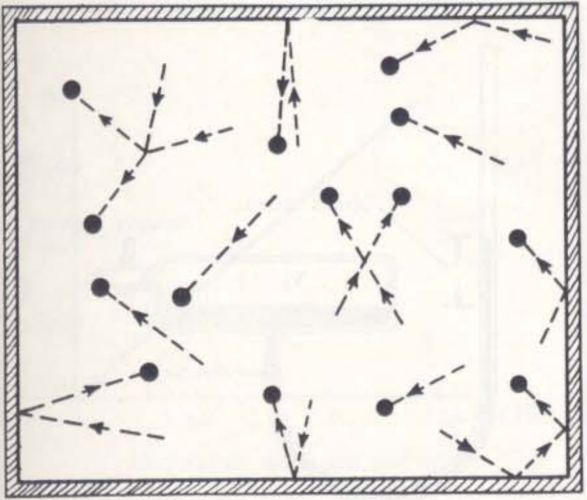
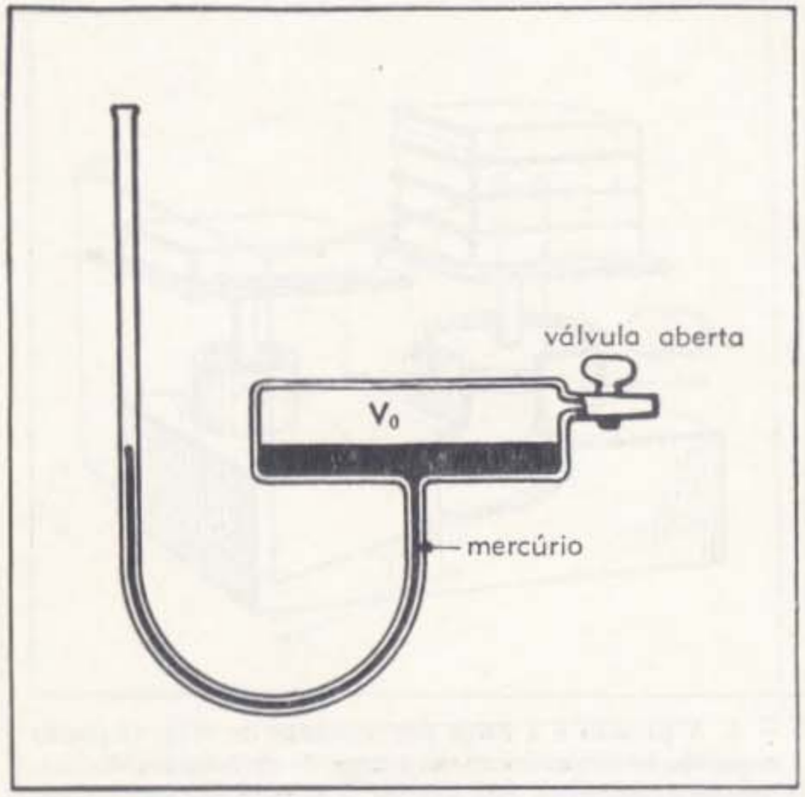
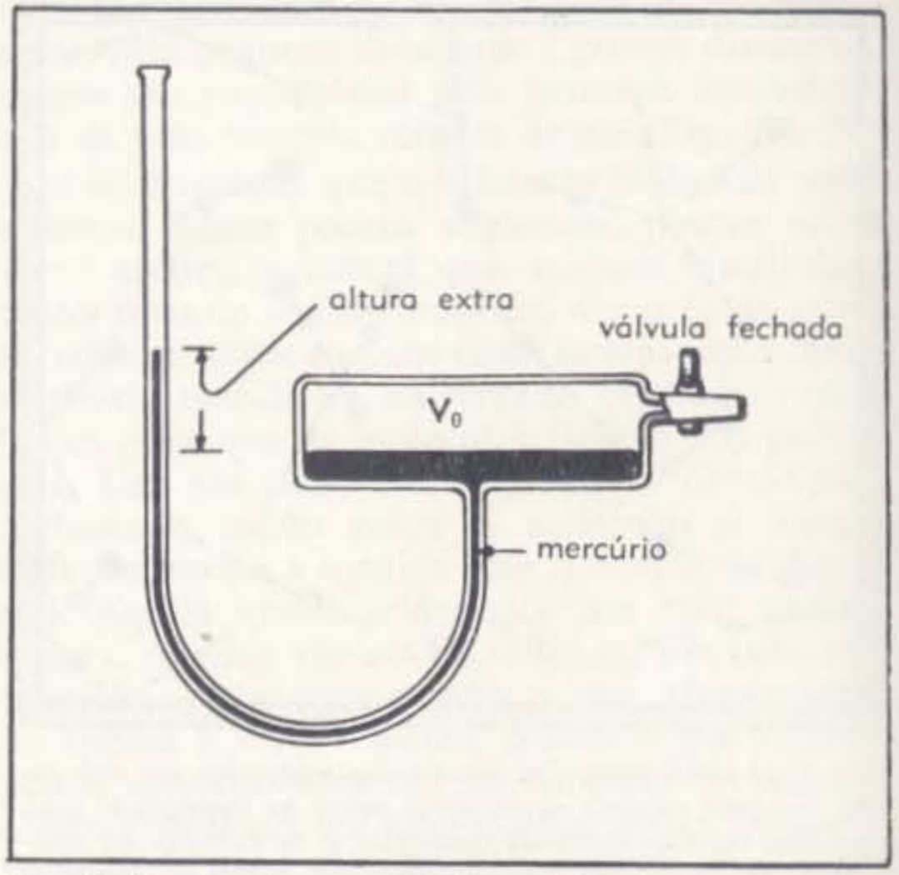
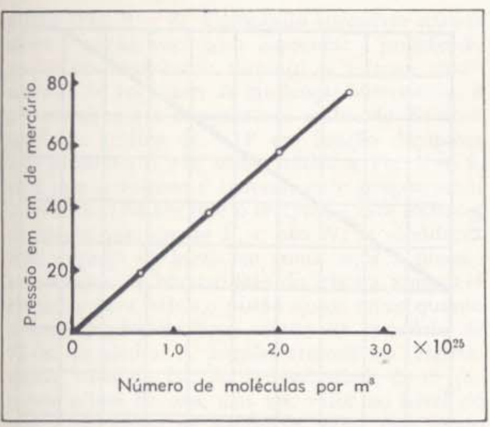
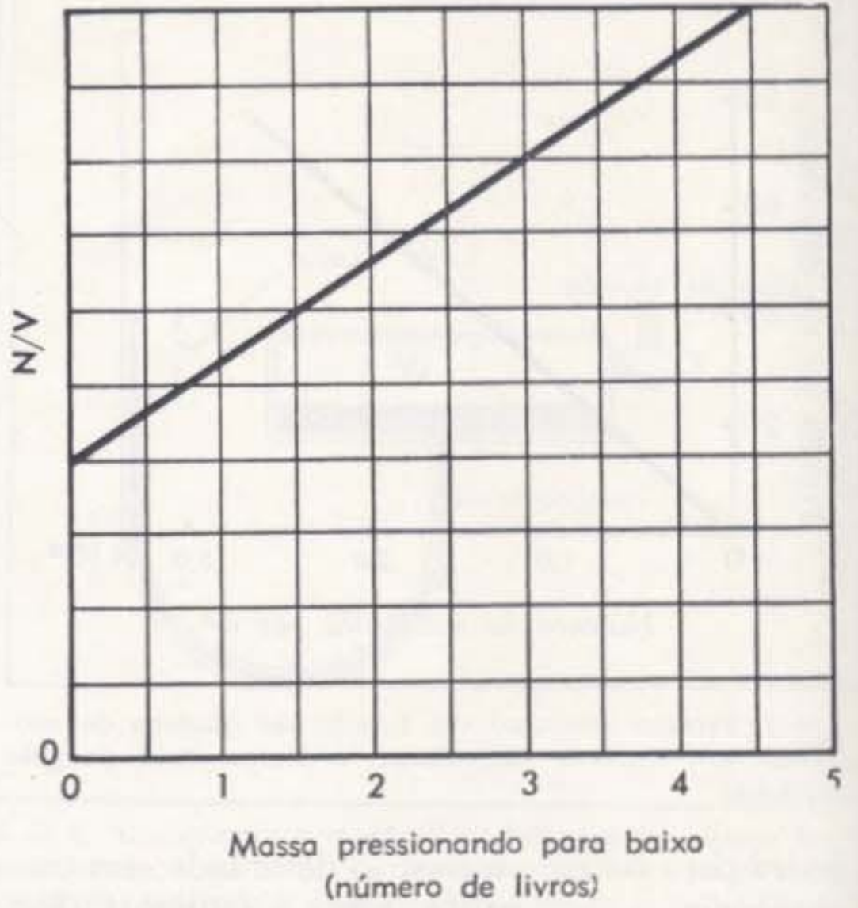
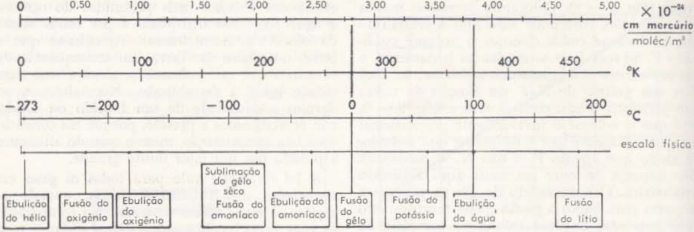
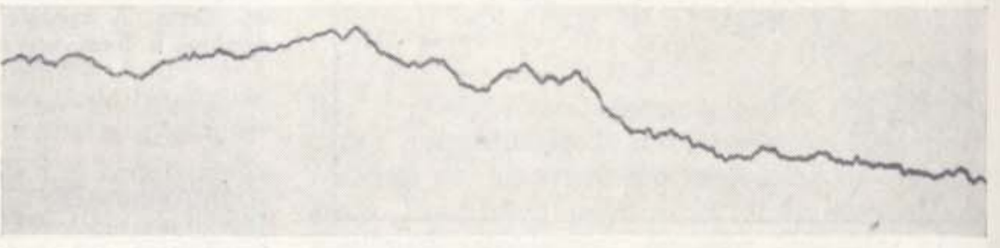
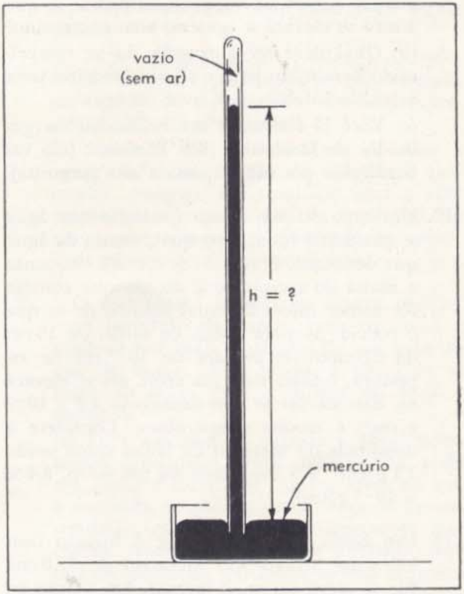
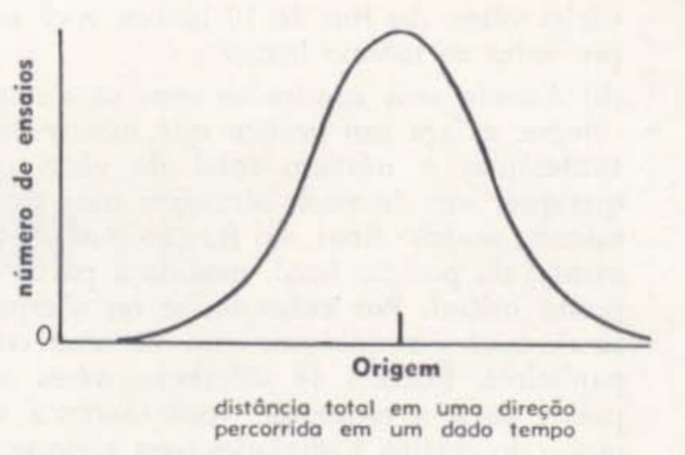

# Capitolo 9 - LA NATURA DI UN GAS

Ogni solido o liquido può trasformarsi in gas, e tutti i gas possono trasformarsi in liquido o solido. In condizioni ordinarie di temperatura e pressione, l’aria che circonda la Terra è un gas. In altre circostanze, tuttavia, è liquida, e un’importante industria si occupa della liquefazione dell’aria, raffreddandola. La familiare neve carbonica, chiamata ghiaccio secco, si trasforma in gas sotto i nostri occhi. Quando portata all’ebollizione, l’acqua diventa vapore, ossia acqua in forma gassosa o vapore acqueo. (Le sostanze che si presentano normalmente allo stato liquido, quando passano allo stato gassoso, sono dette vapori). Il vapore acqueo risultante dall’aria calda e umida dell’estate si condensa in rugiada, a contatto con superfici più fredde. Anche i metalli più resistenti al calore si trasformano in gas, se sufficientemente riscaldati. Quasi tutte le fiamme sono gas incandescente, che risplende e forma vortici. Tali fiamme risultano dalla combustione di ogni sostanza solida.

Lo studio dello stato gassoso della materia, attraverso mezzi semplici, ci aiuta a comprendere il percorso seguito dalla fisica e dalla chimica nella risoluzione dei problemi relativi alla natura della materia. Come può la struttura corpuscolare della materia, l’assetto dei suoi atomi, determinare la natura del mondo materiale? Accade che la natura atomica e molecolare di un gas, che non può essere mostrata con configurazioni nitide e ordinate come quelle dei cristalli, favorisca molto la comprensione della natura dell’intera materia. È quanto vedremo ora. Un approfondimento richiederebbe uno studio più avanzato della fisica del movimento rispetto a quanto affrontato finora, che verrà trattato più dettagliatamente nel Capitolo 26. L’immagine di un gas che stiamo per descrivere fu il primo frutto della comprensione atomica della materia, e costituisce la base per il tentativo, ancora in corso, della scienza di estendere tale immagine alle forme più complesse della materia. Il successo di tale impresa è un’ulteriore testimonianza della profondità e della portata della rappresentazione atomica.

## 9-1. Modelli fisici

Per comprendere il comportamento dei gas, costruiremo il modello di un gas. Cosa intendiamo con la parola modello?

Un modello non è soltanto una replica in scala ridotta di un oggetto, come il modello di una nave o un aeromodello. Esso rappresenta un’idea, un’immagine, un sistema di concetti ritenuti, grazie all’intuizione creativa e al lavoro rigoroso, descrittivi dei fenomeni che vogliamo studiare. Per esempio, quando parliamo del modello di una nuvola, non intendiamo una piccola nuvola in scala fatta di cotone. Intendiamo molto di più. Il nostro modello di una nuvola è la descrizione di ciò che avviene al suo interno — le correnti ascendenti, la turbolenza, la condensazione, la pioggia e la neve — tutto ciò in funzione di ciò che possiamo misurare in laboratorio, e in termini di idee e leggi fisiche verificate, che descrivono le relazioni tra tali misure.

Elaborando un simile modello, ci si attende che esso includa le caratteristiche essenziali dei fenomeni fisici o dei sistemi che si stanno indagando, pur sapendo che non potrà contenerle tutte. Nessun modello è perfetto: la storia ce lo dimostra. Sia il modello astratto, fatto di idee, sia quello tangibile in plastica e filo metallico, non sono del tutto fedeli.

Per questo motivo, i modelli vengono messi alla prova per verificare quanto si avvicinino alla realtà. Il primo test a cui si sottopone un modello consiste nell’esaminarlo in modo logico, per verificare quali proprietà debba avere il sistema fisico da esso rappresentato. Tali proprietà vengono poi investigate in laboratorio. Una concordanza ragionevole tra le proprietà previste sulla base del modello e quelle effettivamente osservate è un buon segnale: probabilmente il modello è migliorabile. E, con il perfezionamento, diventa via via più preciso, più completo.

Infine, i modelli che resistono a molteplici verifiche, che predicono in modo soddisfacente numerosi fenomeni, e suggeriscono esperimenti nuovi e inattesi — che a loro volta ne confermano o estendono la validità — costituiscono il nucleo delle teorie fisiche.

È inutile ingrandire una mappa e pensare che possa essere confusa con la regione reale che rappresenta, o analizzare maniglie di ottone di una casa di bambole come se contenessero tutti gli atomi presenti in una maniglia a grandezza naturale. I modelli devono rispettare la scala appropriata. Non ci si deve aspettare che un modello sia accurato in un ambito di grandezza molto diverso da quello per cui è stato concepito. Ciononostante, i modelli fisici ben riusciti sono spesso più efficaci di quanto si potesse prevedere. Manteniamo quelli che hanno superato verifiche rigorose, quelli che hanno consentito di estendere la nostra comprensione oltre la scala originaria per cui l’immagine fu ideata. Tuttavia, prima o poi, sottoposti a esami più attenti, mostrano dei limiti. Per esempio, abbiamo costruito un modello atomico della materia: tutta la materia è stata descritta in termini di unità fondamentali — gli atomi. Ma non abbiamo descritto la natura interna degli atomi, la quale richiede una teoria diversa, un modello differente, che rappresenta un’estensione del precedente già discusso.

I nostri modelli, le teorie fisiche oggi disponibili, descrivono gran parte del nostro mondo. Domani si amplieranno, diventeranno più completi, e descriveranno via via meglio il mondo naturale, man mano che questo verrà svelato attraverso la sperimentazione.

![Figura 1: Stati della materia. In condizioni appropriate, qualsiasi sostanza può esistere come solido, liquido o gas. Lo iodio è rappresentato sopra in ciascuno di questi stati. Come solido (cristallo), le particelle sono rigide e intimamente legate. Come liquido, le molecole restano un po’ distanziate e hanno maggiore libertà di movimento. Come gas, le molecole sono molto distanziate e con ampia libertà di movimento. Si noti che le molecole hanno la stessa dimensione (circa $6 \times 10^{-10}$ m) nei tre stati. Nel cambiamento di stato, varia la distanza tra le molecole, ma non la loro dimensione. (Da “General Chemistry” 2ª ed., Linus Pauling, Copyright 1949, 1950, 1953, W. H. Freeman & Co).](Figure/Fig_9_01.png)

## 9-2. Il modello molecolare di un gas

Quando inventiamo un modello per spiegare il comportamento del mondo che ci circonda, ci lasciamo guidare dai fatti salienti che vogliamo chiarire. Nel Capitolo 8 abbiamo abbozzato un modello dei gas e menzionato alcune delle loro proprietà più notevoli: abbiamo osservato che (1) sono facilmente comprimibili rispetto ai solidi e ai liquidi; (2) possiedono grande mobilità, al punto da interpenetrarsi facilmente; e (3) hanno densità basse rispetto a quelle delle stesse sostanze in forma liquida o solida.

Ne deduciamo quindi che possiamo immaginare un gas come costituito da un gran numero di molecole molto distanziate tra loro, mentre i solidi e i liquidi sono composti dagli stessi atomi e molecole, ma strettamente uniti (Fig. 9-1). Invertiamo ora il nostro procedimento: partiamo dal modello molecolare e vediamo come esso spiegherebbe le proprietà dei gas. Per farlo, aggiungiamo al modello un’altra caratteristica essenziale: le molecole devono essere in movimento.

Il modello molecolare di un gas è semplice da descrivere. Le molecole della sostanza gassosa costituiscono le unità fondamentali. Se il gas è elementare, le molecole possono essere formate da un solo atomo. A differenza di quanto accade negli atomi o molecole di un cristallo o di un liquido, esse non sono a contatto tra loro, bensì molto distanti, come visto nella Sezione 8-3. Tra di esse non c’è nulla: solo il vuoto. Se un solido o un liquido si trasforma in gas all’interno di una stanza, la stessa massa occupa un volume circa $10^3$ volte superiore a quello originario, acquisendo la densità tipica di un campione gassoso. In condizioni ordinarie, quindi, la distanza media tra le molecole è circa dieci volte maggiore del diametro molecolare. Questa bassa densità e il grande distanziamento spiegano la natura impalpabile di un comune campione di gas (Fig. 9-2).

Ricordando che il diametro molecolare misura solo pochi angstrom, ovvero poche volte $10^{-10}$ metri, capirai che — pur essendo molto distanti nella loro scala — le molecole, nella nostra scala, sono ancora molto vicine. In realtà, non c’è una ragione fondamentale per cui debbano restare così prossime: un gas può assumere qualunque densità; la distanza media tra le molecole aumenta via via che la densità diminuisce. Quello che consideriamo un buon vuoto, come quello presente in una valvola radio o in un tubo catodico, può corrispondere a una distanza media tra le molecole di circa $5 \times 10^{-7}$ metri — una distanza comparabile con quella del più piccolo oggetto visibile tramite un microscopio ottico convenzionale.

Quante volte è meno denso un tale gas rispetto all’aria normale?

La mobilità dei gas è coerente con l’ampio distanziamento tra le molecole. Se le molecole sono così distanti da non potersi toccare, non risentono molto della presenza delle altre. (Assumeremo che non esercitino forze a distanza significativa). Cosa, allora, le mantiene separate? In realtà, lo spazio non è statico: le molecole non stanno ferme, ma si muovono nello spazio come una raffica di piccole pallottole. Di tanto in tanto collidono tra loro, cambiando direzione, e prima o poi urtano contro le pareti del recipiente. In tal modo si diffondono, fino a rimbalzare sulle pareti. Se si avvicinano a un’apertura, ne escono. In assenza di pareti, continuano il loro moto. Così, possono fuoriuscire da qualsiasi passaggio.

Come possiamo allora spiegare l’interpenetrazione dei gas? Se le molecole dei gas sono così ampiamente distanziate, è chiaro che i gas possono mescolarsi tra loro. Immagina un recipiente diviso in due comparti da una parete ermetica, che separa due gas differenti. Se si rimuove la parete, o si apre una valvola, le molecole in movimento si mescolano, fino a ottenere una miscela uniforme, in cui ogni sub-volume del recipiente contiene la stessa proporzione dei due gas. È proprio ciò che si osserva.

Quando si permette a un gas di fluire direttamente da un recipiente verso uno spazio vuoto, la velocità del moto molecolare è approssimativamente pari a quella del suono; essa corrisponde alla velocità tipica delle molecole. Tuttavia, quando il gas attraversa lunghi tubi, o si mescola con un altro gas, la velocità apparente è molto inferiore. In questi casi, le molecole urtano frequentemente tra loro, e il movimento assomiglia a quello di una folla che cerca di passare attraverso un varco stretto. A causa degli urti, con continui spostamenti avanti e indietro, la velocità dell’interpenetrazione non rappresenta una misura affidabile della velocità del moto individuale. La velocità di mescolanza dovrebbe essere molto più bassa, e infatti lo è.

Molecole ampiamente distanziate, che si muovono in tutte le direzioni nello spazio vuoto, con velocità leggermente superiori a quella del suono, collidendo e rimbalzando mentre avanzano — questo è il nostro modello per un gas. Esso spiega in modo soddisfacente la bassa densità, la mobilità e l’interpenetrazione dei gas.

Il fatto che tutta la materia possa essere vaporizzata concorda anch’esso con il modello. Ogni solido o liquido può essere scomposto nelle sue molecole o atomi costitutivi. Quando vengono superate le forze attrattive che li tengono uniti in configurazioni più o meno compatte, gli atomi o le molecole liberati formano un gas. Il riscaldamento allenta i legami tra le molecole e ne consente il movimento in tutte le direzioni. Sottoposti a calore intenso, tutti i composti solidi o liquidi si trasformano in gas. Quando il riscaldamento è sufficiente, le molecole dei composti si dissociano nei singoli atomi degli elementi che li compongono, formando un gas atomico, miscela di tutti gli atomi presenti nel campione. Ecco perché la fiamma, l’arco elettrico e la scintilla producono gli spettri caratteristici degli atomi. In regioni ancora più calde, anche gli atomi si dissociano nei loro costituenti fondamentali.

La liquefazione e il congelamento sono i processi opposti. Comprimendo un gas, possiamo ridurne il volume fino a che le molecole giungono a contatto. Sottraendo calore, gli atomi appena riuniti si congelano. Le forze attrattive tra le molecole li mantengono di nuovo strettamente uniti.

## 9-3. Legge di Boyle

Il modello che abbiamo descritto è plausibile, persino affascinante. Ma deve essere sottoposto a un accurato esame prima di essere realmente accettato. La descrizione della pressione dei gas servirà a testare il modello e a spiegare molti fatti familiari della vita quotidiana, dalla respirazione al comportamento degli pneumatici. Per ridurre il volume di un campione di gas, è necessario uno sforzo: il gas si oppone alla compressione. D’altra parte, qualunque campione di gas tende ad aumentare di volume fino a incontrare un ostacolo. Il nostro modello spiega bene questa tendenza all’espansione. Le molecole colpiscono le pareti e rimbalzano, come una grandinata; esse esercitano una pressione istantanea contro le pareti (Fig. 9-3). Questa successione di urti momentanei costituisce la pressione che spinge contro le pareti e si oppone alla compressione.

La spinta esercitata contro una parete è perpendicolare a essa. Le molecole si muovono verso la parete provenendo da tutte le direzioni, per cui qualsiasi spinta da destra verso sinistra è bilanciata dalla spinta opposta, da sinistra verso destra. Tuttavia, tutte le molecole esercitano una pressione verso l’esterno, contro la parete; e non vi è forza opposta che prema verso l’interno, se non la reazione della parete.

La spinta esercitata varia da un punto all’altro della parete? Se il gas è uniforme, il numero medio di molecole che urtano per unità di superficie sarà lo stesso ovunque, e il gas eserciterà una pressione uniforme in tutte le direzioni. Naturalmente, se un numero maggiore di molecole urta una determinata area, questa subirà una spinta maggiore, ma poiché il numero di urti su ogni superficie significativa è elevatissimo, tali effetti si compensano in tempi molto brevi. Solo la superficie coinvolta nella spinta è rilevante. In effetti, il valore della spinta è proporzionale all’area che riceve il bombardamento molecolare. La forza uniforme perpendicolare per unità di area è ciò che chiamiamo pressione del gas (Fig. 9-4). È una grandezza importante che può essere misurata bilanciandola con la forza di gravità esercitata su alcune masse campione.

Possiamo indagare sperimentalmente la pressione esercitata da un gas confinato nel modo seguente. Si riempie di mercurio la parte inferiore di un tubo aperto all’aria da entrambe le estremità (Fig. 9-5). L’altezza del mercurio risulta allora la stessa in entrambi i lati del tubo. Il lato destro del tubo si apre su uno spazio gassoso $V_1$, di volume definito. Una valvola consente di isolare questo volume dall’aria esterna. Inoltre, attraverso il tubo con la valvola, possiamo introdurre ulteriori quantità di gas nello spazio $V_1$.

Supponiamo di usare un sacchetto di plastica di volume definito $V_1$, per esempio. Quando viene riempito d’aria e lasciato aperto all’atmosfera, contiene un numero definito di molecole (in realtà, un numero di molecole pari a $V_1 / V_0$ rispetto a quelle presenti in un dato volume standard $V_0$). Fissiamo il sacchetto all’estremità destra del tubo (Fig. 9-5). Spingiamo l’aria del sacchetto nel volume $V_1$ e chiudiamo la valvola per mantenere il gas compresso in quello spazio, ora contenente un numero maggiore di molecole rispetto a prima. Il bombardamento sulla superficie del mercurio nel recipiente di destra aumenta perché ci sono più molecole nello stesso volume. La pressione aggiuntiva spinge verso il basso la colonna di mercurio sul lato destro; di conseguenza, il mercurio si solleva a sinistra (Fig. 9-6). L’altezza aggiuntiva del mercurio a sinistra misura la pressione aggiuntiva, cioè la pressione risultante dal bombardamento delle molecole supplementari introdotte nel recipiente.

Se portiamo un secondo sacchetto di plastica pieno d’aria e vi immettiamo nuovamente l’aria nel volume di destra $V_1$, otteniamo due carichi aggiuntivi di molecole. Secondo il nostro modello, ci aspettiamo che la pressione supplementare del mercurio raddoppi. Verifichiamo, infatti, che l’altezza della colonna di mercurio sul lato sinistro aumenta nuovamente della stessa quantità osservata con il primo carico di molecole.

Possiamo continuare ad aggiungere quantità note di molecole nel volume $V_1$ e misurare la risalita del mercurio sul lato sinistro. Tali misure mostrano che la pressione cresce in proporzione diretta al numero di molecole in un dato volume (Fig. 9-7).

Supponiamo di condurre l’esperimento alla temperatura di fusione del ghiaccio. A questa temperatura, conosciamo il numero di molecole di un gas che occupano un dato volume alla pressione atmosferica normale. Dal Capitolo 8 abbiamo appreso che una mole (cioè $6{,}025 \times 10^{23}$ molecole) occupa 22,4 litri a questa temperatura; pertanto, ci sono $2{,}70 \times 10^{25}$ molecole per metro cubo. Sappiamo quindi quante molecole introduciamo in $V_1$. 

Per esempio, se il volume $V_1$ del sacchetto è di 1 litro (ossia $10^{-3}$ m³), ogni carico contiene:

$$
2{,}70 \times 10^{25} \ \text{molecole/m}^3 \times 10^{-3} \ \text{m}^3 = 2{,}70 \times 10^{22} \ \text{molecole}
$$

Dall’altezza della colonna di mercurio sul lato sinistro conosciamo anche la pressione da esse esercitata. Alla temperatura di fusione del ghiaccio, si verifica che per $2{,}70 \times 10^{25}$ molecole/m³, la pressione del gas sostiene una colonna di mercurio di 76 cm. In generale, dato che la pressione è proporzionale al numero di molecole per unità di volume, possiamo esprimerla come:

$$
\frac{P}{76} = \frac{N/V}{2{,}70 \times 10^{25}} \quad \text{oppure} \quad P = 2{,}81 \times 10^{-24} \cdot \frac{N}{V}
$$

dove $N/V$ è il numero di molecole per unità di volume (m³), $P$ è espresso in centimetri di altezza di mercurio.

Abbiamo visto nel Capitolo 8 che il volume occupato da un certo numero di molecole, alla pressione atmosferica, è indipendente dalla natura delle molecole. Ora possiamo usare gas differenti per verificare se la pressione dipenda dalla loro natura. Queste esperienze mostrano che, in generale, la pressione dipende dal numero di molecole per unità di volume, ma non dalla loro natura. Tutti i gas si comportano allo stesso modo quando le densità sono sufficientemente basse, cioè quando la distanza media tra le molecole è grande rispetto alle loro dimensioni.

Possiamo ripetere tutte le esperienze utilizzando un diverso volume $V_2$ invece di $V_1$: otteniamo gli stessi risultati in termini di numero di molecole per unità di volume. In tal modo, ci assicuriamo che la pressione è determinata da $N/V$.

Finora abbiamo lavorato solo alla temperatura di fusione del ghiaccio. Possiamo ripetere questi esperimenti alla temperatura dell’ebollizione dell’acqua. Tutto risulta identico, tranne per il fattore di proporzionalità, che ora vale $3{,}84 \times 10^{-24}$ cm di mercurio per $(\text{molecole}/\text{m}^3)$, invece di $2{,}81 \times 10^{-24}$ cm di mercurio per $(\text{molecole}/\text{m}^3)$, che risultava alla temperatura di fusione del ghiaccio. Per altre temperature, anche in questo caso, la pressione è proporzionale al numero di molecole per unità di volume, ma il fattore di proporzionalità varia a seconda della temperatura.

Riassumendo, dunque, queste esperienze ci mostrano che, a una data temperatura, la pressione esercitata da un gas è proporzionale al numero di molecole diviso per il volume che esse occupano:

$$
P = \theta \cdot \frac{N}{V}
$$

dove $\theta$ è il fattore di proporzionalità. Questo risultato è quello che ci si aspetta, purché le molecole non urtino troppo frequentemente tra loro. Se c’è spazio sufficiente, il numero di molecole che colpisce le pareti del recipiente dipende dal numero presente nella zona adiacente alla parete; di conseguenza, la pressione deve essere proporzionale a $N/V$, come abbiamo verificato. Se vi è il doppio delle molecole per unità di volume — quindi il doppio nella regione vicina alla parete — allora il doppio colpirà la stessa area di parete in un tempo dato, e la pressione sarà doppia. Questa legge del comportamento dei gas è nota come **legge di Boyle**, in onore di **Robert Boyle**, brillante contemporaneo di Newton, che fu il primo a dimostrarla sperimentalmente.

Puoi anche dimostrare la legge di Boyle con esperimenti su un campione specifico di gas contenuto in un cilindro chiuso da un pistone (Fig. 9-8). Aggiungendo progressivamente masse sul pistone, puoi aumentare la pressione del gas e osservare come diminuisce il volume confinato $V$. Se i cambiamenti sono eseguiti lentamente, il gas resta a temperatura ambiente. Tracciando un grafico di $N/V$ in funzione della massa che esercita pressione sul gas, come indicato nella Fig. 9-9, si vede che il volume è inversamente proporzionale alla pressione. (Ricorda che il recipiente è chiuso, quindi solo $V$, e non $N$, varia).

Non dimenticare di considerare anche la pressione atmosferica. Il bombardamento da parte dell’aria atmosferica esercita sul pistone una spinta quasi pari a quella di una colonna di mercurio alta 76 cm. La pressione atmosferica, infatti, varia in funzione della quantità d’aria sopra di noi, ma al livello del mare il suo valore è di 76 cm di mercurio, valore usato per definire la pressione atmosferica standard.

La legge di Boyle è pienamente compatibile con il modello molecolare di un gas. Essa esprime ciò che ci si aspetterebbe se un insieme di molecole, ampiamente distanziate, si muovesse in un recipiente urtando contro le pareti. Il modello sembra valido.

Esploriamone i limiti. Supponiamo di aumentare considerevolmente la pressione sul nostro campione. Continuiamo a comprimere più gas nello stesso volume. La densità cresce. Alla fine, le molecole non possono più muoversi liberamente. Devono restare a contatto per la maggior parte del tempo, e usciamo così dal campo di validità del nostro modello semplice, che presupponeva molecole molto distanti. Il modello cessa quindi di essere valido. Quando il gas è così compresso, la pressione sulle pareti non dipende più dagli urti delle molecole in movimento, ma diventa la pressione necessaria per tenere insieme le molecole nello spazio ridotto. Questa è una proprietà della struttura interna delle molecole, non del loro movimento.

Molto prima che le molecole siano così strettamente unite, il modello fallisce, e lo stesso vale per la legge di Boyle. I gas, a pressioni di migliaia di atmosfere, si discostano fortemente dalla linearità prevista dalla legge. Con l’aumentare della pressione, il volume diminuisce molto più rapidamente. In effetti, il comportamento non differisce molto da quello di un solido o di un liquido sottoposto a pressione. La densità dell’acqua, o anche dell’acciaio, dipende da quanto fortemente le molecole sono compattate. Alla pressione di mille atmosfere — come nei fondali oceanici più profondi — l’acqua ha una densità superiore del 4% rispetto a quella ordinaria. Si ritiene che il ferro, al centro della Terra, a causa dell’enorme pressione, raggiunga una densità pari a quella del piombo.

Normalmente, quando si indica la densità di un liquido o solido, non si specifica la pressione, perché questa, in pratica, varia poco, anche quando modificata di un grande fattore.

La legge di Boyle è valida per tutti i gas a densità sufficientemente basse, quando le molecole sono molto distanziate rispetto alle loro dimensioni. In effetti, per densità maggiori, essa si applica meglio ai gas di molecole semplici, come l’ossigeno o l’idrogeno, piuttosto che a quelli con molecole grandi e complesse, come il vapore d’alcool. Lo studio delle deviazioni dalla legge di Boyle apre la strada a un’analisi più approfondita — e più complessa — delle molecole. Per ora, ci manterremo nel dominio più semplice delle basse densità.

## 9-4. Temperatura e termometri a gas

In genere, misuriamo le variazioni di temperatura osservando le variazioni di volume di un liquido — quasi sempre mercurio o alcol. Ciascuna di queste sostanze si dilata in modo peculiare man mano che la temperatura aumenta — l’acqua, ad esempio, si contrae leggermente poco sopra il punto di fusione del ghiaccio. Tuttavia, i gas che seguono la legge di Boyle (cioè tutti quelli le cui molecole sono sufficientemente distanziate) mostrano esattamente lo stesso comportamento. Questi gas, quindi, misurano la temperatura in modo più fondamentale rispetto all’espansione di altre sostanze, e permettono di dedurre una definizione razionale di temperatura a partire dal loro comportamento.

Abbiamo visto, nella sezione precedente, che alla temperatura di fusione del ghiaccio la pressione dei gas, espressa in cm di mercurio, è:

$$
P = 2{,}81 \times 10^{-24} \cdot \frac{N}{V}
$$

dove $N$ è il numero di molecole che occupano il volume $V$. Alla temperatura di ebollizione del vapore acqueo, invece:

$$
P = 3{,}84 \times 10^{-24} \cdot \frac{N}{V}
$$

In generale, nella formula $P = \theta \cdot (N/V)$, il fattore di proporzionalità $\theta$ dipende unicamente dalla temperatura.

In altre parole, a una data temperatura $\theta$, il valore di $PV/N$ è lo stesso per tutti i gas a bassa densità, qualunque sia la pressione o il numero $N$ di molecole presenti. Il volume $V$ che esse occupano è sempre tale da mantenere costante $\theta$, purché la temperatura resti invariata.

Inoltre, per tutti questi gas, $\theta$ cresce regolarmente con l’aumento della temperatura. Di conseguenza, $\theta$ è la misura naturale della temperatura. Potremmo scegliere i valori di $\theta$ — cioè $2{,}81 \times 10^{-24}$ cm di mercurio/(molecole/m³) alla temperatura di fusione del ghiaccio, $3{,}84 \times 10^{-24}$ cm di mercurio/(molecole/m³) alla temperatura di ebollizione dell’acqua, ecc. — come scala di riferimento per la temperatura. E in effetti, questa sarà la nostra scelta. Storicamente, tuttavia, altre scale di temperatura sono state introdotte prima. La loro relazione con la scala fondamentale è mostrata nella Fig. 9-10. Come si può vedere, la **scala Kelvin** è proporzionale a questa scala di base; si tratta della stessa scala ma con unità più pratiche, chiamate **gradi Kelvin**, indicati con $^\circ$K. La **scala centigrada** ha unità di uguale ampiezza rispetto a quella Kelvin, ma lo zero è stato arbitrariamente fissato alla temperatura di fusione del ghiaccio, che corrisponde a 273°K o $2{,}81 \times 10^{-24}$ cm di mercurio/(molecole/m³) nella scala dei gas. Osserva che ci sono 100°C (o 100°K) tra la temperatura di fusione del ghiaccio e quella di ebollizione dell’acqua alla pressione normale.

Le unità di queste scale sono state scelte per comodità. I termometri ad uso scientifico sono in genere calibrati in gradi Celsius, ma è bene ricordare che lo zero di questa scala è frutto di una scelta arbitraria. Avrebbe potuto essere fissato, per esempio, alla temperatura di fusione dell’oro. La scala Kelvin e quella del termometro a gas hanno invece uno zero naturale — lo **zero assoluto**, che discuteremo brevemente nella prossima sezione.

## 9-5. Temperatura e il modello di un gas

Nella sezione precedente abbiamo visto che il fattore di proporzionalità $\theta$ della legge di Boyle ci ha condotti a una definizione ragionevole di temperatura. Questo fattore $\theta$ è indipendente dalla natura del gas e dipende solo dalla temperatura, definita ad esempio dal punto di fusione del ghiaccio, dal punto di ebollizione del vapore acqueo o da un altro riferimento fisico. Possiamo comprendere meglio la natura della temperatura se ora esaminiamo cosa rappresenta $\theta$ alla luce del nostro modello molecolare dei gas. La legge di Boyle è:

$$
P = \theta \cdot \frac{N}{V}
$$

Abbiamo già visto perché è ragionevole che la pressione sia proporzionale al numero di molecole per unità di volume. Qualunque altro fattore che influenzi la pressione è incluso in $\theta$. Nel modello molecolare, cosa racchiude dunque $\theta$?

Per un dato numero di molecole in una regione vicina a una parete, la pressione esercitata su tale parete deve dipendere dalla velocità del moto molecolare. Se le molecole si muovono lentamente, solo poche urteranno la parete ogni secondo e con poca intensità. Se invece si muovono rapidamente, molte molecole colpiranno la parete e ciascun urto sarà più violento — proprio come una palla da baseball lanciata ad alta velocità ti colpisce con più forza rispetto a una che si muove lentamente.

La pressione sulla parete deve quindi aumentare con la velocità del movimento molecolare, e diminuire se tale velocità si riduce. Il fattore di proporzionalità $\theta$ della legge di Boyle riflette questa dipendenza dal moto molecolare.

Un altro fattore importante incluso in $\theta$ è la **massa molecolare**. Una palla di cannone e una pallina da ping-pong che si muovono alla stessa velocità non esercitano lo stesso impatto su un bersaglio fermo: la palla di cannone, avendo maggiore massa, colpirà con più forza. Anche la massa molecolare influisce quindi sulla costante di proporzionalità $\theta$. Tuttavia, quando aumentiamo la temperatura, **non** modifichiamo la massa molecolare. Una bombola di gas a temperatura elevata pesa quanto la stessa bombola alla temperatura più bassa. Quindi, secondo il modello molecolare, un aumento di temperatura deve corrispondere a un aumento della velocità molecolare.

Dobbiamo estendere il modello molecolare includendo l’idea che **una temperatura più alta implica una velocità molecolare maggiore**. L’esperienza quotidiana conferma in gran parte questa conclusione. Ad esempio, l’aumento di temperatura accelera in generale le reazioni chimiche. Questo è coerente con l’idea che le molecole si muovano più rapidamente. A velocità più elevate, si urtano con maggiore forza e più frequentemente. Le collisioni separano le molecole e riordinano gli atomi con più frequenza; pertanto, le reazioni procedono più velocemente.

Inoltre, l’idea che un maggiore moto molecolare accompagni l’innalzamento della temperatura **non dovrebbe essere limitata ai gas**. Un gas riscaldato trasmette la sua temperatura alle zone più fredde circostanti, **aumentando la velocità dei piccoli movimenti molecolari nei liquidi o nei solidi**, e degli atomi all’interno delle molecole.

Supponiamo che le pareti del recipiente siano di metallo, con i suoi atomi ordinatamente disposti in ciascun granulo cristallino. In generale, gli atomi non possono abbandonare le loro posizioni nella rete cristallina; vibrano però attorno alla loro posizione come farebbe un insieme di piccole sfere montate su molle. Questo moto incessante è misurato dalla temperatura, proprio come il moto casuale delle molecole di un gas. Le molecole in movimento vibrano anche internamente, un atomo contro l’altro, oltre a ruotare. Talvolta, una molecola del gas urta un atomo della parete cristallina, facendolo vibrare più rapidamente. La molecola rimbalza, tornando indietro con velocità minore. Di tanto in tanto, una molecola lenta che passa vicino a un atomo vibrante può essere accelerata da quest’ultimo, allontanandosi con maggiore velocità. Questo **scambio continuo di energia** tra movimento atomico e molecolare è il **mezzo attraverso cui le temperature si equilibrano** e il movimento permane.

Quando riscaldati, i solidi si trasformano fondendosi, o anche vaporizzando se la temperatura è sufficientemente alta. Il moto molecolare si intensifica con l’innalzarsi della temperatura, fino a diventare così intenso che atomi e molecole possono spostarsi o separarsi. A temperature ancora più elevate, il moto molecolare è così vigoroso che le molecole dei gas si urtano e **si spezzano**. Il gas si riduce in **atomi**. Questo è il motivo per cui, in una **fonte luminosa incandescente ad alta temperatura**, si osservano soltanto gli **spettri degli elementi**, cioè **gli spettri degli atomi semplici**.

Abbassando il pistone di una pompa da bicicletta, il pistone mobile urta contro le molecole di gas contenute nella pompa e ne aumenta la velocità. Maggiore velocità implica temperatura più alta, così come temperatura più alta significa maggiore velocità. Il gas dovrebbe quindi riscaldarsi. Questo accade realmente: la temperatura del gas può salire al punto che l’esterno del cilindro risulta caldo al tatto. Ancora una volta, la nostra relazione tra velocità molecolare e temperatura trova conferma: **temperatura più alta, maggiore velocità**.

Quando la temperatura si abbassa, le molecole rallentano. Si muovono lentamente. Alla fine, il movimento diventa così lento che le forze attrattive tra molecole possono portarle a unirsi, senza più rimbalzare dopo gli urti tra loro o contro le pareti del recipiente. Se la temperatura scende al di sotto di 100°K, ad esempio, l’aria diventa prima liquida e poi solida; i suoi due principali componenti, azoto e ossigeno, subiscono queste trasformazioni a temperature leggermente diverse. A 5°K, alla normale pressione atmosferica, **non esistono gas**: solo l’elio non si solidifica; esso si trasforma in una **nuova e straordinaria sostanza**, simile a un liquido ma con proprietà non riscontrate in nessun’altra sostanza nota: si chiama **superfluido**.

[Pagina: 185]

Le basse temperature favoriscono l’ordine, la regolarità, l’incastro accurato degli atomi e delle molecole. Questa è la profonda ragione che sta dietro ai cristalli e ai fiocchi di neve. L’ordine è legato al freddo. Alle alte temperature accade l’opposto: tutto è in rapido movimento, tutto è disordine, caos. Eppure, in mezzo a questo moto caotico, rimangono prevedibili i **valori medi** della densità, della pressione e di altre proprietà. Le **meravigliose regolarità dei gas** dipendono proprio da questa disorganizzazione. Il gas è puro movimento e disordine; non ha configurazioni regolari, né forme specifiche, né densità predeterminate. **Il calore è disordine.**

La vita sembra richiedere solo la **giusta combinazione di ordine e disordine**: non può funzionare in uno stato congelato di completa rigidità, pur potendo sopravvivere in tali condizioni. Ma non può nemmeno sopravvivere in una condizione di disordine eccessivo. Per lo sviluppo della vita, la temperatura dev’essere quella giusta. E, per quanto ne sappiamo, la vita si limita al nostro ambiente speciale, entro un intervallo di temperatura compreso **tra circa 200°K e 400°K**. Si tratta di un intervallo ristretto in un universo in cui la temperatura varia da **pochi gradi Kelvin** in alcune regioni dello spazio, a **decine di milioni di gradi** nel centro delle stelle.

Quando consideriamo atomi e molecole, la velocità cresce con la temperatura; l’ordine diminuisce. L’assenza di moto molecolare è il minimo possibile; non esiste un ordine più perfetto di quello che regna in una configurazione cristallina completamente congelata. Lo **zero naturale di temperatura**, $\theta = 0$, ottenuto per **estrapolazione** dal comportamento dei gas nella regione in cui seguono la legge di Boyle fino alle basse temperature, sembra corrispondere a una **velocità molecolare nulla**. Non essendoci una velocità più bassa, questo zero assume un **significato assoluto**. Lo **zero della scala Kelvin** (che coincide con $\theta = 0$) è spesso chiamato **zero assoluto**.

![Figura 11: Misura della velocità delle molecole. Le molecole emergono dal gas nella stufa passando nel vuoto, e vengono colliminate in un fascio sottile dalla seconda fenditura. La terza fenditura consente l’ingresso di un breve getto di molecole in un cilindro rotante. A causa della rotazione, le molecole non colpiscono la parte opposta della fenditura. Dalla posizione in cui esse incidono e dalla velocità di rotazione del cilindro, si può calcolare la velocità molecolare. (Da “Introduction to Atomic Physics”, di O. Oldenberg, McGraw-Hill Book Company).](Figure/Fig_9_11.png)

Lord Kelvin, grande fisico e ingegnere elettrico inglese, fornì vari argomenti per stabilire la scala Kelvin della temperatura e il concetto di zero assoluto. Il suo ragionamento si basava sulle **leggi generali che descrivono il funzionamento delle macchine termiche**, indipendenti dalla visione molecolare. Perciò, il lavoro Lord Kelvin stabilì la scala della temperatura e il significato dello zero assoluto, indipendentemente dall’interpretazione molecolare delle leggi dei gas. D’altra parte, l’idea che al **punto zero assoluto non vi sia moto molecolare** non è del tutto sicura. È una conclusione seducente alla luce della nostra interpretazione delle leggi dei gas, ma quando si arriva a 0°K si è ormai andati ben oltre il dominio del comportamento gassoso. Tutti i movimenti diventano allora **movimenti di molecole o atomi legati tra loro**. Si ritiene oggi che esista un **minimo movimento residuo**, e che lo **stato più freddo** non sia del tutto inerte, come indicato dall’estrapolazione delle leggi dei gas. Tale estrapolazione, quindi, non coincide più con il concetto di **moto nullo**, ma assume un significato diverso.

Un risultato inaspettato deriva dalle leggi dei gas: un campione con un dato numero di **molecole pesanti** e un altro con lo stesso numero di **molecole leggere** esercitano **la stessa pressione** sulle pareti di un dato volume, alla stessa temperatura. La pressione **non dipende dalla massa molecolare**, né dalla natura delle molecole; dipende solo dal numero di molecole presenti. Questo è sorprendente, poiché ci aspetteremmo che una pioggia di palline da baseball eserciti una pressione maggiore di una pioggia di chicchi di grandine. L’unica spiegazione plausibile è che, a parità di temperatura, le molecole più pesanti **si muovano più lentamente** rispetto a quelle leggere. Misurando la velocità con cui le molecole dei gas, alla stessa temperatura, passano attraverso un’apertura nel vuoto (Fig. 9-11), si osserva che **le molecole pesanti si muovono mediamente più lentamente**.

[Pagina: 186]

Infatti, gli esperimenti indicano che il valore medio di $mv^2$, cioè la massa molecolare moltiplicata per il quadrato della velocità molecolare, è **proporzionale alla temperatura**.

È facile verificare in modo approssimativo come nascono queste differenze di velocità. Il movimento molecolare **non avviene per magia**: le molecole si muovono perché vengono urtate da altre molecole in movimento. Quelle più pesanti si mettono in moto con maggiore difficoltà, mentre un urto dello stesso tipo metterebbe in moto le molecole leggere con maggiore velocità. Questo suggerisce, pur senza dimostrarlo, il risultato osservato.

La natura del calore e della temperatura è troppo ricca per essere esaurita in questi paragrafi; nei capitoli successivi si approfondirà ulteriormente (Capitolo 26). Quando affronteremo la meccanica, forniremo argomenti più dettagliati, dimostrando che la **temperatura di un gas è proporzionale a $mv^2$**. Uno studio successivo — non trattato in questo libro — mostra che, se si attende a lungo, i valori medi di $mv^2$ tra differenti tipi di molecole che si urtano reciprocamente tendono a **uguagliarsi**. La temperatura tende a uniformarsi proprio in questo modo. Nella pompa da bicicletta, dopo la compressione, il moto delle molecole del gas caldo rallenta, mentre le altre molecole circostanti **aumentano la loro velocità**. Dopo un po’ di tempo, le temperature della pompa e delle regioni circostanti **si uniformano**, avvicinandosi a quella della zona contenente il maggior numero di molecole.

![Figura 13: All’inizio del secolo, Jean Perrin osservò attentamente il numero di piccole particelle sospese a diverse profondità in un liquido. Trovò una distribuzione di particelle sospese simile a quella illustrata, su scala ingrandita. Essa somiglia alla distribuzione delle molecole in un gas. Le particelle nella parte alta della sospensione (o le molecole superiori in un gas) esercitano pressione su quelle sottostanti. Le particelle più in basso, su cui grava la maggior parte delle altre, sono più compresse, risultando in una densità maggiore verso il fondo. Questo illustra quanto accade nell’atmosfera terrestre, in cui metà della massa si trova nei primi 5,5 km sopra la superficie. Salendo, la densità dell’aria diminuisce.](Figure/Fig_9_13.png)

## 9-6. Moto browniano e rumore Johnson

Su scala sufficientemente piccola, la densità di un gas dipende dal minuscolo volume considerato. Qua e là si muove una molecola; il resto dello spazio è vuoto. La **densità costante** che osserviamo normalmente deve essere un **valore medio**: il numero di molecole contenute in un piccolo cubo, contato più volte in momenti diversi, e fatta la media dei risultati (vedi Fig. 9-2). Lo stesso accade con la **pressione**. La pressione che rileviamo — con un manometro o tramite peso — è anch’essa una **media spaziale e temporale**. Un manometro piccolissimo e molto sensibile oscillerebbe fortemente: indicherebbe una pressione elevata se colpito da una molecola, e una pressione bassa se nessuna molecola fosse presente. Un manometro di questo tipo fornirebbe una prova diretta del moto caotico delle molecole di gas, ma i nostri manometri usuali indicano solo **valori medi**.

Esiste qualche indizio diretto di questo caos che possiamo percepire direttamente? Poiché tutto avviene su scala estremamente piccola, di norma **non osserviamo le enormi fluttuazioni**. Tuttavia, il caos molecolare può essere osservato direttamente in una serie affascinante di esperimenti. Il botanico **Robert Brown**, abile nell’uso del microscopio semplice — uno di quelli che puoi costruire tu stesso in laboratorio — nel **1827**, utilizzando una semplice lente e una sfera di vetro con distanza focale di circa 1/32 di pollice, osservò con entusiasmo che **minuscole particelle** provenienti dai granuli di polline **si muovevano costantemente** nell’acqua in cui erano immerse.

“Questi movimenti erano tali che mi convinsi”, scrisse, “che appartenevano alla particella stessa”, e non erano il risultato, ad esempio, di correnti nell’acqua. Inizialmente pensò che le particelle si muovessero perché **vive**, e di aver scoperto una **nuova caratteristica della vita**; ma verificò poi che anche particelle **bollite** continuavano a muoversi. Alla fine, come oggi sappiamo con certezza, **nessuna particella microscopica rimane mai immobile**. Questo moto è chiamato **moto browniano**.

Possiamo registrare il moto browniano di una particella, come mostrato nella Fig. 9-12, dove si chiarisce che la sua traiettoria obbedisce al **caso** e al **caos**. Circa cinquant’anni fa, quando fu compresa la natura di questo fenomeno, esso divenne una delle **più convincenti prove dell’esistenza reale delle molecole**.

Una particella tanto piccola si comporta come una **molecola gigantesca**. Se è abbastanza grande da essere visibile al microscopio, deve contenere tra $10^{10}$ e $10^{12}$ atomi: è veramente enorme nella scala molecolare. Immersa in un liquido o in un gas, in qualunque momento, tale particella **subisce urti da sciami di molecole in movimento**. Queste esercitano una forza variabile sul piccolo grano. In un dato momento viene spinto più fortemente da un lato, poco dopo dall’altro; e si muove seguendo questi impulsi. Ruota anch’esso, come il caos molecolare che lo circonda, vorticando. Dalle **leggi fondamentali del calore** e dalla **teoria matematica delle probabilità**, è possibile calcolare quale dovrebbe essere il moto medio di tale particella, e le misure delle sue traiettorie confermano questi calcoli. La traiettoria differisce da quella di una molecola solo per la scala: è il medesimo tipo di percorso casuale, simile a quello seguito da una molecola mentre si diffonde, trasportando l’odore dell’ammoniaca o del gas da cucina per la stanza.

Nella Fig. 9-13, si osservano piccoli granuli, più pesanti del liquido in cui sono immersi. Sono **sostenuti contro la gravità dal moto browniano**. Si comportano come le molecole dell’atmosfera, più dense vicino alla superficie e più rarefatte in alto; ma in questa “atmosfera in miniatura”, l’altezza si estende solo per **una frazione di millimetro**, mentre l’aria si estende per molti chilometri. L’altezza della sospensione moltiplicata

per la massa effettiva dei granuli, considerati come molecole, equivale all’altezza dell’aria moltiplicata per la massa delle sue molecole. Lima di ferro, o anche chiodi, avrebbero un’altezza “atmosferica” calcolabile in base a questo principio; ma poiché considerati come molecole sarebbero troppo pesanti, tale altezza **perderebbe significato** — sarebbe inferiore alle dimensioni della stessa limatura o degli stessi chiodi, in realtà una **frazione estremamente piccola della dimensione di un atomo**.

Anche gli oggetti grandi presentano **moto browniano**, ma esso è generalmente **troppo piccolo per essere rilevato**. È piccolo perché gli oggetti massicci non reagiscono rapidamente, e perché — poiché molte molecole li colpiscono — i loro effetti si bilanciano quasi completamente in intervalli temporali brevi. Tuttavia, con strumenti sufficientemente sensibili, è possibile osservare le **fluttuazioni** anche in oggetti di dimensioni moderate. Nella **Fig. 9-14**, uno specchio sospeso liberamente è montato in una camera accuratamente protetta contro vibrazioni, correnti d’aria e altre perturbazioni. Esso ruota casualmente a destra e a sinistra — un altro esempio di **moto browniano**. Poiché un **piccolo cambiamento nell’angolo** dello specchio provoca un **grande spostamento** della posizione del fascio di luce riflesso, queste fluttuazioni possono essere rilevate.

Il moto browniano stabilisce chiaramente un **limite all’impiego di strumenti minuti** per misurazioni estremamente piccole. Il braccio di una bilancia è soggetto al moto browniano, e ciò pone un limite alla precisione con cui si possono confrontare due masse. Ogni ago di strumento sperimenta questo **tremore leggero ma incessante**, che costituisce un **limite generale alla precisione delle misure**. Nelle misure elettriche, esso genera un **segnale casuale e irregolare** in ogni circuito. Questo segnale può essere udito come **rumore**, detto **rumore Johnson**, dal nome del primo osservatore. Esso è semplicemente un’altra manifestazione del **moto browniano nei materiali del circuito**, e **non può essere eliminato**.

Un televisore in un ambiente tranquillo, tra un canale e l’altro, mostra una **configurazione casuale detta “neve”**, che è in gran parte l’effetto di segnali elettrici casuali generati dal rumore Johnson. Sembra anche probabile che l’**orecchio umano** si trovi **proprio al limite** della percezione del moto browniano dell’aria — come un rumore costante nel silenzio assoluto di una stanza, dove esiste solo il **moto molecolare casuale**.

**L’unico mezzo noto per ridurre il moto browniano è il freddo**. A basse temperature, sia il moto browniano che il rumore Johnson **si attenuano**. È stato costruito un termometro che funziona **misurando questo rumore**.

Il **moto browniano** può essere utilizzato per **misurare il numero di Avogadro**, $N_A$. Se $N_A$ fosse piccolo, tale che le molecole fossero grandi come granelli di sabbia, le **fluttuazioni osservate** nel movimento del polline o di piccoli specchi sarebbero molto grandi — supponendo che polline e specchi restino della stessa dimensione. Se $N_A$ fosse ancora maggiore di quanto sia, le fluttuazioni risulterebbero ancora più equilibrate di quanto lo siano ora. Dalla **dimensione delle fluttuazioni**, si può calcolare il **numero di molecole** responsabili del movimento. A partire dalla teoria dettagliata e dall’osservazione degli effetti browniani, **Perrin** e altri scienziati, nelle prime decadi di questo secolo, hanno ottenuto diverse misurazioni di $N_A$ (Sezione 8-7). Il moto browniano è quindi **direttamente connesso alla scala molecolare**, e sappiamo in modo quantitativo che esso **riflette il movimento termico** del mondo submicroscopico.

Questi effetti delle fluttuazioni **confermano ampiamente il modello cinetico dei gas**, e anche quello della materia macroscopica nel suo insieme. È provato che le **molecole nei liquidi e nei solidi** sono in movimento. Esse condividono questa proprietà con i gas, il cui comportamento è molto più semplice. **Il caos molecolare incessante esiste sempre**, anche se di norma non è visibile.

## 9-7. Gas senza pareti

Può sembrare un paradosso parlare di un **gas senza pareti**. Di certo un tale gas si espanderebbe rapidamente e si disperderebbe. Tuttavia, **noi viviamo immersi in uno di essi**. L’atmosfera è un gas con una sola parete interna: la superficie della Terra. Sopra di essa **non esiste una seconda parete**. È la **gravità** che mantiene le molecole dell’atmosfera in posizione. Nell’aria relativamente densa, al livello del mare, una molecola percorre solo un **micron** ($10^{-6}$ m), o meno, prima di urtare un’altra molecola. **Al limite superiore dell’atmosfera**, a centinaia di chilometri di altezza, la densità è bassa; le molecole possono percorrere **molti chilometri tra un urto e l’altro**. Là, le molecole si comportano come una **moltitudine di piccole pallottole**: si muovono in traiettorie curve, salendo quando colpite dal basso e ricadendo sotto l’attrazione terrestre. **Non c’è un confine netto** per la nostra atmosfera, ma solo una **diluizione graduale** della densità dell’aria.

L’**insieme di stelle** rappresentato nella Fig. 9-15 è **un altro tipo di gas senza pareti**. Le sue “molecole” sono **grandi stelle**, che si muovono intorno ma **raramente sfuggono** alle reciproche attrazioni gravitazionali. Lo stesso accade per le **galassie**. In una galassia come la nostra, esiste un “gas” di stelle, ma anche un **gas di atomi** che riempie gli spazi tra le stelle. I movimenti e le attrazioni che regolano queste strutture sono oggetto di studio dell’**astrofisica**. L’idea di un **sistema senza pareti e senza solidità** si ritrova ovunque; **anche l’atomo** è una di queste strutture, e **il nucleo atomico** è un’altra. Vale la pena ricordare che **l’atmosfera** fornisce un **esempio diretto** di come possano essere queste entità.
## PER CASA, IN CLASSE E IN LABORATORIO

1. Considera l’idea che tutta la materia sia formata da atomi. L’idea che la materia sia costruita a partire da 100 diversi tipi di atomi conduce a un modello fisico? Perché?

2. (a) Abbozza il modello atomico dei solidi, discusso brevemente nell’ultimo capitolo. 
   (b) Come si confronta il volume di un solido con i volumi degli atomi individuali? Ad esempio, il volume di un solido è circa uguale al volume totale degli atomi? Molto maggiore? Molto minore?  
   (c) In un modello atomico, come ti aspetteresti che differiscano le comprimibilità di solidi e gas?

3. Nella Sezione 9-2 abbiamo evidenziato che il movimento è una caratteristica essenziale del modello molecolare dei gas. Utilizza l’idea (discussa nel Capitolo 4) secondo cui gli effetti gravitazionali diventano meno rilevanti su piccola scala, per spiegare come le “molecole” di un gas possano essere in movimento, mentre le “molecole di legno”, come nella Fig. 8-6, restano immobili su un tavolo.

4. (a) Cosa accade se capovolgi un bicchiere e lo immergi nell’acqua, con l’apertura rivolta verso il basso?  
   (b) Puoi usare questo effetto per ricostruire il ragionamento di Erone di Alessandria, che lo utilizzò per dimostrare che l’aria è una sostanza materiale?

5. Quali evidenze ricorderesti per dimostrare la mobilità, l’interpenetrabilità e la miscelazione dei gas? Come inizio, rispondi alle domande: “Come ti raggiungono la maggior parte degli odori?” e “Cosa succede all’aria attorno a te quando ti muovi?”

6. Due studenti progettano di determinare la densità dell’aria. Prima, pesano un contenitore vuoto, verificando una massa di 20 g. Poi gonfiano un pallone plastico flessibile fino a raggiungere un diametro di 21 cm e ne trasferiscono il contenuto nel contenitore. Successivamente, il contenitore con l’aria del pallone ha una massa di 26 g. Qual è la densità dell’aria in base a queste misurazioni?

7. Un pneumatico viene gonfiato a una pressione 3 volte superiore a quella atmosferica. Qual è la densità dell’aria all’interno del pneumatico?

8. Al livello del mare, un barometro a mercurio indica una pressione di 76 cm di mercurio, mentre a un’altitudine di 1500 metri indica 63 cm. Qual è la densità relativa dell’aria a tale altitudine rispetto a quella al livello del mare? Supponi che la temperatura sia la stessa in entrambi i casi.

9. Nell’apparecchio indicato nella Fig. 9-5, si collega un sacchetto di plastica di volume $V_1$, pieno di gas. Questo gas viene spinto nello spazio gassoso $V_1$ sul lato destro dell’apparecchio. L’altezza del mercurio sul lato sinistro aumenta di circa 76 cm. Si chiude la valvola destra; poi si collega un secondo sacchetto di gas, anch’esso di volume $V_1$ alla pressione atmosferica. Infine, si apre la valvola e si spinge anche questo gas nel volume $V_1$.
   - (a) Di quanto si alza ulteriormente la colonna di mercurio?
   - (b) Con il sacchetto ancora collegato, si riapre la valvola. Di quanto scende la colonna di mercurio?
   - (c) Perché la colonna scende di più di 76 cm?

10. In un barometro a mercurio (Fig. 9-16), al livello del mare, la pressione normale dell’aria (una atmosfera) esercitata sul mercurio nella vaschetta sostiene una colonna di mercurio in un tubo chiuso.

   - (a) Quale altezza $h$ ti aspetti per la colonna di mercurio nel barometro?
   - (b) Se sali in atmosfera fino a che la densità dell’aria si riduce alla metà di quella al livello del mare, quale altezza $h$ ti aspetti ora?

11. Una colonna d’acqua alta 10 m esercita una pressione circa pari a quella atmosferica. Una campana subacquea (cilindro aperto alla base) con 2 m di diametro e 3 m di altezza viene immersa in acqua fino a una profondità di 100 m.

   - (a) Supponendo che la temperatura dell’acqua sia uniforme, a quale altezza salirà l’acqua nella campana?
   - (b) Quale deve essere la pressione dell’aria compressa pompata nella campana per mantenerla completamente libera da acqua?
   - (c) Hai mai costruito un ludione o il sub di Cartesio? (Il tuo insegnante non ti darà punti bonus per questa risposta.)

12. Un ceppo o una barca galleggiano se la loro massa è inferiore a quella dell’acqua spostata; un pallone si solleva se la massa del recipiente e del gas contenuto è minore di quella di un ugual volume di aria circostante. Se una bolla di sapone di 10 cm di diametro e pareti spesse $10^{-4}$ cm è riempita con gas neon, salirà o scenderà nell’aria (densità $1{,}2 \times 10^{-3}$ g/cm³) alla stessa temperatura? Considera la densità del materiale della bolla pari a 1,1 g/cm³ e quella del gas neon pari a $8{,}4 \times 10^{-4}$ g/cm³.

13. Un pallone di massa 10,3 g viene gonfiato con elio fino a un diametro di 32,0 cm. Si solleva in aria e trascina con sé, oltre al pallone stesso, 9,2 metri di corda prima di raggiungere l’equilibrio. Si sa che la corda ha massa di 0,78 g/m.

   - (a) Qual è la densità dell’elio nel pallone?
   - (b) Qual è il rapporto tra la pressione interna ed esterna del pallone?  
   *Nota: densità dell’aria: 1,20 g/litro; densità dell’elio: 0,165 g/litro.*

14.  
   - (a) Un termometro a gas contenente elio è alla temperatura del punto di fusione dell’ammoniaca, in cui è stato immerso per un certo tempo. Si legge il volume di He alla pressione atmosferica normale. Il termometro viene poi trasferito in un bagno di acqua bollente. La pressione sul gas He è ancora quella atmosferica. Di quale fattore varia il volume dell’He? (Usa la Fig. 9-10 per valutare la temperatura dell’ammoniaca in fusione).  
   - (b) Se il termometro fosse a volume costante, di quale fattore varierebbe la pressione del gas He?  
   - (c) Se si usasse ossigeno anziché elio nel termometro, come cambierebbero le risposte a (a) e (b)?

15. La pressione in un tubo di volume $1{,}00 \times 10^{-3}$ m³ contenente elio è stata ridotta a $1{,}00 \times 10^{-2}$ cm di mercurio, a 0°C.

   - (a) Qual è il numero di molecole per unità di volume? Quante molecole totali ci sono nel tubo?
   - (b) Il tubo viene immerso in azoto liquido. Dopo un po’, un manometro collegato si stabilizza a $2{,}68 \times 10^{-3}$ cm di mercurio. Qual è la temperatura sulla scala di base dei gas ($\theta$)? Qual è la temperatura nella scala Kelvin?
   - (c) Se l’elio fosse sostituito da aria, come cambierebbero le risposte alle domande (a) e (b)? (Vedi Fig. 9-10).

16. L’aria contenente vapore acqueo è più o meno densa dell’aria secca alla stessa temperatura e pressione?

17. Quando un’auto viaggia a lungo, specialmente d’estate, i pneumatici e l’aria che contengono si riscaldano, a causa della flessione, dell’attrito e del calore della strada. Se la temperatura esterna è di 27°C, di quale fattore, pensi, aumenterà la pressione se la temperatura dell’aria nei pneumatici aumenta di 30°C?

18. *Nota:* In questo problema scoprirai l’utilità delle **relazioni** tra variabili per ottenere risposte a diverse temperature e pressioni. Ricorda che a 273 K e una atmosfera, ci sono $2{,}10 \times 10^{25}$ molecole/m³ (Sezione 9-3). Un certo pneumatico contiene $(10/81)$ m³ di aria. È normalmente gonfiato a una pressione totale di 3 atmosfere.

   - (a) Se questa pressione è stata misurata a 27°C, quante molecole di aria contiene il pneumatico?
   - (b) Dopo alcune ore di viaggio, la temperatura interna del pneumatico sale a 47°C. Qual è ora la pressione?
   - (c) Quante molecole di aria occorrerebbe estrarre dal pneumatico caldo per riportare la pressione a 3 atmosfere a 47°C?
19. Un gas è costituito da **molecole di idrogeno** e **di ossigeno**.

   - (a) Quali molecole si muovono più rapidamente?
   - (b) Qual è approssimativamente il rapporto tra le velocità?

20. Ci sono buone ragioni per ritenere che, per i **gas monoatomici**, la **velocità del suono** sia sempre una frazione definita della **velocità del moto molecolare**. (In termini generali, è il moto molecolare che trasporta il suono; di conseguenza, le due velocità devono essere collegate).

   - (a) Utilizzando la tabella seguente, calcola il prodotto della **massa per il quadrato della velocità del suono** per ciascuno dei gas monoatomici indicati.

| Gas (a 273 K) | Massa (u.m.a.) | Velocità del suono (m/s) |
|--------------|----------------|---------------------------|
| He           | 4,00           | 970                       |
| Ne           | 20,2           | 435                       |
| A (Ar)       | 39,9           | 308,5                     |

   - (b) Spiega la relazione tra i risultati ottenuti e le affermazioni fatte sulle **velocità termiche molecolari** verso la fine della Sezione 9-5.

21. La tabella seguente, riferita al **gas argon**, mostra la **velocità del suono** misurata e il suo quadrato, a diverse **temperature in Kelvin**.

| Temp (K) | Velocità del suono $v_s$ (m/s) | $v_s^2$ (m²/s²)      |
|----------|-------------------------------|----------------------|
| 273      | 308,5                         | $9{,}55 \times 10^4$ |
| 573      | 446,5                         | $1{,}99 \times 10^5$ |
| 873      | 551,1                         | $3{,}00 \times 10^5$ |
| 1273     | 665,5                         | $4{,}43 \times 10^5$ |

   - (a) Traccia un grafico del **quadrato della velocità del suono** (asse verticale) in funzione della **temperatura assoluta** (asse orizzontale).
   - (b) Supponendo che la **velocità del suono** sia sempre la stessa frazione della **velocità molecolare**, confronta il tuo risultato con l’affermazione fatta verso la fine della Sezione 9-5, secondo cui **la temperatura è proporzionale al quadrato della velocità molecolare**. Le due conclusioni sono coerenti?
22. * Il movimento browniano avviene perché, in un dato intervallo di tempo, una particella viene colpita da più molecole da un lato rispetto all’altro. In tal modo, la particella si muove casualmente verso destra o sinistra.

   - (a) Per un modello approssimativo di questo movimento browniano, lancia una moneta, e fai un passo a destra se ottieni testa, o uno a sinistra se ottieni croce. Esegui 10 lanci, seguendo ogni volta le istruzioni. Annota poi a che distanza ti trovi dal punto di partenza, e se sei a destra o a sinistra. Ripeti l’intera procedura più volte. Dopo 10 lanci, torni sempre allo stesso punto?

   - (b) Confronta i tuoi risultati con quelli dei tuoi compagni, e traccia un grafico che mostri (in verticale) il numero totale di volte in cui uno qualsiasi di voi ha raggiunto una determinata posizione finale, in funzione (orizzontale) della posizione finale, misurata dal punto di partenza. Ad esempio, se nel conteggio finale, tu o uno dei tuoi compagni siete arrivati 18 volte a 3 passi a sinistra, segnerai un punto 3 unità a sinistra del centro e alto 18 unità. Se siete tornati al punto iniziale 27 volte, segnerai un punto al centro dell’asse orizzontale con un’altezza di 27 unità, ecc.

   - (c) Esamina questo grafico per capire dove tu (o la particella in moto browniano) sareste più probabilmente alla fine del percorso. La curva dovrebbe essere simmetrica rispetto al punto di partenza? Lo è?

   - (d) Se misuri le distanze percorse, senza considerare la direzione, rispetto al punto iniziale, qual è approssimativamente la distanza media, in passi, corrispondente a una serie di 10 lanci? Ti aspetti che questa media sia zero?

   - (e) Confronta il tipo di movimento appena studiato con le osservazioni del movimento browniano reale. Vedi la Fig. 9 — 17, oppure utilizza le tue osservazioni del movimento browniano. Ricorda che ogni lancio di moneta, che ti indica la direzione, rappresenta il bombardamento casuale delle molecole che colpiscono una particella browniana.

## LETTURE COMPLEMENTARI

- **Max Born**, *L’universo inquieto*  
  *The Restless Universe*, Dover, 1957  
  Disponibile su Archive.org: [https://archive.org/details/restlessuniverse0000born](https://archive.org/details/restlessuniverse0000born)

- **Robert Boyle**, *Il chimico scettico*  
  *The Sceptical Chymist*, Everyman's Library  
  Disponibile su Archive.org: [https://archive.org/details/scepticalchymis00boyl](https://archive.org/details/scepticalchymis00boyl)

- **Sir William Bragg**, *Sulla natura delle cose*  
  *Concerning the Nature of Things*, Dover, 1954  
  Disponibile su Archive.org: [https://archive.org/details/concerningnature00brag](https://archive.org/details/concerningnature00brag)

- **Albert Einstein e Leopold Infeld**, *L’evoluzione della fisica*  
  *The Evolution of Physics*, Simon & Schuster, 1938  
  Disponibile su Archive.org: [https://archive.org/details/evolutionofphysi033254mbp](https://archive.org/details/evolutionofphysi033254mbp)

- **George Gamow**, *Uno, due, tre... infinito*  
  *One, Two, Three... Infinity*, Biblioteca di Cultura Scientifica, Editora Zahar  
  Disponibile su Archive.org: [https://archive.org/details/onetwothreeinfin0000geor](https://archive.org/details/onetwothreeinfin0000geor)

- **Gerald Holton**, *Introduzione ai concetti e alle teorie della scienza fisica*  
  *Introduction to Concepts and Theories in Physical Science*, Addison-Wesley, 1952  
  Disponibile su Archive.org: [https://archive.org/details/introductiontoco00holt](https://archive.org/details/introductiontoco00holt)

- **Sir James Jeans**, *Introduzione alla teoria cinetica dei gas*  
  *An Introduction to the Kinetic Theory of Gases*, Cambridge University Press, 1952  
  Disponibile su Archive.org: [https://archive.org/details/introductiontoth000487mbp](https://archive.org/details/introductiontoth000487mbp)

- **L. T. More**, *Vita e opere dell’onorevole Robert Boyle*  
  *The Life and Works of the Honorable Robert Boyle*, Oxford University Press, 1944  
  Disponibile su Archive.org: [https://archive.org/details/bwb_P7-CRE-135](https://archive.org/details/bwb_P7-CRE-135)

- **Linus Pauling**, *Chimica generale*  
  *General Chemistry*, W. H. Freeman & Co., 1956  
  *Non disponibile su Archive.org*
